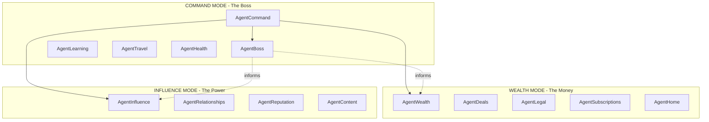
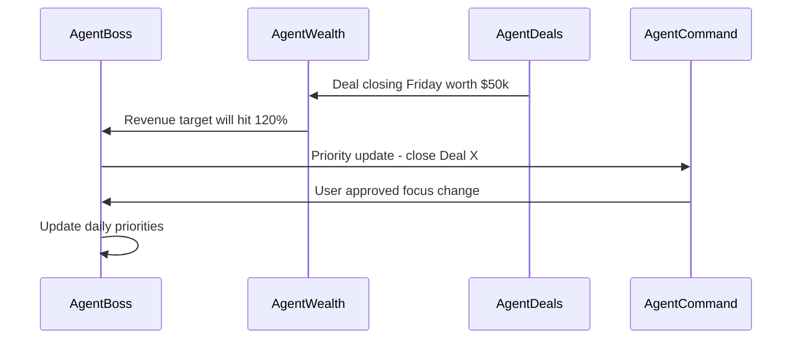

# RunAlNur Agent Empire - Complete Build Roadmap

## The 3-Mode Agent Architecture

---

## Agent Roster by Mode

### COMMAND MODE (The Boss)

| Agent | Purpose | Priority |

|-------|---------|----------|

| **AgentBoss** | Tells you what to focus on, monitors progress, holds you accountable | Phase 1 |

| **AgentLearning** | Skills development, courses, knowledge acquisition | Phase 3 |

| **AgentTravel** | Trip planning, booking, itinerary management | Phase 3 |

| **AgentHealth** | Vitals, health metrics, wellness optimization | Phase 4 |

| **AgentCommand** | Meta-orchestrator - watches all agents, approval queue | Phase 2 |

### WEALTH MODE (The Money)

| Agent | Purpose | Priority |

|-------|---------|----------|

| **AgentWealth** | Net worth, cash flow, budget, financial overview | Phase 2 |

| **AgentDeals** | Opportunities, partnerships, investments, pipeline | Phase 2 |

| **AgentSubscriptions** | Detect/manage recurring charges, cancel unused | Phase 2 |

| **AgentLegal** | Contracts, compliance, legal protection | Phase 3 |

| **AgentHome** | Property management, maintenance, smart home | Phase 4 |

### INFLUENCE MODE (The Power)

| Agent | Purpose | Priority |

|-------|---------|----------|

| **AgentInfluence** | Social metrics dashboard, follower/engagement tracking | Phase 3 |

| **AgentRelationships** | CRM for network, warm intros, connection management | Phase 3 |

| **AgentReputation** | Mentions, press, sentiment analysis | Phase 4 |

| **AgentContent** | Create/schedule content, performance optimization | Phase 4 |

---

## Build Order (4 Phases)

### Phase 1: The Brain

**AgentBoss** - Foundation of everything

What it does:

- Analyzes your ClickUp tasks, projects, deadlines
- Ranks priorities by impact/urgency
- Gives daily briefing: "Your top 3 priorities today"
- Monitors if you're actually doing them
- End-of-day summary

Technical approach:

- LLM (Claude) analyzes your data
- Pulls from existing ClickUp integration
- Simple prompt engineering to start
- UI: Priority queue in Command mode

---

### Phase 2: Core Agents

**AgentCommand** + **AgentWealth** + **AgentDeals** + **AgentSubscriptions**

AgentCommand:

- Dashboard showing all agent activity
- Approval queue for actions needing sign-off
- Agent status grid (what's running, what's idle)
- Agent-to-agent communication log

AgentWealth:

- Net worth tracking (manual entry first, Plaid later)
- Cash flow dashboard
- Financial goals/targets
- Budget vs actual

AgentDeals (inside Wealth):

- Deal pipeline (you already have DealPipeline component)
- Opportunity tracking
- Revenue forecasting

AgentSubscriptions (inside Wealth):

- List all recurring charges
- Usage detection (which are actually used)
- Cancel/pause recommendations

---

### Phase 3: Expansion

**AgentLearning** + **AgentTravel** + **AgentLegal** + **AgentInfluence** + **AgentRelationships**

AgentLearning (Command):

- Skills you're developing
- Courses/content to consume
- Learning goals and progress
- AgentBoss integrates: "You need to learn X for this deal"

AgentTravel (Command):

- Upcoming trips
- Booking management
- Itinerary optimization
- Travel costs tracked (feeds into Wealth)

AgentLegal (Wealth):

- Contract repository
- Expiration alerts
- Compliance checklist
- Legal task tracking

AgentInfluence (Influence):

- Social metrics across platforms
- Follower growth trends
- Engagement rates
- Best posting times

AgentRelationships (Influence):

- Key contacts/network map
- Relationship strength scores
- Follow-up reminders
- Warm intro paths

---

### Phase 4: Full Empire

**AgentHealth** + **AgentHome** + **AgentReputation** + **AgentContent**

AgentHealth (Command):

- Vitals from wearables (Apple Health, Oura, Whoop)
- Sleep, HRV, activity tracking
- Health trends and alerts
- AgentBoss integrates: "Sleep was poor, consider lighter day"

AgentHome (Wealth):

- Property as asset
- Maintenance scheduling
- Utility optimization
- Service provider management

AgentReputation (Influence):

- Brand mentions across web
- Press/media tracking
- Sentiment analysis
- Alert on negative mentions

AgentContent (Influence):

- Content calendar
- Draft/schedule posts
- Performance analytics
- AI-assisted content creation

---

## How Agents Communicate

---

## Technical Foundation

All agents share:

- **Status reporting** - Each agent reports: idle, working, needs_approval, error
- **Action queue** - Actions agents want to take, awaiting approval
- **Event bus** - Agents publish events, others subscribe
- **Shared context** - User profile, goals, preferences all agents can read

Database tables needed:

- `agent_status` - Current state of each agent
- `agent_actions` - Pending/completed actions
- `agent_events` - Event log for agent communication
- `agent_approvals` - Human approval queue

---

## Summary: The Order

1. **AgentBoss** - The brain that prioritizes everything
2. **AgentCommand** - The dashboard that shows agent activity
3. **AgentWealth + AgentDeals + AgentSubscriptions** - Money management
4. **AgentInfluence + AgentRelationships** - Social capital
5. **AgentLearning + AgentTravel + AgentLegal** - Life management
6. **AgentHealth + AgentHome + AgentReputation + AgentContent** - Full empire

Start with AgentBoss. Everything else builds on top.