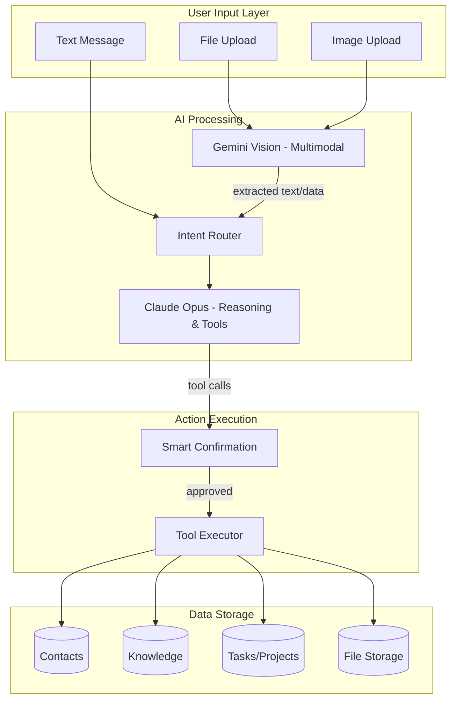

# Agentic COO AI System

Transform the COO/AI into a fully agentic assistant that can understand natural language, intelligently route information to the right system components, and process multimodal inputs (files, images).

## Current State Analysis

The existing system has:

- Tool calling infrastructure in [`lib/ai/agent.ts`](runalnur-app/lib/ai/agent.ts) (Claude + Gemini)
- Basic tools in [`lib/ai/tools.ts`](runalnur-app/lib/ai/tools.ts): create_project, create_task, create_contact
- Chat interface in [`components/ai/ChatInterface.tsx`](runalnur-app/components/ai/ChatInterface.tsx) (text-only)
- File upload infrastructure in [`app/api/storage/upload-url/route.ts`](runalnur-app/app/api/storage/upload-url/route.ts)

**Key gaps**: No multimodal input, Anthropic doesn't execute tools (only text response), no local knowledge storage, no smart confirmation UI.

---

## Architecture



---

## Implementation Plan

### Phase 1: Extended Tool System

Add new tools to [`lib/ai/tools.ts`](runalnur-app/lib/ai/tools.ts) and implementations to [`lib/ai/actions.ts`](runalnur-app/lib/ai/actions.ts):

| Tool | Purpose |

|------|---------|

| `create_knowledge` | Store knowledge/notes/learnings |

| `create_bulk_contacts` | Import multiple contacts at once |

| `create_milestone` | Add project milestones |

| `create_deadline` | Set deadlines with reminders |

| `search_knowledge` | Query knowledge base |

| `update_contact` | Update existing contact info |

| `create_sop` | Create standard operating procedure |

Database migration for local knowledge:

```sql
CREATE TABLE knowledge_base (
  id UUID PRIMARY KEY,
  user_id UUID NOT NULL REFERENCES auth.users(id),
  arm_id TEXT REFERENCES arms(id),
  title VARCHAR(500) NOT NULL,
  content TEXT NOT NULL,
  source VARCHAR(50), -- 'ai', 'manual', 'import', 'guru_sync'
  category VARCHAR(100),
  tags TEXT[],
  metadata JSONB,
  created_at TIMESTAMPTZ DEFAULT NOW()
);
```

### Phase 2: Fix Tool Execution for Claude

Update [`lib/ai/agent.ts`](runalnur-app/lib/ai/agent.ts) `runAnthropic()` function to:

1. Parse tool_use blocks from Claude's response
2. Execute tools via `toolHandlers`
3. Send tool results back to Claude for final response

### Phase 3: Multimodal Chat Interface

Update [`components/ai/ChatInterface.tsx`](runalnur-app/components/ai/ChatInterface.tsx):

- Add file/image drop zone or attachment button
- Preview attachments before sending
- Show processing indicator for multimodal content
- Display extracted data from images/files

### Phase 4: Gemini Vision Processing

Create `lib/ai/multimodal.ts`:

- Process images via Gemini Vision API
- Extract text from documents (OCR)
- Parse structured data from screenshots/receipts
- Analyze uploaded files (PDF text extraction)

### Phase 5: Smart Confirmation UI

Create `components/ai/ActionConfirmation.tsx`:

- Show proposed actions before execution
- Group by type (contacts, tasks, knowledge)
- Allow edit/approve/reject per item
- Auto-execute simple actions, confirm bulk/destructive

Confirmation rules:

| Action Type | Confirm? |

|-------------|----------|

| Single contact create | No |

| Bulk contacts (3+) | Yes |

| Delete anything | Yes |

| Create project | No |

| Update status | No |

| Bulk task create | Yes |

### Phase 6: API Endpoint Updates

Update [`app/api/ai/chat/route.ts`](runalnur-app/app/api/ai/chat/route.ts):

- Accept multipart form data with files
- Route files to Gemini for processing
- Combine extracted data with user message
- Return pending actions for confirmation

---

## Files to Create/Modify

**New files:**

- `lib/ai/multimodal.ts` - Gemini vision processing
- `lib/ai/tools-extended.ts` - Additional tools
- `components/ai/ActionConfirmation.tsx` - Confirmation UI
- `components/ai/FileDropZone.tsx` - File upload UI
- `supabase/migrations/20260120_knowledge_base.sql` - Knowledge table
- `app/api/ai/multimodal/route.ts` - Multimodal processing endpoint

**Modified files:**

- [`lib/ai/tools.ts`](runalnur-app/lib/ai/tools.ts) - Add new tool definitions
- [`lib/ai/actions.ts`](runalnur-app/lib/ai/actions.ts) - Add new tool implementations  
- [`lib/ai/agent.ts`](runalnur-app/lib/ai/agent.ts) - Fix Claude tool execution
- [`components/ai/ChatInterface.tsx`](runalnur-app/components/ai/ChatInterface.tsx) - Add multimodal UI
- [`app/api/ai/chat/route.ts`](runalnur-app/app/api/ai/chat/route.ts) - Handle files

---

## Example Interactions

**User uploads a contact list image:**

> "Here's a list of contacts from a networking event"

> [image of business cards]

COO processes via Gemini Vision, extracts contacts, shows confirmation:

> "I found 5 contacts in your image. Ready to add them?"

> - John Smith, ABC Corp, john@abc.com

> - Sarah Lee, XYZ Inc, sarah@xyz.com

> ...

> [Add All] [Edit] [Cancel]

**User shares knowledge:**

> "Remember this: Dubai real estate agents need RERA certification. Always verify before working with them."

COO stores to knowledge base:

> "Got it. Saved to Knowledge Base under 'Janna / Real Estate / Compliance'."

**User shares a deadline:**

> "I need to submit RERA paperwork by Feb 15"

COO creates deadline:

> "Created deadline: RERA Paperwork Submission - Feb 15, 2026. Added reminder for Feb 10."