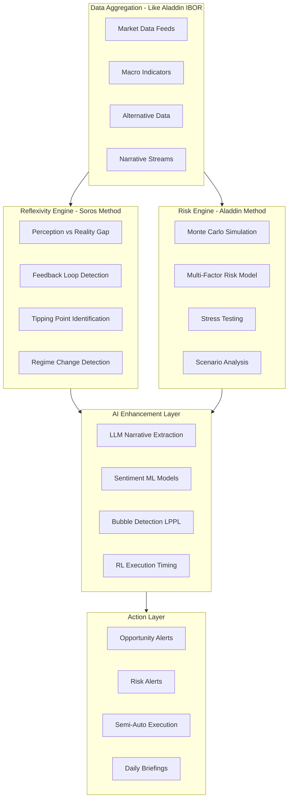

# Aladdin-Soros Hybrid Intelligence Engine

## Research Summary: How They Actually Work

### BlackRock Aladdin - The Infrastructure

Aladdin manages $21+ trillion through these core mechanisms:

**1. Unified Book of Record (IBOR)**

- Single source of truth for ALL positions across entities
- Real-time aggregation: equities, bonds, derivatives, FX, private assets, real estate
- Normalized data feeds from 100+ sources into standard formats

**2. Risk Analytics Engine**

- Runs **millions of Monte Carlo simulations** weekly
- Tracks **thousands of risk factors** daily: rates, FX, credit spreads, commodities
- Stress tests: both historical (2008 crisis replay) and hypothetical (Fed +300bps)
- Factor decomposition: systematic vs idiosyncratic risk separation

**3. Scenario Analysis Framework**

- "What-if" modeling for any macro shock
- Climate risk via Aladdin Climate (acquired Baringa models)
- ESG/sustainability forward-looking metrics
- Tail risk: CVaR, conditional scenarios

**4. API-First Architecture**

- Extensible via Aladdin Studio for custom workflows
- Integration with external data providers (Preqin for private markets)
- Now cloud-native on Azure with Snowflake

---

### George Soros - The Philosophy

Soros's edge comes from understanding **reflexivity** - that markets don't just reflect reality, they shape it:

**1. Theory of Reflexivity**

- Participant perceptions influence fundamentals
- Fundamentals then alter perceptions - creating feedback loops
- This creates bubbles and crashes that are PREDICTABLE if you understand the loop

**2. The Black Wednesday Trade (1992) - Anatomy**

- **Setup**: UK in European Exchange Rate Mechanism (ERM), committed to maintaining GBP/DEM peg
- **Fundamental weakness**: UK inflation higher than Germany, interest rates misaligned
- **Reflexive dynamic**: Markets began doubting Bank of England could maintain peg
- **Execution**: Soros built $10B short position in GBP using leverage
- **Catalyst**: When UK raised rates to defend, it signaled desperation - accelerated the attack
- **Result**: UK forced out of ERM, GBP collapsed 15%, Soros made $1B+ in one day

**3. Key Principles**

- **Fallibility**: Always assume your thesis could be wrong - cut losses fast
- **Conviction + Leverage**: When asymmetry is extreme, go big
- **Narrative Intelligence**: Watch for divergence between what people believe and what is true
- **Timing**: Not just being right, but being right at the right moment

---

## The Al Nur Synthesis: What We Build

Combine Aladdin's systematic infrastructure with Soros's reflexive prediction, enhanced by AI:



---

## Phase 1: Multi-Asset Data Foundation (2-3 weeks)

### 1.1 Unified Book of Record Schema

Like Aladdin's IBOR, but expanded for all capital types:

```sql
-- Core holdings across all asset classes
CREATE TABLE holdings (
  id UUID PRIMARY KEY DEFAULT gen_random_uuid(),
  entity_id UUID REFERENCES entities(id),
  
  -- Asset classification
  asset_class VARCHAR(50), -- 'equity', 'fixed_income', 'fx', 'crypto', 'commodity', 'real_estate', 'private_equity'
  asset_subclass VARCHAR(50), -- 'us_large_cap', 'btc', 'gold', 'residential', etc.
  
  -- Position details
  symbol VARCHAR(50),
  name VARCHAR(255),
  quantity NUMERIC,
  cost_basis NUMERIC,
  current_price NUMERIC,
  current_value NUMERIC,
  currency VARCHAR(10) DEFAULT 'USD',
  
  -- Risk metadata
  beta NUMERIC,
  volatility_30d NUMERIC,
  correlation_spx NUMERIC,
  liquidity_score INTEGER, -- 1-100, how fast can you exit
  
  -- Tracking
  last_priced_at TIMESTAMP,
  price_source VARCHAR(50),
  created_at TIMESTAMP DEFAULT NOW(),
  updated_at TIMESTAMP DEFAULT NOW()
);

-- Price history for all assets
CREATE TABLE price_history (
  id UUID PRIMARY KEY DEFAULT gen_random_uuid(),
  holding_id UUID REFERENCES holdings(id),
  symbol VARCHAR(50),
  asset_class VARCHAR(50),
  price NUMERIC,
  volume NUMERIC,
  timestamp TIMESTAMP,
  source VARCHAR(50)
);

-- Currency positions and exposures
CREATE TABLE fx_exposures (
  id UUID PRIMARY KEY DEFAULT gen_random_uuid(),
  entity_id UUID REFERENCES entities(id),
  currency_pair VARCHAR(10), -- 'EUR/USD', 'GBP/USD', etc.
  position_type VARCHAR(20), -- 'long', 'short', 'natural'
  notional NUMERIC,
  entry_rate NUMERIC,
  current_rate NUMERIC,
  pnl NUMERIC,
  hedge_ratio NUMERIC,
  created_at TIMESTAMP DEFAULT NOW()
);
```

### 1.2 Multi-Source Data Integration

New file: [`lib/integrations/data-aggregator.ts`](runalnur-app/lib/integrations/data-aggregator.ts)

**Data Sources to Integrate:**

| Asset Class | Data Source | What We Get |

|-------------|-------------|-------------|

| US Equities | Polygon.io or Alpha Vantage | Real-time prices, fundamentals |

| Crypto | CoinGecko API | Prices, volume, market cap |

| Forex | OANDA or Forex API | Currency pairs, rates |

| Commodities | Quandl | Gold, oil, commodities |

| Real Estate | Zillow API + Redfin | Property values, market data |

| Macro | FRED API | Interest rates, inflation, GDP |

| News | NewsAPI + RSS | Narrative streams |

---

## Phase 2: Reflexivity Engine - Soros Method (3-4 weeks)

This is the key differentiator. Build systems to detect **perception-reality gaps** and **feedback loops**.

### 2.1 Narrative Gap Detection

New file: [`lib/intelligence/reflexivity-engine.ts`](runalnur-app/lib/intelligence/reflexivity-engine.ts)

```typescript
interface ReflexivitySignal {
  asset: string;
  assetClass: 'currency' | 'equity' | 'crypto' | 'commodity' | 'property';
  
  // Perception metrics (from narrative analysis)
  narrativeSentiment: number; // -100 to +100
  mediaVolume: number;
  consensusView: string; // 'bullish', 'bearish', 'neutral'
  narrativeMomentum: number; // is sentiment accelerating?
  
  // Fundamental metrics
  fundamentalValue: number;
  fundamentalTrend: string;
  
  // The Gap
  perceptionRealityGap: number; // positive = overvalued by narrative
  gapDirection: 'widening' | 'narrowing' | 'stable';
  
  // Feedback loop strength
  feedbackLoopStrength: number; // 0-100
  feedbackLoopPhase: 'early' | 'accelerating' | 'peak' | 'reversing';
  
  // Action signals
  opportunityType: 'long' | 'short' | 'hedge' | 'wait';
  confidenceLevel: number;
  timeHorizon: string;
}

// Currency crisis detection - Soros's specialty
interface CurrencyCrisisIndicators {
  currency: string;
  
  // Fundamental pressures
  inflationDifferential: number; // vs major trading partners
  interestRateDifferential: number;
  currentAccountDeficit: number; // % of GDP
  externalDebtRatio: number;
  foreignReservesCoverage: number; // months of imports
  
  // Policy credibility
  centralBankCredibility: number; // 0-100
  pegStability: number; // if pegged
  policyConsistency: number;
  
  // Capital flow signals
  capitalFlowMomentum: number;
  hotMoneyExposure: number;
  
  // Narrative signals
  mediaConfidenceIndex: number;
  policymakerTone: number; // extracted from speeches
  
  // Crisis probability
  crisisProbability6M: number;
  crisisProbability12M: number;
  expectedDevaluation: number;
}
```

### 2.2 Macro Regime Detection

Detect when the fundamental regime is shifting (like Soros did with ERM):

```typescript
interface MacroRegime {
  currentRegime: 'expansion' | 'slowdown' | 'recession' | 'recovery' | 'crisis';
  regimeConfidence: number;
  regimeAge: number; // months in current regime
  
  // Transition probabilities
  transitionProbabilities: {
    toExpansion: number;
    toSlowdown: number;
    toRecession: number;
    toCrisis: number;
  };
  
  // Key drivers
  leadingIndicators: {
    yieldCurve: number;
    creditSpreads: number;
    pmi: number;
    unemploymentTrend: number;
    inflationMomentum: number;
  };
  
  // Regime-specific opportunities
  preferredAssetClasses: string[];
  avoidAssetClasses: string[];
}
```

### 2.3 Feedback Loop Tracker

Track how narratives feed into fundamentals and vice versa:

```sql
CREATE TABLE feedback_loops (
  id UUID PRIMARY KEY DEFAULT gen_random_uuid(),
  asset VARCHAR(100),
  asset_class VARCHAR(50),
  
  -- Loop identification
  loop_type VARCHAR(50), -- 'self_fulfilling', 'self_defeating', 'amplifying'
  loop_phase VARCHAR(50), -- 'early', 'accelerating', 'peak', 'reversing'
  
  -- Measurements
  narrative_sentiment NUMERIC,
  price_momentum NUMERIC,
  volume_trend NUMERIC,
  fundamental_change NUMERIC,
  
  -- Loop strength (how much does narrative move fundamentals?)
  narrative_to_fundamental_lag INTEGER, -- days
  fundamental_to_price_lag INTEGER,
  loop_strength NUMERIC, -- 0-1
  
  -- Predictions
  expected_continuation_days INTEGER,
  reversal_probability NUMERIC,
  
  created_at TIMESTAMP DEFAULT NOW()
);
```

---

## Phase 3: Risk Engine - Aladdin Method (2-3 weeks)

### 3.1 Multi-Factor Risk Model

New file: [`lib/intelligence/risk-engine.ts`](runalnur-app/lib/intelligence/risk-engine.ts)

Track exposure to systematic risk factors like Aladdin:

```typescript
interface RiskFactors {
  // Market factors
  equityBeta: number;
  interestRateDuration: number;
  creditSpreadSensitivity: number;
  fxExposure: Record<string, number>; // by currency
  commodityExposure: Record<string, number>;
  
  // Crypto-specific
  btcCorrelation: number;
  defiExposure: number;
  regulatoryRisk: number;
  
  // Real estate specific
  capRateExposure: number;
  geographicConcentration: Record<string, number>;
  
  // Alternative factors
  momentumExposure: number;
  valueExposure: number;
  qualityExposure: number;
  
  // Liquidity
  portfolioLiquidity: number; // days to liquidate
  liquidityAtRisk: number; // % that would suffer slippage
}

interface RiskMetrics {
  // Standard metrics
  portfolioVolatility: number;
  valueAtRisk95: number;
  valueAtRisk99: number;
  conditionalVaR: number;
  maxDrawdownExpected: number;
  
  // Concentration
  top5HoldingsWeight: number;
  herfindahlIndex: number;
  correlationWithSP500: number;
  
  // Tail risk
  tailRiskScore: number;
  blackSwanExposure: number;
}
```

### 3.2 Scenario Stress Testing

Like Aladdin's stress tests but including Soros-style regime scenarios:

```typescript
const PREDEFINED_SCENARIOS = [
  // Historical replays (Aladdin style)
  { name: '2008_financial_crisis', equityShock: -0.50, creditSpread: +500, rates: -200 },
  { name: '2020_covid_crash', equityShock: -0.35, volatilitySpike: +300, rates: -150 },
  { name: '1997_asian_crisis', emEquityShock: -0.40, emFxShock: -0.30 },
  
  // Currency crisis scenarios (Soros style)
  { name: 'erm_break_redux', targetCurrency: 'EUR', fxShock: -0.15, rateSpike: +200 },
  { name: 'em_currency_crisis', emFxShock: -0.25, capitalFlight: true },
  { name: 'usd_confidence_crisis', usdShock: -0.20, goldSpike: +0.30 },
  
  // Crypto scenarios
  { name: 'crypto_winter', btcShock: -0.70, altcoinShock: -0.85 },
  { name: 'crypto_regulation', btcShock: -0.30, defiShock: -0.60 },
  
  // Macro regime shifts
  { name: 'stagflation', equityShock: -0.20, inflationSpike: +5, ratesUp: +300 },
  { name: 'deflation_japan', equityShock: -0.30, ratesDown: -100, propertyShock: -0.25 },
  
  // Geopolitical
  { name: 'taiwan_crisis', equityShock: -0.25, techShock: -0.40, supplyChainDisruption: true },
  { name: 'oil_shock', oilSpike: +100, equityShock: -0.15 },
];
```

---

## Phase 4: AI Enhancement Layer (3-4 weeks)

### 4.1 LLM Narrative Extraction

New file: [`lib/intelligence/narrative-ai.ts`](runalnur-app/lib/intelligence/narrative-ai.ts)

Use LLMs to extract actionable signals from unstructured text:

```typescript
interface NarrativeAnalysis {
  // Source metadata
  source: string;
  publishedAt: Date;
  credibilityScore: number;
  
  // Extracted signals
  primaryAssets: string[];
  sentiment: number; // -100 to +100
  sentimentConfidence: number;
  
  // Narrative classification
  narrativeType: 'bullish_thesis' | 'bearish_thesis' | 'neutral_analysis' | 'event_report' | 'opinion';
  keyThemes: string[];
  
  // Forward-looking signals
  impliedTimeHorizon: string;
  expectedCatalysts: string[];
  riskFactorsMentioned: string[];
  
  // Policy/regulatory signals
  policyImplications: string[];
  regulatoryRisk: number;
  
  // Reflexivity indicators
  consensusAlignment: number; // does this align with or challenge consensus?
  contraindicator: boolean; // is this a contrarian signal?
}

// Central bank communication parser - critical for FX
interface CentralBankAnalysis {
  institution: string;
  speaker: string;
  date: Date;
  
  // Tone analysis
  hawkishDovishScore: number; // -100 (dovish) to +100 (hawkish)
  forwardGuidanceStrength: number;
  credibilityAssessment: number;
  
  // Policy signals
  impliedRatePath: number[]; // expected rates next 4 quarters
  qeQtSignals: string;
  inflationConcern: number;
  growthConcern: number;
  
  // Market impact prediction
  expectedFxImpact: Record<string, number>;
  expectedRateImpact: number;
}
```

### 4.2 LPPL Bubble Detection Model

Implement Log-Periodic Power Law model (Sornette) for detecting bubbles:

```typescript
// Based on Didier Sornette's work on "Dragon Kings"
interface LPPLSignal {
  asset: string;
  
  // Model parameters
  criticalTime: Date; // predicted crash/peak time
  crashProbability: number;
  expectedCrashMagnitude: number;
  
  // Confidence metrics
  modelFit: number; // R-squared
  parameterStability: number;
  
  // Phase
  bubblePhase: 'early' | 'middle' | 'late' | 'critical';
  daysToExpectedPeak: number;
  
  // Action
  recommendation: 'reduce_exposure' | 'hedge' | 'exit' | 'monitor';
}

// LPPL formula: price = A + B(tc - t)^m + C(tc - t)^m * cos(w * ln(tc - t) + phi)
// tc = critical time (crash point)
// Look for log-periodic oscillations accelerating toward critical point
```

### 4.3 Multi-Agent Decision System

Like the research showed (P1GPT, MASFIN), use multiple AI agents with different perspectives:

```typescript
interface AgentPerspective {
  agentType: 'technical' | 'fundamental' | 'sentiment' | 'macro' | 'contrarian';
  
  // Agent's view
  assetView: Record<string, {
    direction: 'long' | 'short' | 'neutral';
    conviction: number;
    timeHorizon: string;
    reasoning: string;
  }>;
  
  // Agent confidence in own analysis
  selfConfidence: number;
  
  // Historical accuracy
  historicalAccuracy: number;
}

// Coordinator combines agent views weighted by historical accuracy
function coordinateAgents(perspectives: AgentPerspective[]): FinalDecision {
  // Weight by historical accuracy
  // Identify consensus vs disagreement
  // Flag when contrarian agent strongly disagrees with consensus (Soros opportunity)
}
```

---

## Phase 5: Currency and Macro Prediction System (2-3 weeks)

This is the Soros specialty - build specific tools for FX and macro prediction:

### 5.1 Currency Crisis Early Warning System

New file: [`lib/intelligence/fx-crisis-detector.ts`](runalnur-app/lib/intelligence/fx-crisis-detector.ts)

```typescript
interface CurrencyCrisisAlert {
  currency: string;
  alertLevel: 'watch' | 'warning' | 'critical';
  
  // Fundamental triggers
  fundamentalScore: number;
  triggers: {
    highInflation: boolean;
    currentAccountDeficit: boolean;
    lowReserves: boolean;
    debtSustainability: boolean;
    policyInconsistency: boolean;
  };
  
  // Speculative pressure
  speculativeScore: number;
  shortInterest: number;
  optionsSkew: number; // put/call imbalance
  
  // Capital flow signals
  capitalFlowScore: number;
  hotMoneyOutflow: boolean;
  institutionalPositioning: string;
  
  // Narrative/political
  politicalRisk: number;
  centralBankCredibility: number;
  
  // Prediction
  devaluationProbability30d: number;
  devaluationProbability90d: number;
  expectedDevaluationMagnitude: number;
  
  // Recommended action
  action: 'short' | 'hedge' | 'reduce_exposure' | 'monitor';
  positionSizing: number; // % of portfolio
  hedgeInstruments: string[];
}
```

### 5.2 Gold and Safe Haven Monitor

```typescript
interface SafeHavenSignals {
  // Gold signals
  goldFairValue: number;
  goldCurrentPrice: number;
  goldValuationGap: number;
  realRatesDriver: number;
  inflationExpectationsDriver: number;
  usdCorrelation: number;
  
  // Flight to safety indicators
  vixLevel: number;
  creditSpreadWidening: boolean;
  yieldCurveFlatteningInverting: boolean;
  
  // Geopolitical risk premium
  geopoliticalRiskIndex: number;
  
  // Position recommendation
  goldAllocation: number; // % of portfolio
  treasuryAllocation: number;
  cashAllocation: number;
}
```

---

## Phase 6: Execution and Action Layer (2 weeks)

### 6.1 Opportunity Prioritization with Soros Asymmetry

New file: [`lib/intelligence/opportunity-ranker.ts`](runalnur-app/lib/intelligence/opportunity-ranker.ts)

```typescript
interface SorosOpportunity {
  asset: string;
  opportunityType: 'reflexive_divergence' | 'regime_change' | 'crisis_play' | 'reversion';
  
  // Asymmetry analysis (Soros's key)
  upside: number;
  downside: number;
  asymmetryRatio: number; // upside/downside
  probabilityOfSuccess: number;
  expectedValue: number; // probability * upside - (1-probability) * downside
  
  // Timing
  catalysts: string[];
  expectedCatalystTiming: Date;
  urgency: 'immediate' | 'days' | 'weeks' | 'months';
  
  // Position sizing (Kelly-like)
  optimalPositionSize: number;
  maxPositionSize: number;
  
  // Exit criteria
  profitTarget: number;
  stopLoss: number;
  timeStop: Date; // exit if thesis hasn't played out by this date
  
  // Conviction score
  sorosScore: number; // composite of asymmetry, conviction, timing
}
```

### 6.2 Daily Intelligence Briefing - Soros Edition

Enhanced briefing structure:

```typescript
interface DailyBriefing {
  date: Date;
  
  // Portfolio status
  nav: number;
  navChange24h: number;
  navChange7d: number;
  
  // Risk dashboard
  currentRiskLevel: 'low' | 'moderate' | 'elevated' | 'high';
  topRiskFactors: string[];
  var95: number;
  
  // Reflexivity alerts
  perceptionRealityGaps: Array<{
    asset: string;
    gapMagnitude: number;
    direction: string;
    opportunity: string;
  }>;
  
  // Currency watch
  currencyCrisisAlerts: CurrencyCrisisAlert[];
  fxOpportunities: SorosOpportunity[];
  
  // Macro regime
  currentRegime: MacroRegime;
  regimeChangeSignals: string[];
  
  // Bubble watch
  lpplAlerts: LPPLSignal[];
  
  // Top opportunities
  topOpportunities: SorosOpportunity[];
  
  // Actions required
  urgentActions: string[];
  recommendedTrades: Array<{
    asset: string;
    action: string;
    size: number;
    reasoning: string;
  }>;
}
```

---

## Implementation Roadmap

| Phase | Timeline | Key Deliverables |

|-------|----------|------------------|

| 1. Data Foundation | Weeks 1-3 | IBOR schema, market data APIs, price history |

| 2. Reflexivity Engine | Weeks 4-7 | Narrative gap detection, feedback loop tracking, currency crisis indicators |

| 3. Risk Engine | Weeks 8-10 | Factor model, stress tests, scenario analysis |

| 4. AI Layer | Weeks 11-14 | LLM narrative extraction, LPPL model, multi-agent system |

| 5. FX/Macro System | Weeks 15-17 | Currency crisis EWS, safe haven monitor |

| 6. Execution Layer | Weeks 18-19 | Opportunity ranker, enhanced briefings |

---

## Key Files to Create

| File | Purpose |

|------|---------|

| `lib/intelligence/reflexivity-engine.ts` | Core Soros method - perception/reality gaps |

| `lib/intelligence/fx-crisis-detector.ts` | Currency crisis early warning |

| `lib/intelligence/risk-engine.ts` | Aladdin-style factor risk model |

| `lib/intelligence/narrative-ai.ts` | LLM narrative extraction |

| `lib/intelligence/lppl-model.ts` | Bubble detection (Sornette) |

| `lib/intelligence/macro-regime.ts` | Regime detection and transitions |

| `lib/intelligence/opportunity-ranker.ts` | Soros-style asymmetry scoring |

| `lib/integrations/data-aggregator.ts` | Multi-source market data |

| `lib/integrations/fred-api.ts` | Macro economic data |

| `lib/integrations/forex-api.ts` | Currency data |

---

## Recommended First Trade

To prove the system, start with a currency thesis:

1. **Monitor**: Pick 3-5 currencies with fundamental weaknesses (high inflation differential, current account deficit, political instability)
2. **Track**: Build narrative sentiment tracker for those currencies
3. **Detect**: Look for perception-reality gap widening
4. **Alert**: When crisis probability crosses threshold, alert for review
5. **Position**: If approved, take small hedged position with defined stop

This tests the full stack: data, reflexivity detection, risk management, execution.