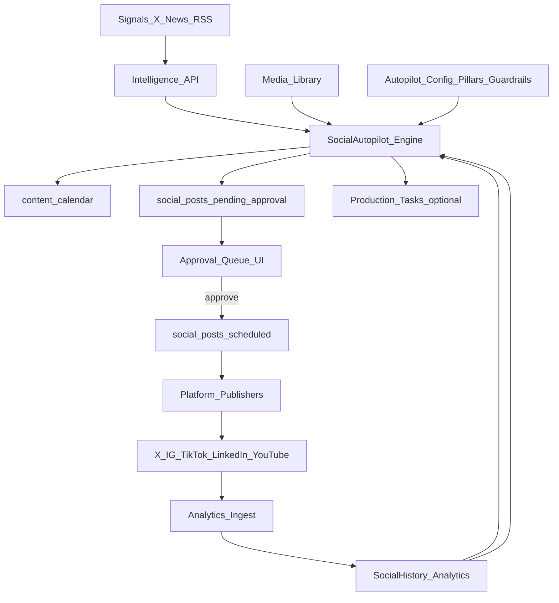

# Dynasty Social Autopilot (Autonomous + Approval-Gated)

## What you’re asking for (translated into product requirements)

- **Autonomous**: The AI should continuously *observe signals* (trends, your media library, performance history), *decide what to create*, *place it into the calendar*, and *prepare drafts*.
- **Approval-gated**: Nothing gets posted without you approving (final publish is always manual/explicit).
- **End-to-end**: Not just “generate captions”—it must cover ideation → planning → production → scheduling → approval queue → publishing → analytics → learning.

## Aha: the foundations are already in place

- **Database schema exists** for `social_accounts`, `social_posts`, `content_calendar`, `post_templates` in [`runalnur-app/supabase/migrations/20260121_media_social.sql`](runalnur-app/supabase/migrations/20260121_media_social.sql).
- **Signal ingestion already exists** via the Intelligence system (X/news/RSS) in [`runalnur-app/lib/integrations/intelligence.ts`](runalnur-app/lib/integrations/intelligence.ts) and [`runalnur-app/app/api/intelligence/route.ts`](runalnur-app/app/api/intelligence/route.ts).
- **UI exists but is mock data** for social command/calendar/analytics: [`runalnur-app/app/social/page.tsx`](runalnur-app/app/social/page.tsx), [`runalnur-app/app/social/calendar/page.tsx`](runalnur-app/app/social/calendar/page.tsx), [`runalnur-app/app/social/analytics/page.tsx`](runalnur-app/app/social/analytics/page.tsx).

That means the “insufficient scope” issue isn’t that we can’t do it—the missing pieces are the **autopilot brain**, the **approval workflow UI**, and the **platform connectors / analytics ingest**.

## Architecture (high-level)

## Plan (build the “full amazing automated system” in 3 layers)

### Layer 1 — Autopilot Brain (ideation → calendar placement → drafts)

- **Create a Social Autopilot engine** that:
  - Pulls signals from `/api/intelligence` (plus optional keyword lists per entity).
  - Uses your media library to choose fitting assets.
  - Generates **platform-specific drafts** (X vs IG vs LinkedIn constraints) and writes them into `social_posts` with `status='pending_approval'`.
  - Creates/updates `content_calendar` entries for planned posts (status transitions: `idea → planned → ready`).
  - Suggests optimal times (`ai_best_time_suggestion`) using simple heuristics first, then analytics later.

**Files to add/change**

- Add a server module: [`runalnur-app/lib/social/autopilot.ts`](runalnur-app/lib/social/autopilot.ts)
- Add API route to run autopilot on demand: [`runalnur-app/app/api/social/autopilot/run/route.ts`](runalnur-app/app/api/social/autopilot/run/route.ts)
- Add list/create endpoints:
  - [`runalnur-app/app/api/social/posts/route.ts`](runalnur-app/app/api/social/posts/route.ts)
  - [`runalnur-app/app/api/social/calendar/route.ts`](runalnur-app/app/api/social/calendar/route.ts)

### Layer 2 — Approval Gate UX (your control panel)

- Replace mock data in social pages with real Supabase-backed data:
  - **Approval Queue**: filter `social_posts` where `status='pending_approval'`.
  - **Calendar**: render from `content_calendar` + scheduled posts.
  - **Post Review**: open a draft, view media, edit caption/hashtags, and approve.

**Files to change**

- [`runalnur-app/app/social/page.tsx`](runalnur-app/app/social/page.tsx) (stop using mock stats; add “Run Autopilot” + approval queue preview)
- [`runalnur-app/app/social/calendar/page.tsx`](runalnur-app/app/social/calendar/page.tsx) (render real calendar)
- [`runalnur-app/app/social/analytics/page.tsx`](runalnur-app/app/social/analytics/page.tsx) (wire to `social_analytics` later)
- Add hooks:
  - [`runalnur-app/lib/hooks/useSocialPosts.ts`](runalnur-app/lib/hooks/useSocialPosts.ts)
  - [`runalnur-app/lib/hooks/useContentCalendar.ts`](runalnur-app/lib/hooks/useContentCalendar.ts)

### Layer 3 — Platform Connectors + Publishing (still approval-gated)

- Implement connectors so the app can **publish only after approval**.
- Store tokens using the existing encrypted credentials system in [`runalnur-app/lib/integrations/user-credentials.ts`](runalnur-app/lib/integrations/user-credentials.ts).
  - Extend `IntegrationProvider` to include social providers (e.g. `x`, `instagram`, `linkedin`, `youtube`, `tiktok`).
  - Use `social_accounts.integration_provider` to point at the matching credentials.
- Add publish API endpoints:
  - `POST /api/social/posts/:id/approve` → moves to `approved` and optionally schedules.
  - `POST /api/social/posts/:id/publish` → publishes (server-side) and updates `post_status` JSON per account.

**Files to add/change**

- Update [`runalnur-app/lib/integrations/user-credentials.ts`](runalnur-app/lib/integrations/user-credentials.ts) to support social providers.
- Add platform clients (start with X):
  - [`runalnur-app/lib/social/platforms/x.ts`](runalnur-app/lib/social/platforms/x.ts)
  - [`runalnur-app/lib/social/publisher.ts`](runalnur-app/lib/social/publisher.ts)
- Add endpoints:
  - `[runalnur-app/app/api/social/posts/[id]/approve/route.ts](runalnur-app/app/api/social/posts/[id]/approve/route.ts)`
  - `[runalnur-app/app/api/social/posts/[id]/publish/route.ts](runalnur-app/app/api/social/posts/[id]/publish/route.ts)`

## Scheduling (autonomous runs)

- Add a cron-style endpoint similar to [`runalnur-app/app/api/cron/briefings/route.ts`](runalnur-app/app/api/cron/briefings/route.ts) for autopilot, e.g. `/api/cron/social-autopilot`.
- Configure **Vercel Cron** to call it (e.g. daily + weekly planning run). The codebase already supports cron endpoints; the schedule is a Vercel setting.

## Guardrails (so it’s “amazing” but safe)

- Enforce **hard rules** in the autopilot engine:
  - Never publish without approval.
  - Respect per-platform limits (length, hashtag count, media count).
  - Avoid repetition (dedupe topic/angle across a rolling window).
  - Maintain entity voice (store “voice + pillars” config and apply it).

## Deliverable milestones

- **Milestone A**: Autopilot generates and places a week of content into `content_calendar` + creates drafts `pending_approval`.
- **Milestone B**: Approval UI works end-to-end: review → edit → approve → schedule.
- **Milestone C**: Publishing integration (start with X) + post-status tracking + analytics ingest loop.