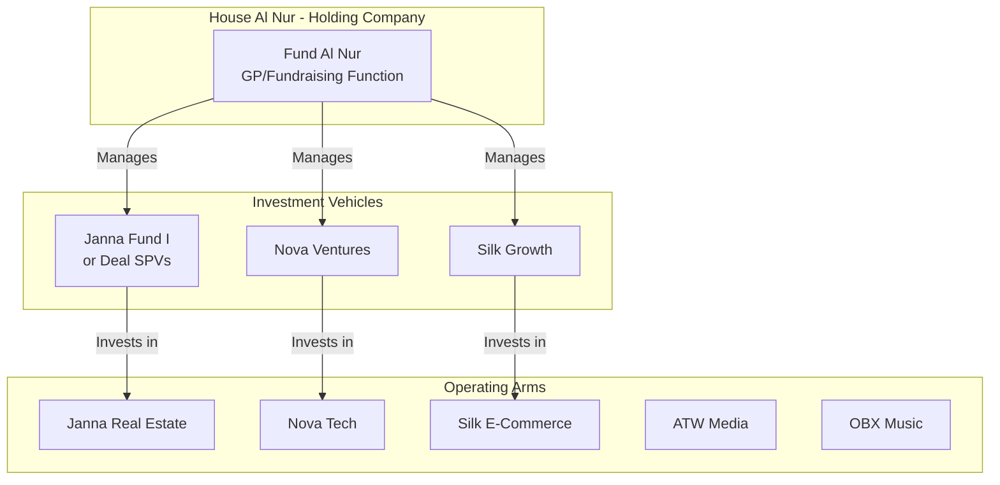
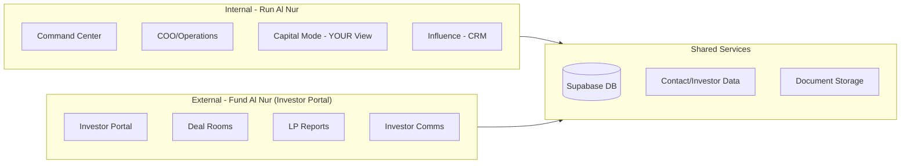
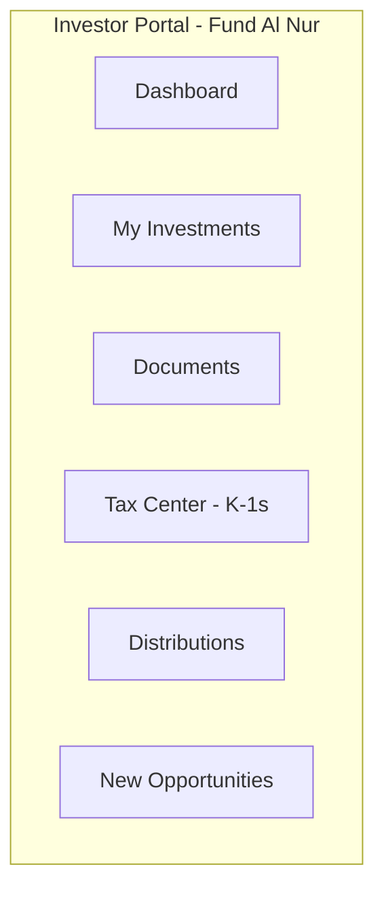
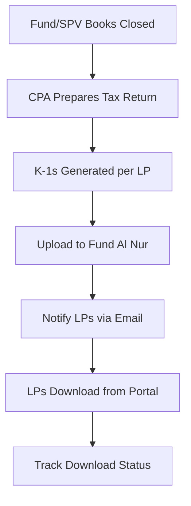

# PRIORITY: Integration Diagnosis and Fixes

Before proceeding with Capital Raising features, the core integrations need to be fixed. Here's what broke and why.

## Root Cause Analysis

### 1. Missing `INTEGRATIONS_ENCRYPTION_KEY` in Vercel (PRIMARY CULPRIT)

All per-user integration credentials are encrypted with AES-256-GCM. The encryption key is required to read/write credentials.

**Code location:** [`lib/security/crypto.ts:20-28`](runalnur-app/lib/security/crypto.ts)

```typescript
function getEncryptionKey(): Buffer {
  const keyBase64 = process.env.INTEGRATIONS_ENCRYPTION_KEY;
  if (!keyBase64) {
    throw new Error("INTEGRATIONS_ENCRYPTION_KEY environment variable is not set.");
  }
  // ...
}
```

**Code location:** [`lib/integrations/user-credentials.ts:80-87`](runalnur-app/lib/integrations/user-credentials.ts)

```typescript
if (!isEncryptionConfigured()) {
  // In production we hard-fail so integrations never silently "look connected".
  if (process.env.NODE_ENV === "production") {
    throw new Error("Encryption not configured");
  }
  return null;  // In dev, silently returns null = "not connected"
}
```

**Impact:** Every call to `getUserCredentials()` or `getApiKey()` returns `null` = ALL integrations appear disconnected even if credentials were previously saved.

### 2. ClickUp Requires Per-User OAuth (Not Env Vars)

**Code location:** [`lib/clickup/client.ts:4-18`](runalnur-app/lib/clickup/client.ts)

```typescript
export async function getClickUpClientForUser(tenantId, userId) {
  const accessToken = await getOAuthAccessToken(tenantId, userId, "clickup");
  if (accessToken) {
    return { client: new ClickUpClient({ apiKey: accessToken }), mode: "oauth" };
  }
  // Env fallback is DEMO_MODE only (never in production)
  if (process.env.DEMO_MODE === "true") { ... }
  return null;  // No OAuth token = not connected
}
```

**Impact:** If encryption key is missing, stored OAuth token can't be decrypted = ClickUp appears disconnected.

### 3. AI Falls Back to Demo Responses

**Code location:** `app/api/ai/chat/route.ts`

The AI chat route tries in order:

1. `getApiKey(tenantId, user.id, "anthropic")` - needs encryption key
2. `process.env.ANTHROPIC_API_KEY` - env var fallback
3. Demo response with `isDemo: true` - if neither works

**Impact:** No per-user key AND no env var = AI shows demo responses only.

### 4. Settings Page Has Wrong Provider Labels

**Code location:** [`app/settings/page.tsx:110-123`](runalnur-app/app/settings/page.tsx)

```typescript
{
  id: 'openai',
  name: 'OpenAI / Claude',  // Wrong/conflated
  ...
}
```

**Impact:** There's no separate `anthropic` or `gemini` entry - all lumped under misleading "OpenAI/Claude" name.

### 5. Contacts Not Showing = Tenant/Owner Mismatch

**Code location:** [`lib/supabase/schema.sql:612-622`](runalnur-app/lib/supabase/schema.sql)

```sql
CREATE POLICY "Contacts tenant+owner access" ON contacts
  FOR ALL
  USING (
    EXISTS (SELECT 1 FROM tenant_memberships m WHERE m.tenant_id = contacts.tenant_id AND m.user_id = auth.uid())
    AND contacts.owner_id = auth.uid()
  )
```

**Impact:** If user not in `tenant_memberships` or contacts have wrong `owner_id`, they return empty.

---

## Fix Summary Table

| Issue | Root Cause | Fix |

|-------|-----------|-----|

| All integrations disconnected | `INTEGRATIONS_ENCRYPTION_KEY` missing in Vercel | Add env var (generate: `openssl rand -base64 32`) |

| ClickUp not connected | OAuth token unreadable | Fix encryption key, may need re-OAuth |

| Guru not connected | API key unreadable | Fix encryption key, may need re-enter key |

| AI shows demo responses | No per-user key + no env fallback | Add `ANTHROPIC_API_KEY` to Vercel |

| Settings says "OpenAI/Claude" | Hardcoded wrong label | Split into separate provider entries |

| Contacts not showing | RLS / tenant mismatch | Verify `tenant_memberships`, check `owner_id` |

| COO/AgentBoss not working | Depends on ClickUp + AI | Cascading fix from above |

---

## Required Vercel Environment Variables

```bash
# CRITICAL - without this, all stored credentials are unreadable
INTEGRATIONS_ENCRYPTION_KEY=<generate via: openssl rand -base64 32>

# AI Providers (at least one required for non-demo AI)
ANTHROPIC_API_KEY=sk-ant-...
OPENAI_API_KEY=sk-...
GOOGLE_AI_API_KEY=...

# Already should have
NEXT_PUBLIC_SUPABASE_URL=...
NEXT_PUBLIC_SUPABASE_ANON_KEY=...
SUPABASE_SERVICE_ROLE_KEY=...
```

---

## Code Fixes Needed

### Settings Page: Split AI Providers

In [`app/settings/page.tsx`](runalnur-app/app/settings/page.tsx), replace the single "OpenAI / Claude" entry with three separate entries:

```typescript
{
  id: 'anthropic',
  name: 'Anthropic (Claude)',
  description: 'Claude AI for COO and AgentBoss',
  status: 'pending',
  envKey: 'ANTHROPIC_API_KEY',
  docsUrl: 'https://console.anthropic.com/settings/keys',
  instructions: [...],
},
{
  id: 'openai',
  name: 'OpenAI',
  description: 'GPT models for AI features',
  status: 'pending',
  envKey: 'OPENAI_API_KEY',
  docsUrl: 'https://platform.openai.com/api-keys',
  instructions: [...],
},
{
  id: 'gemini',
  name: 'Google Gemini',
  description: 'Gemini models for AI features',
  status: 'pending',
  envKey: 'GOOGLE_AI_API_KEY',
  docsUrl: 'https://aistudio.google.com/app/apikey',
  instructions: [...],
},
```

---

## Verification Steps After Fixes

1. Add `INTEGRATIONS_ENCRYPTION_KEY` to Vercel
2. Redeploy
3. Check Settings page - integrations should show current status
4. If ClickUp shows disconnected, re-run OAuth flow
5. If Guru shows disconnected, re-enter API key
6. Test AI chat - should get real responses, not demo
7. Check Contacts - should show existing contacts

---

# Capital Raising System for House Al Nur

## The Core Question: Who Should Organize the Raises?

Based on your current structure and industry best practices, here's the answer:



**Recommendation: Centralized Fundraising at Holding Level via "Fund Al Nur"**

- **Fund Al Nur** = The GP/fundraising arm under House Al Nur
- Organizes ALL capital raises across the empire
- Single investor relations team, single brand, single process
- Each arm gets capital through deal-specific SPVs or arm-specific funds

**Why NOT at each arm level:**

- Fragmented investor relationships
- Duplicated compliance costs (each arm needs its own 506(b)/506(c) filings)
- Investors want to build relationship with ONE entity, not 7
- Cross-pollination opportunities lost (Janna investor might want Nova too)

---

## The Software Stack: Run Al Nur + Fund Al Nur

You asked: "Run Al Nur only or Run Al Nur + Fund Al Nur?"

**Answer: Both, connected but distinct.**



| System | Users | Purpose |

|--------|-------|---------|

| **Run Al Nur** | You, team, operations | Internal command center, deal pipeline, YOUR capital view |

| **Fund Al Nur** | Investors, LPs, prospects | Investor portal, deal rooms, K-1s, distributions |

---

## Every Aspect of Capital Raising - The Full Map

### Phase 1: Investor Sourcing and Pipeline

**What software does:**

- **Investor CRM** - Track every potential investor (extends your current contacts system in [`lib/types.ts`](runalnur-app/lib/types.ts))
- **Lead scoring** - Qualification based on accreditation, check size, sector interest
- **Funnel tracking** - Stages: Lead > Qualified > Meeting > Soft Commit > Hard Commit > Funded
- **Source tracking** - Know which channels produce best investors (referral, content, events)

**Current state:** Your `contacts` table and Influence mode have the foundation but need investor-specific fields:

```typescript
// Proposed extension to Contact type
interface InvestorProfile extends Contact {
  investor_type: 'individual' | 'family_office' | 'institutional' | 'hnwi';
  accreditation_status: 'verified' | 'pending' | 'unknown';
  check_size_range: { min: number; max: number };
  sector_interests: ArmId[];
  source_channel: string;
  pipeline_stage: 'lead' | 'qualified' | 'meeting' | 'soft_commit' | 'hard_commit' | 'funded';
  total_invested: number;
  total_distributed: number;
}
```

### Phase 2: Marketing and Content

**What software does:**

- **Landing pages** - Deal-specific pages with gated access
- **Webinar management** - Registration, replay hosting, follow-up automation
- **Content library** - Track records, case studies, team bios
- **Email sequences** - Drip campaigns for investor education

**Build vs. Buy:**

- Landing pages: Build in Fund Al Nur (Next.js makes this easy)
- Webinars: Integrate Zoom/Loom + calendar
- Email: HubSpot (you already have integration in [`lib/integrations/hubspot.ts`](runalnur-app/lib/integrations/hubspot.ts))

### Phase 3: Deal Rooms and Due Diligence

**What software does:**

- **Virtual data room** - Secure document sharing with tracking
- **Permission levels** - NDA > Teaser > Full DD package progression
- **Activity tracking** - Know who viewed what, for how long
- **Q&A management** - Centralize investor questions and answers

**Industry standard features:**

- Watermarked PDFs
- Download restrictions
- Audit trail
- Expiring links

### Phase 4: Subscription and Closing

**What software does:**

- **Digital subscription** - E-sign for PPM, subscription agreement, accreditation verification
- **KYC/AML** - Identity verification, beneficial ownership
- **ACH/Wire intake** - Collect investment amounts
- **Cap table management** - Track ownership across all vehicles

**What Juniper Square/SyndicationPro do here:**

- Integrated e-signature (DocuSign/HelloSign)
- Accreditation verification services
- ACH collection with escrow
- Automated investor onboarding

### Phase 5: Investor Portal (Fund Al Nur)

**What investors see:**

- Dashboard with all their investments across House Al Nur arms
- Performance metrics (TVPI, DPI, IRR)
- Document access (K-1s, statements, reports)
- Distribution history
- Upcoming capital calls

**This is the core of "Fund Al Nur" as a product:**



### Phase 6: Ongoing LP Relations

**What software does:**

- **Quarterly reports** - Template-based generation, distribution tracking
- **Distribution waterfall** - Calculate and process distributions per deal terms
- **Capital calls** - Issue, track, reconcile
- **Tax document delivery** - K-1 generation and distribution
- **Investor updates** - Email + portal announcements

### Phase 7: Analytics and Reporting

**Internal dashboards (Run Al Nur Capital Mode):**

- AUM by arm, by fund, by vintage
- Fundraising pipeline velocity
- Investor concentration risk
- LP satisfaction metrics
- Projected capital calls and distributions

**LP-facing reports (Fund Al Nur):**

- Individual portfolio performance
- Quarterly statements
- Tax documents
- Distribution confirmations

---

## Best-in-Class Capital Raising Software Comparison

| Platform | Best For | Price Range | Key Strength |

|----------|----------|-------------|--------------|

| **Juniper Square** | Large PE/RE shops | $50K+/year | Full-stack, AI-powered (JunieAI), $1T+ AUM on platform |

| **SyndicationPro** | Real estate syndicators | $500-2K/month | Quick setup, great for deal-by-deal raises |

| **Covercy** | Emerging managers | Free tier available | Banking integration, modern UI |

| **InvestNext** | Mid-market RE | Custom pricing | Strong CRM, investor nurturing |

| **Altvia** | PE/VC | Enterprise | Salesforce-integrated LP management |

| **AppFolio IM** | Property managers | Per-unit pricing | If already using AppFolio property |

**What top capital raising firms use:**

- Blackstone, KKR, Apollo: Custom-built + Bloomberg terminals
- Mid-market PE: Juniper Square, Altvia
- Real estate syndicators: SyndicationPro, InvestNext
- Emerging managers: Covercy, Cash Flow Portal

---

## Recommended Architecture for House Al Nur

### Option A: Build In-House (Recommended for Your Situation)

Given you already have Run Al Nur with:

- Supabase backend
- Contact management
- Capital mode scaffolding
- Integration infrastructure

**Build Fund Al Nur as a connected but separate Next.js app:**

```
runalnur-app/          # Internal command center (exists)
fundalnur-app/         # Investor portal (new)
shared/
  - supabase/          # Shared database
  - lib/               # Shared types, utilities
```

**Pros:**

- Full control, no per-investor fees
- Deep integration with Run Al Nur
- Custom branding per arm if needed
- Own your investor data completely

**Cons:**

- Development time
- Compliance features (KYC, accreditation) need integrations

### Option B: Hybrid - Use Covercy/SyndicationPro for LP Operations

- Use Run Al Nur for internal pipeline and deal management
- Use paid platform for investor-facing portal and compliance
- Sync data between systems via API

**Pros:**

- Faster to market
- Proven compliance workflows
- Less liability

**Cons:**

- Per-investor costs add up
- Data lives in two places
- Less customization

---

## Implementation Priorities

### Immediate (Foundation)

1. **Investor CRM extension** - Add investor fields to contacts in Run Al Nur
2. **Deal/Raise entity** - New table for tracking individual capital raises
3. **Pipeline dashboard** - Visualize fundraising funnel in Run Al Nur

### Short-term (Fund Al Nur MVP)

1. **Investor portal** - Simple authenticated portal showing investments
2. **Document center** - Secure upload and sharing
3. **Basic reporting** - Quarterly statement generation

### Medium-term (Full System)

1. **Digital subscription** - E-sign integration
2. **Distribution waterfall engine** - Calculate distributions per deal terms
3. **K-1 integration** - Connect with tax preparer systems
4. **Capital call automation** - Issue and track calls

### Advanced (Institutional)

1. **Multi-fund accounting** - Full fund administration
2. **Waterfall modeling** - Complex carried interest calculations
3. **Secondary market** - LP interest transfers
4. **AI investor matching** - Predictive investor targeting

---

## Database Schema Extensions Needed

```sql
-- Investment vehicles (funds, SPVs)
CREATE TABLE investment_vehicles (
  id UUID PRIMARY KEY,
  arm_id TEXT REFERENCES arms(id),
  name VARCHAR(255),
  vehicle_type VARCHAR(50), -- 'fund', 'spv', 'syndicate'
  target_raise NUMERIC,
  minimum_investment NUMERIC,
  status VARCHAR(50), -- 'forming', 'raising', 'closed', 'investing', 'harvesting'
  vintage_year INTEGER,
  created_at TIMESTAMPTZ DEFAULT NOW()
);

-- LP commitments
CREATE TABLE lp_commitments (
  id UUID PRIMARY KEY,
  vehicle_id UUID REFERENCES investment_vehicles(id),
  investor_id UUID REFERENCES contacts(id), -- investor contact
  commitment_amount NUMERIC,
  called_amount NUMERIC DEFAULT 0,
  distributed_amount NUMERIC DEFAULT 0,
  ownership_percentage NUMERIC,
  commitment_date DATE,
  status VARCHAR(50), -- 'soft', 'hard', 'funded', 'partial'
  created_at TIMESTAMPTZ DEFAULT NOW()
);

-- Capital calls
CREATE TABLE capital_calls (
  id UUID PRIMARY KEY,
  vehicle_id UUID REFERENCES investment_vehicles(id),
  call_number INTEGER,
  call_date DATE,
  due_date DATE,
  total_amount NUMERIC,
  purpose TEXT,
  status VARCHAR(50), -- 'draft', 'issued', 'partial', 'complete'
  created_at TIMESTAMPTZ DEFAULT NOW()
);

-- Distributions
CREATE TABLE distributions (
  id UUID PRIMARY KEY,
  vehicle_id UUID REFERENCES investment_vehicles(id),
  distribution_date DATE,
  total_amount NUMERIC,
  distribution_type VARCHAR(50), -- 'return_of_capital', 'profit', 'preferred'
  status VARCHAR(50),
  created_at TIMESTAMPTZ DEFAULT NOW()
);

-- Investor portal access
CREATE TABLE investor_portal_access (
  id UUID PRIMARY KEY,
  investor_id UUID REFERENCES contacts(id),
  email VARCHAR(255),
  portal_user_id UUID, -- Supabase auth user
  access_level VARCHAR(50), -- 'prospect', 'active_lp', 'former_lp'
  last_login TIMESTAMPTZ,
  created_at TIMESTAMPTZ DEFAULT NOW()
);
```

---

## Summary Answers

**1. Who organizes the raises?**

- **Fund Al Nur** - A dedicated GP/fundraising function under House Al Nur (holding level)
- NOT each arm independently
- Single investor relations, single brand, deal-specific vehicles

**2. Holding vs. Arms?**

- **Holding level** for all investor relationships and GP functions
- **Arm-specific SPVs/funds** for the actual investment vehicles
- Example: "Janna Real Estate Fund I" is the vehicle, "Fund Al Nur" is the GP

**3. Software stack?**

- **Run Al Nur** = Internal ops (keep building)
- **Fund Al Nur** = Investor-facing portal (build new, connected to same DB)
- Shared Supabase backend with role-based access

**4. Build vs. Buy?**

- Given your technical capability and desire for control: **Build**
- Start with Fund Al Nur MVP (portal + docs + basic reporting)
- Integrate third-party services for compliance (KYC, e-sign)

---

## Deep Dive: Distribution Waterfall Math

The waterfall determines how money flows back to investors. This is critical to get right.

### Standard Real Estate Syndication Waterfall

```
TOTAL DISTRIBUTABLE CASH
         │
         ▼
┌─────────────────────────────────────┐
│ 1. RETURN OF CAPITAL                │
│    LPs get their invested capital   │
│    back first (pro-rata)            │
│    Example: LP invested $100K,      │
│    gets $100K before any profit     │
└─────────────────────────────────────┘
         │
         ▼
┌─────────────────────────────────────┐
│ 2. PREFERRED RETURN (Pref)          │
│    LPs get X% annual return on      │
│    their capital before GP shares   │
│    Typical: 6-10% annually          │
│    Can be cumulative or non-cum     │
│    Example: 8% pref on $100K =      │
│    $8K/year owed to LP              │
└─────────────────────────────────────┘
         │
         ▼
┌─────────────────────────────────────┐
│ 3. GP CATCH-UP                      │
│    GP gets 100% of distributions    │
│    until they've received their     │
│    share of profits so far          │
│    Example: If 20% carry, GP gets   │
│    100% until they have 20% of      │
│    all profits distributed          │
└─────────────────────────────────────┘
         │
         ▼
┌─────────────────────────────────────┐
│ 4. CARRIED INTEREST SPLIT           │
│    Remaining profits split per      │
│    agreed ratio (typically 80/20)   │
│    Example: $100K profit remaining  │
│    LP gets $80K, GP gets $20K       │
└─────────────────────────────────────┘
```

### Waterfall Calculation Code

```typescript
interface WaterfallParams {
  totalDistributable: number;
  lpCapitalContributed: number;
  lpCapitalReturned: number;  // already returned
  preferredRate: number;      // e.g., 0.08 for 8%
  holdingPeriodYears: number;
  gpCatchUpPercent: number;   // e.g., 1.0 for 100% catch-up
  carriedInterest: number;    // e.g., 0.20 for 20%
  prefAlreadyPaid: number;    // pref already distributed
}

interface WaterfallResult {
  returnOfCapital: number;
  preferredReturn: number;
  gpCatchUp: number;
  lpProfit: number;
  gpCarry: number;
  totalToLP: number;
  totalToGP: number;
}

function calculateWaterfall(params: WaterfallParams): WaterfallResult {
  let remaining = params.totalDistributable;
  const result: WaterfallResult = {
    returnOfCapital: 0,
    preferredReturn: 0,
    gpCatchUp: 0,
    lpProfit: 0,
    gpCarry: 0,
    totalToLP: 0,
    totalToGP: 0,
  };

  // Step 1: Return of Capital
  const capitalOwed = params.lpCapitalContributed - params.lpCapitalReturned;
  result.returnOfCapital = Math.min(remaining, capitalOwed);
  remaining -= result.returnOfCapital;

  if (remaining <= 0) return finalize(result);

  // Step 2: Preferred Return
  const totalPrefOwed = params.lpCapitalContributed * 
    params.preferredRate * params.holdingPeriodYears;
  const prefOwed = totalPrefOwed - params.prefAlreadyPaid;
  result.preferredReturn = Math.min(remaining, prefOwed);
  remaining -= result.preferredReturn;

  if (remaining <= 0) return finalize(result);

  // Step 3: GP Catch-Up (to reach carried interest %)
  // GP needs to "catch up" to their carry % of total profits
  const totalProfitsSoFar = result.preferredReturn + remaining;
  const gpTargetShare = totalProfitsSoFar * params.carriedInterest;
  result.gpCatchUp = Math.min(remaining, gpTargetShare * params.gpCatchUpPercent);
  remaining -= result.gpCatchUp;

  if (remaining <= 0) return finalize(result);

  // Step 4: Split remaining per carry agreement
  result.gpCarry = remaining * params.carriedInterest;
  result.lpProfit = remaining * (1 - params.carriedInterest);

  return finalize(result);
}

function finalize(result: WaterfallResult): WaterfallResult {
  result.totalToLP = result.returnOfCapital + result.preferredReturn + result.lpProfit;
  result.totalToGP = result.gpCatchUp + result.gpCarry;
  return result;
}
```

### Key Performance Metrics

| Metric | Formula | What It Tells You |

|--------|---------|-------------------|

| **TVPI** (Total Value to Paid-In) | (Distributions + NAV) / Capital Called | Overall multiple on invested capital |

| **DPI** (Distributions to Paid-In) | Distributions / Capital Called | Realized returns only |

| **RVPI** (Residual Value to Paid-In) | NAV / Capital Called | Unrealized value remaining |

| **IRR** (Internal Rate of Return) | Time-weighted return solving for discount rate | Annualized return accounting for timing |

| **Equity Multiple** | Total Return / Total Invested | Simple multiple (2x, 3x, etc.) |

---

## Deep Dive: Compliance and Regulations

### 506(b) vs 506(c) - Which to Use?

| Aspect | 506(b) | 506(c) |

|--------|--------|--------|

| **General Solicitation** | NOT allowed (no public marketing) | ALLOWED (can advertise) |

| **Investor Types** | Accredited + up to 35 sophisticated non-accredited | Accredited ONLY |

| **Verification** | Self-certification OK | MUST verify accreditation (third-party) |

| **Relationship Requirement** | Pre-existing relationship needed | No relationship needed |

| **Best For** | Raising from your network | Marketing to strangers, webinars, social media |

**For House Al Nur:**

- Start with **506(b)** for warm network raises
- Use **506(c)** when running webinar funnels or public marketing campaigns
- Each SPV/fund files its own Form D with SEC

### Accreditation Verification (506(c) Required)

**Methods to verify accredited investor status:**

1. **Income verification** - Tax returns, W-2s, or CPA/attorney letter confirming $200K+ income ($300K joint) for past 2 years
2. **Net worth verification** - Bank/brokerage statements, property appraisals, or CPA/attorney letter confirming $1M+ net worth (excluding primary residence)
3. **Professional certification** - Licensed broker-dealer, investment adviser, or Series 7/65/82 holder
4. **Third-party services** - Verify Investor, Parallel Markets, or similar platforms

**Software integration needed:**

```typescript
interface AccreditationRecord {
  investor_id: string;
  verification_method: 'income' | 'net_worth' | 'professional' | 'third_party';
  verified_by: string;  // service name or professional
  verification_date: Date;
  expiration_date: Date;  // typically 90 days for 506(c)
  documents: string[];  // stored document references
  status: 'pending' | 'verified' | 'expired' | 'rejected';
}
```

### Blue Sky Filings (State Compliance)

Even with federal Reg D exemption, most states require notice filings:

- **Form D filing** with SEC within 15 days of first sale
- **State notice filings** in states where investors reside
- Fees range from $0 to $500+ per state
- Some states (e.g., Texas, California) have additional requirements

**Automation opportunity:** Track investor states, auto-generate filing reminders, integrate with filing services.

### Anti-Money Laundering (AML) / Know Your Customer (KYC)

Required checks before accepting investment:

1. **Identity verification** - Government ID, address verification
2. **Beneficial ownership** - For entities, who owns 25%+ or controls
3. **Source of funds** - For larger investments
4. **Sanctions screening** - OFAC list check
5. **PEP screening** - Politically exposed persons

**Integration options:**

- Plaid Identity
- Persona
- Jumio
- Parallel Markets (combines accreditation + KYC)

---

## Deep Dive: Webinar and Content Marketing Automation

### The Capital Raising Funnel

```
┌─────────────────────────────────────────────────────────┐
│                    AWARENESS                             │
│  LinkedIn content, podcasts, thought leadership          │
│  Goal: Build authority, attract eyeballs                 │
└─────────────────────────────────────────────────────────┘
                         │
                         ▼
┌─────────────────────────────────────────────────────────┐
│                    CAPTURE                               │
│  Lead magnet: "Guide to Investing in [Asset Class]"     │
│  Webinar registration, newsletter signup                 │
│  Goal: Get email, start relationship                     │
└─────────────────────────────────────────────────────────┘
                         │
                         ▼
┌─────────────────────────────────────────────────────────┐
│                    NURTURE                               │
│  Email sequence: Education → Track record → Testimonials │
│  Webinar replay, case studies, market updates            │
│  Goal: Build trust, demonstrate expertise                │
└─────────────────────────────────────────────────────────┘
                         │
                         ▼
┌─────────────────────────────────────────────────────────┐
│                    CONVERT                               │
│  Deal announcement, exclusive preview                    │
│  1:1 call scheduling, Q&A session                        │
│  Goal: Move to soft commit                               │
└─────────────────────────────────────────────────────────┘
                         │
                         ▼
┌─────────────────────────────────────────────────────────┐
│                    CLOSE                                 │
│  Subscription docs, funding instructions                 │
│  Goal: Funded LP                                         │
└─────────────────────────────────────────────────────────┘
```

### Webinar System Architecture

**Pre-webinar:**

- Landing page with registration form (Fund Al Nur)
- Calendar integration for reminders
- Email sequence: Confirmation → Reminder (24h) → Reminder (1h)
- Attendance tracking

**Live webinar:**

- Zoom/StreamYard integration
- Q&A collection
- Poll/engagement tracking
- Attendee identification

**Post-webinar:**

- Replay hosting (gated in Fund Al Nur)
- Follow-up sequence based on attendance:
                                - Attended: "Thanks for joining" → Deal preview
                                - Registered but missed: "Here's the replay" → Nurture sequence
- Track replay views and engagement

**Software stack:**

```
Webinar hosting:     Zoom Webinars or StreamYard
Registration:        Fund Al Nur (custom) or HubSpot landing pages
Email automation:    HubSpot (already integrated)
Replay hosting:      Fund Al Nur (video player + gated access)
Analytics:           Track all touchpoints in investor CRM
```

### Email Sequences for Capital Raising

**Sequence 1: New Lead Nurture (10 emails over 30 days)**

1. Welcome + lead magnet delivery
2. Your investment philosophy
3. Case study: Past deal performance
4. Market insight / thought leadership
5. Team introduction
6. Investor testimonial
7. FAQ about investing with you
8. Tax benefits of [asset class]
9. How due diligence works
10. "Ready to see our next deal?" CTA

**Sequence 2: Deal Announcement (5 emails over 14 days)**

1. New opportunity preview (for qualified leads)
2. Deal details + key metrics
3. Webinar invitation for Q&A
4. Social proof (who else is investing)
5. Final call + deadline reminder

**Sequence 3: Post-Investment LP Nurture (ongoing)**

1. Welcome to the family
2. What to expect (timeline, communications)
3. Quarterly update template
4. Annual tax document notification
5. New opportunity preview (for re-investment)

---

## Deep Dive: Tax Integration and K-1 Workflow

### The K-1 Problem

Every LP in a partnership/LLC receives a Schedule K-1 showing their share of:

- Ordinary income/loss
- Rental income/loss
- Interest income
- Dividends
- Capital gains/losses
- Section 199A deductions
- And 20+ other line items

**The challenge:** K-1s are notoriously late (often after April 15), complex, and error-prone.

### K-1 Generation Workflow



### Software Requirements

**Fund Al Nur Tax Center features:**

- K-1 upload and storage (PDF, organized by year/vehicle)
- Email notification when K-1s are ready
- Download tracking (who has/hasn't downloaded)
- Estimated K-1 preview (for LP tax planning before final K-1)
- Historical K-1 archive

**Integration with tax prep:**

- Connect with CPA firm's portal (or receive K-1s via secure upload)
- Potential future: Direct integration with tax prep software APIs

### Tax Document Database Schema

```sql
-- Tax documents table
CREATE TABLE tax_documents (
  id UUID PRIMARY KEY,
  vehicle_id UUID REFERENCES investment_vehicles(id),
  investor_id UUID REFERENCES contacts(id),
  tax_year INTEGER NOT NULL,
  document_type VARCHAR(50), -- 'k1', 'k1_estimate', '1099', 'other'
  file_path TEXT NOT NULL,
  file_name TEXT NOT NULL,
  uploaded_at TIMESTAMPTZ DEFAULT NOW(),
  notified_at TIMESTAMPTZ,
  downloaded_at TIMESTAMPTZ,
  downloaded_by UUID REFERENCES auth.users(id),
  created_at TIMESTAMPTZ DEFAULT NOW()
);

-- Index for quick lookup by investor
CREATE INDEX idx_tax_docs_investor_year 
  ON tax_documents(investor_id, tax_year DESC);
```

### Tax Timeline Automation

| Date | Action | Automation |

|------|--------|------------|

| Jan 15 | Remind LPs: K-1s coming, file extension if needed | Email blast |

| Mar 1 | K-1 estimate available (if CPA provides) | Portal upload + notification |

| Mar 15 | Target K-1 delivery date | Alert GP if CPAs are late |

| Apr 15 | Tax deadline - K-1s should be delivered | Escalation if not complete |

| Sep 15 | Extended deadline | Final K-1s must be out |

---

## Additional Database Tables for Full System

```sql
-- Webinar/event tracking
CREATE TABLE investor_events (
  id UUID PRIMARY KEY,
  event_type VARCHAR(50), -- 'webinar', 'call', 'meeting', 'conference'
  title VARCHAR(255),
  scheduled_at TIMESTAMPTZ,
  zoom_link TEXT,
  replay_url TEXT,
  status VARCHAR(50), -- 'scheduled', 'live', 'completed', 'cancelled'
  created_at TIMESTAMPTZ DEFAULT NOW()
);

CREATE TABLE event_registrations (
  id UUID PRIMARY KEY,
  event_id UUID REFERENCES investor_events(id),
  investor_id UUID REFERENCES contacts(id),
  registered_at TIMESTAMPTZ DEFAULT NOW(),
  attended BOOLEAN DEFAULT FALSE,
  replay_viewed BOOLEAN DEFAULT FALSE,
  replay_view_duration INTEGER, -- seconds
  created_at TIMESTAMPTZ DEFAULT NOW()
);

-- Email sequence tracking
CREATE TABLE email_sequences (
  id UUID PRIMARY KEY,
  name VARCHAR(255),
  trigger_type VARCHAR(50), -- 'new_lead', 'deal_launch', 'post_investment'
  emails JSONB, -- Array of {day_offset, subject, template_id}
  active BOOLEAN DEFAULT TRUE,
  created_at TIMESTAMPTZ DEFAULT NOW()
);

CREATE TABLE investor_sequence_progress (
  id UUID PRIMARY KEY,
  investor_id UUID REFERENCES contacts(id),
  sequence_id UUID REFERENCES email_sequences(id),
  current_step INTEGER DEFAULT 0,
  started_at TIMESTAMPTZ DEFAULT NOW(),
  completed_at TIMESTAMPTZ,
  paused BOOLEAN DEFAULT FALSE
);

-- Accreditation records
CREATE TABLE accreditation_records (
  id UUID PRIMARY KEY,
  investor_id UUID REFERENCES contacts(id),
  verification_method VARCHAR(50),
  verified_by VARCHAR(255),
  verification_date DATE,
  expiration_date DATE,
  documents JSONB, -- Array of document references
  status VARCHAR(50) DEFAULT 'pending',
  notes TEXT,
  created_at TIMESTAMPTZ DEFAULT NOW()
);

-- Document access tracking (for data rooms)
CREATE TABLE document_access_log (
  id UUID PRIMARY KEY,
  investor_id UUID REFERENCES contacts(id),
  document_id UUID,
  document_name VARCHAR(255),
  vehicle_id UUID REFERENCES investment_vehicles(id),
  action VARCHAR(50), -- 'viewed', 'downloaded'
  view_duration INTEGER, -- seconds (if tracked)
  ip_address VARCHAR(50),
  user_agent TEXT,
  accessed_at TIMESTAMPTZ DEFAULT NOW()
);
```

---

## Updated Todo List

With these additions, the implementation priorities expand:

### Phase 1: Foundation

1. Investor CRM extension
2. Investment vehicles + LP commitments tables
3. Pipeline dashboard in Run Al Nur

### Phase 2: Fund Al Nur MVP

1. Investor portal authentication (separate from Run Al Nur users)
2. Investment dashboard for LPs
3. Document center with access tracking
4. Basic K-1 upload and distribution

### Phase 3: Fundraising Automation

1. Webinar registration + tracking
2. Email sequence automation (via HubSpot integration)
3. Deal room with tiered access
4. Accreditation workflow

### Phase 4: Operations

1. Distribution waterfall engine
2. Capital call generation and tracking
3. Quarterly report templates
4. Tax document management

### Phase 5: Compliance + Scale

1. KYC/AML integration
2. Blue sky filing tracker
3. Secondary transfer workflow
4. Multi-fund consolidated reporting

---

## Juniper Square Competitive Research Guide

To build Fund Al Nur properly, study the market leader systematically.

### Official Video Demos (Start Here)

These show the actual UI and workflows:

| Resource | URL | What You'll Learn |

|----------|-----|-------------------|

| **Main Platform Demo** | junipersquare.com/videos/admin-demo | Full admin interface walkthrough |

| **Investor Portal Demo** | junipersquare.com/videos/juniper-square-investor-portal | LP-facing experience |

| **Digital Subscriptions** | junipersquare.com/videos/digital-subscriptions | E-sign and onboarding flow |

| **JunieAI Demo** | junipersquare.com/videos/junie-ai-reel | AI capabilities |

| **Client Stories** | pages.junipersquare.com/client-stories.html | Real-world use cases |

| **August 2025 Release** | junipersquare.com/videos/aug25-release-highlights | Latest features |

### Product Pages (Feature Deep Dives)

Each page details a specific module - study all of them:

**Core Platform:**

- `/platform/investor-crm` - AI CRM features
- `/platform/data-rooms` - Secure document sharing
- `/platform/subscriptions` - Digital onboarding
- `/platform/investor-portal` - LP portal features
- `/platform/investor-reporting` - Reports and K-1s
- `/platform/distribution-payments` - Payment processing
- `/platform/apis-and-integrations` - API capabilities

**Solutions:**

- `/solutions/administration` - Fund admin services
- `/solutions/administration/treasury-services` - Capital calls/distributions
- `/solutions/compare-plans` - Feature tier comparison

### Request a Live Demo (Best Intel)

Request a demo at junipersquare.com/learn-more. You'll get:

- Live walkthrough from their sales team
- Questions answered about specific features
- Pricing details (starts at $18K/year)
- They'll show sophisticated features trying to sell you

**Strategy:** Tell them you're evaluating for a multi-arm family office structure. They'll demonstrate their most advanced capabilities.

### Competitive Comparison Sources

These reveal features through contrast:

- **Covercy vs Juniper Square** - covercy.com/juniper-square-competitors
- **InvestNext vs Juniper Square** - investnext.com/landing/investnext-vs-juniper-square-alternatives
- **Agora pricing comparison** - agorareal.com/compare/juniper-square-pricing/
- **G2 Reviews** - g2.com (search "Juniper Square", read detailed user reviews)

---

## Complete Fund Al Nur Feature Specification

Based on Juniper Square analysis, here's every feature to build, organized by module:

### Module 1: AI CRM (Investor Pipeline)

| Feature | Description | Priority | Juniper Square Has |

|---------|-------------|----------|-------------------|

| Investor profiles | Contact details, investment history, preferences | Must have | Yes |

| Pipeline stages | Non-linear LP journey (prospect in Fund A, LP in Fund B) | Must have | Yes |

| Activity tracking | Emails, meetings, calls, document views logged | Must have | Yes |

| Fundraising dashboards | Pipeline value, velocity, conversion rates | Must have | Yes |

| Investor tagging | Segment by type, check size, interests | Must have | Yes |

| Communication history | Full thread of all interactions | Must have | Yes |

| Meeting transcription | AI summaries of investor calls | Nice to have | Yes (JunieAI) |

| Lead discovery | AI-suggested prospects based on patterns | Advanced | Yes (JunieAI) |

| Preqin integration | Import institutional LP data | Optional | Yes |

| Natural language queries | "Who are my top FL investors?" | Advanced | Yes (JunieAI) |

### Module 2: Data Rooms (Fundraising)

| Feature | Description | Priority | Juniper Square Has |

|---------|-------------|----------|-------------------|

| Folder/document organization | Hierarchical structure per deal | Must have | Yes |

| Permission levels | Room → Folder → Document granularity | Must have | Yes |

| NDA collection | Gate access behind signed NDA | Must have | Yes |

| Watermarks | Dynamic watermarks with viewer name/date | Should have | Yes |

| View tracking | Who viewed what document, for how long | Must have | Yes |

| Download tracking | Log all downloads with timestamp | Must have | Yes |

| Download restrictions | Prevent downloads for sensitive docs | Should have | Yes |

| Expiring links | Time-limited access URLs | Nice to have | Yes |

| Q&A threads | In-document investor questions with GP responses | Nice to have | Yes |

| Version control | Track document versions | Should have | Yes |

| Bulk upload | Upload multiple docs at once | Must have | Yes |

### Module 3: Digital Subscriptions (Onboarding)

| Feature | Description | Priority | Juniper Square Has |

|---------|-------------|----------|-------------------|

| Subscription doc assembly | Dynamic PPM, subscription agreement | Must have | Yes |

| E-signature integration | DocuSign or equivalent | Must have | Yes (DocuSign) |

| Conditional logic | Different fields per investor type (individual/entity/IRA) | Should have | Yes |

| Accreditation verification | 506(c) compliance verification | Must have | Yes |

| KYC/AML collection | ID verification, beneficial ownership | Must have | Yes |

| LP commenting | Questions during subscription flow | Nice to have | Yes |

| Countersigning workflow | GP signature after LP signs | Must have | Yes |

| Progress tracking | See where each investor is in flow | Must have | Yes |

| Data extraction | Pull info from uploaded docs automatically | Should have | Yes (JunieAI) |

| Subscription status dashboard | Overview of all pending subscriptions | Must have | Yes |

### Module 4: Investor Portal (LP-Facing)

| Feature | Description | Priority | Juniper Square Has |

|---------|-------------|----------|-------------------|

| Investment dashboard | All investments at a glance | Must have | Yes |

| Performance metrics | IRR, TVPI, DPI, equity multiple per investment | Must have | Yes |

| Document library | All docs organized by investment/year | Must have | Yes |

| K-1 / tax center | Tax documents by year with download tracking | Must have | Yes |

| Distribution history | All payments received with details | Must have | Yes |

| Capital call notices | Outstanding and paid calls | Must have | Yes |

| Self-service profile updates | Update contact info, bank details, W-9 | Should have | Yes |

| New opportunity alerts | Preview upcoming deals | Should have | Yes |

| Mobile responsive | Full functionality on phone | Must have | Yes |

| White-label branding | Custom logo, colors, domain | Must have | Yes |

| Multi-investment view | See investments across multiple funds | Must have | Yes |

| Secure messaging | Communicate with GP through portal | Nice to have | Yes |

### Module 5: Investor Reporting

| Feature | Description | Priority | Juniper Square Has |

|---------|-------------|----------|-------------------|

| Capital account statements | Detailed position by LP | Must have | Yes |

| NAV statements | Net asset value reporting | Must have | Yes |

| Quarterly reports | Templated narrative + metrics | Must have | Yes |

| K-1 distribution | Upload, auto-match to LP, deliver | Must have | Yes |

| Management fee reports | Fee calculations shown | Should have | Yes |

| Custom templates | Match your branding/letterhead | Should have | Yes |

| Bulk generation | Generate all reports at once | Must have | Yes |

| Delivery tracking | Who downloaded what, when | Should have | Yes |

| Personalized summaries | Custom narrative per investor | Nice to have | Yes |

| Multi-format export | PDF, Excel | Should have | Yes |

### Module 6: Capital Calls and Distributions (Treasury)

| Feature | Description | Priority | Juniper Square Has |

|---------|-------------|----------|-------------------|

| Capital call calculation | Pro-rata by commitment percentage | Must have | Yes |

| Call notice generation | PDF notices per LP | Must have | Yes |

| Contribution tracking | Mark received, track outstanding | Must have | Yes |

| Contribution reconciliation | Match bank deposits to calls | Should have | Yes |

| Waterfall calculation | Return of capital → pref → catch-up → carry | Must have | Yes |

| Distribution calculation | Amount per LP based on waterfall | Must have | Yes |

| Distribution notices | PDF notices generated per LP | Must have | Yes |

| Payment processing | ACH, wire, check options | Should have | Yes |

| Payment status tracking | Real-time status visible to LPs | Should have | Yes |

| Bank reconciliation | Match outgoing payments to distributions | Should have | Yes |

| Multi-currency support | Handle FX for international LPs | Nice to have | Yes |

### Module 7: Fund Accounting (Advanced)

| Feature | Description | Priority | Juniper Square Has |

|---------|-------------|----------|-------------------|

| Chart of accounts | Fund-level general ledger | Advanced | Yes |

| Journal entries | Record all transactions | Advanced | Yes |

| Trial balance | Standard accounting reports | Advanced | Yes |

| Partner capital accounts | Track each LP's cost basis | Must have | Yes |

| Management fee calculation | Calculate and accrue fees | Should have | Yes |

| Carried interest tracking | GP carry accrual and vesting | Should have | Yes |

| Multi-currency accounting | FX gain/loss tracking | Nice to have | Yes |

| Audit trail | Complete history of all changes | Must have | Yes |

### Module 8: AI Features (JunieAI Equivalent)

| Feature | Description | Priority | Juniper Square Has |

|---------|-------------|----------|-------------------|

| Natural language queries | Ask questions about your data | Advanced | Yes |

| Document data extraction | Pull structured data from PDFs | Should have | Yes |

| Meeting summaries | Transcribe and summarize calls | Nice to have | Yes |

| Email drafting | AI-assisted LP communications | Nice to have | Yes |

| DDQ auto-fill | Auto-complete due diligence questionnaires | Advanced | Yes |

| Workflow automation | AI agents for routine tasks | Advanced | Yes |

| Anomaly detection | Flag unusual patterns | Advanced | Yes |

| Cash reconciliation assist | AI helps match transactions | Advanced | Yes |

### Module 9: Compliance and Security

| Feature | Description | Priority | Juniper Square Has |

|---------|-------------|----------|-------------------|

| SOC 2 Type II compliance | Enterprise security certification | Advanced | Yes |

| Multi-factor authentication | Required for all users | Must have | Yes |

| Role-based permissions | Granular access control | Must have | Yes |

| Audit logging | All actions logged | Must have | Yes |

| Data encryption | At rest and in transit | Must have | Yes |

| SSO integration | SAML/OIDC for enterprise | Nice to have | Yes |

| IP allowlisting | Restrict access by IP | Nice to have | Yes |

---

## Juniper Square Pricing Reference

For context on what the market pays:

| Tier | AUM Range | Starting Price | Features |

|------|-----------|----------------|----------|

| **Sponsor** | Under $50M | $18,000/year | Basic platform |

| **Professional** | $50M-500M | Custom | + Advanced reporting |

| **Enterprise** | $500M+ | Custom | + Dedicated CSM, API access |

**Add-on costs:**

- Investor portal
- Reporting application
- Insights analytics
- API access
- Custom integrations
- Compliance verification services

**Fund Al Nur advantage:** By building in-house, you avoid per-investor fees and annual platform costs that scale with AUM.

---

## Recommended Study Plan

### Week 1: Watch and Document

- Watch all video demos listed above
- Take screenshots of every screen
- Document navigation structure and information architecture
- Note UI patterns and design language

### Week 2: Request Live Demos

- Request Juniper Square demo (free, no commitment)
- Also request demos from Covercy and InvestNext
- Prepare list of specific questions about features
- Compare the three platforms side-by-side

### Week 3: Feature Specification

- Create detailed specs for each Fund Al Nur module using tables above
- Mark priorities: Must have vs Nice to have
- Map features to your existing Run Al Nur database schema
- Identify integration points between systems

### Week 4: Technical Design

- Design database schema extensions
- Plan API structure for investor portal
- Document authentication flow (separate from Run Al Nur)
- Create UI wireframes for key screens

---

## Feature Parity Checklist

Use this to track progress building Fund Al Nur:

```
[ ] Module 1: AI CRM
    [ ] Investor profiles with investment history
    [ ] Pipeline stages and funnel tracking
    [ ] Activity tracking and logging
    [ ] Fundraising dashboards
    [ ] Communication history

[ ] Module 2: Data Rooms
    [ ] Folder/document organization
    [ ] Permission levels (room/folder/doc)
    [ ] NDA collection
    [ ] View and download tracking
    [ ] Watermarks

[ ] Module 3: Digital Subscriptions
    [ ] Subscription document assembly
    [ ] E-signature integration
    [ ] Accreditation verification
    [ ] KYC/AML collection
    [ ] Progress tracking

[ ] Module 4: Investor Portal
    [ ] Investment dashboard
    [ ] Performance metrics (IRR, TVPI, DPI)
    [ ] Document library
    [ ] K-1 tax center
    [ ] Distribution history
    [ ] Capital call notices
    [ ] White-label branding

[ ] Module 5: Investor Reporting
    [ ] Capital account statements
    [ ] NAV statements
    [ ] Quarterly reports
    [ ] K-1 distribution
    [ ] Bulk generation

[ ] Module 6: Treasury (Capital Calls/Distributions)
    [ ] Capital call calculation
    [ ] Call notice generation
    [ ] Contribution tracking
    [ ] Waterfall calculation
    [ ] Distribution calculation
    [ ] Distribution notices
    [ ] Payment processing

[ ] Module 7: Fund Accounting (Phase 2)
    [ ] Partner capital accounts
    [ ] Management fee calculation
    [ ] Carried interest tracking

[ ] Module 8: AI Features (Phase 3)
    [ ] Document data extraction
    [ ] Natural language queries
    [ ] Email drafting assistance
```

---

## Key Differentiators for Fund Al Nur

Where you can exceed Juniper Square:

1. **Multi-arm awareness** - Juniper Square treats each fund separately. Fund Al Nur can show investors their position across Nova, Janna, Silk, etc. with cross-arm insights.

2. **Integrated with operations** - Juniper Square is standalone. Fund Al Nur connects to Run Al Nur's project management, giving LPs visibility into what's actually happening.

3. **No per-investor fees** - Juniper Square charges based on AUM/investor count. Fund Al Nur is yours forever.

4. **AI-native from day one** - Rather than bolting on AI later (JunieAI launched 2024), build AI capabilities into the core architecture.

5. **Custom branding per arm** - Show Janna branding for real estate deals, Nova branding for tech deals, all in one portal.

6. **Shariah-compliant options** - If relevant, build screening and compliance features for Islamic finance structures.