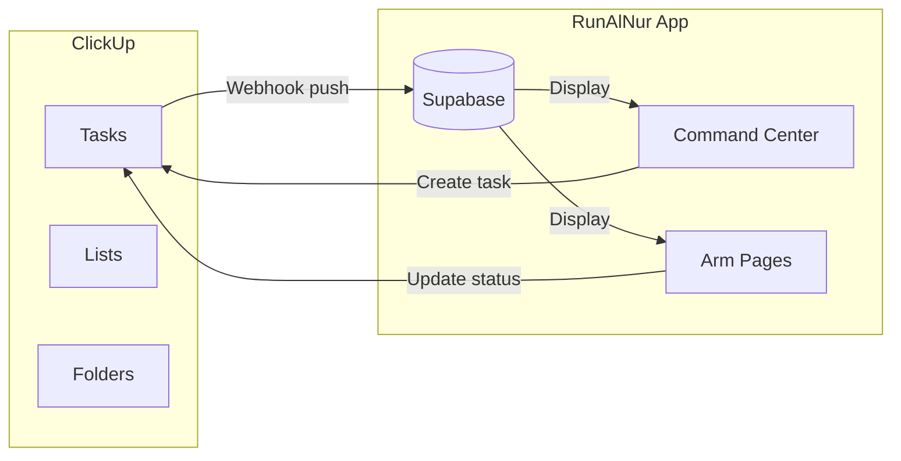

# ClickUp + RunAlNur Command Site Integration

## Understanding the Landscape

### ClickUp API Capabilities

| Action | API Support | Notes |

|--------|-------------|-------|

| Create Folders | Yes | `POST /space/{id}/folder` |

| Create Lists | Yes | `POST /folder/{id}/list` |

| Create Tasks | Yes | `POST /list/{id}/task` with custom fields |

| Read hierarchy | Yes | Workspaces, Spaces, Folders, Lists, Tasks |

| **Create Statuses** | **No** | Must be done manually in UI |

| **Create Views** | **No** | Gantt/Board/Calendar - manual only |

| **Status Templates** | **No** | Apply manually in UI |

| Set Custom Fields | Yes | On tasks only |

### Arm-to-Space Mapping

```
RunAlNur Arms         ClickUp Spaces
─────────────────────────────────────────
nova      ←→  "Nova"
janna     ←→  "Janna"  
atw       ←→  "Arabia & The World"
obx       ←→  "OBX / Obi Alfred"
house     ←→  "House Al Nūr – Corporate"
silk      ←→  (not in ClickUp yet)
maison    ←→  (not in ClickUp yet)
```

---

## Part 1: ClickUp Setup Automation

### What We Will Automate

1. **Create missing folders** in each Space per spec
2. **Create all lists** inside each folder
3. **Create seed tasks** with proper names in each list
4. **Skip existing items** (idempotent - safe to run multiple times)

### What Requires Manual UI Work

1. **Status Template "Standard – Al Nūr"**: Create once with statuses (Backlog, In Progress, Blocked, Review, Done), then apply to each Space/Folder
2. **Views**: Add Board/Gantt/Calendar views manually
3. **Dependencies**: Enable in Casablanca Projects list manually
4. **Custom Field Defaults**: Set Brand default per Space manually

### Implementation Files

| File | Purpose |

|------|---------|

| [`lib/integrations/clickup.ts`](runalnur-app/lib/integrations/clickup.ts) | Add `createFolder()`, `createList()` methods |

| `lib/clickup/house-al-nur-spec.ts` (new) | Complete spec as typed data structure |

| `lib/clickup/setup-executor.ts` (new) | Idempotent setup logic |

| `app/api/clickup/setup/route.ts` (new) | POST to execute, GET to check status |

---

## Part 2: RunAlNur Command Site Integration

### Current State

- App stores Projects, Tasks, Contacts in **Supabase**
- ClickUp integration can **read** but doesn't sync to local DB
- HubSpot contacts **do sync** into local DB

### Proposed Architecture



### Integration Features

**1. Space-to-Arm Mapping Config**

Add to [`lib/constants.ts`](runalnur-app/lib/constants.ts):

```typescript
export const CLICKUP_SPACE_MAP: Record<ArmId, string> = {
  nova: "Nova",
  janna: "Janna",
  atw: "Arabia & The World",
  obx: "OBX / Obi Alfred", 
  house: "House Al Nūr – Corporate",
  silk: "", // Not in ClickUp
  maison: "", // Not in ClickUp
};
```

**2. ClickUp Task Sync (Optional)**

New hook `useClickUpTasks(armId)` that:

- Fetches tasks from ClickUp Space matching the arm
- Optionally caches to Supabase for offline/fast queries
- Shows in Arm pages alongside local tasks

**3. Dashboard ClickUp Widget**

On Command Center, show:

- Tasks due today from ClickUp
- Recent ClickUp activity  
- Quick-create task button (pushes to ClickUp)

**4. Webhook Handler** (already exists)

[`app/api/clickup/webhook/route.ts`](runalnur-app/app/api/clickup/webhook/route.ts) - receives task updates from ClickUp and can update local cache.

---

## Execution Order

### Phase 1: ClickUp Client Extension

- Add `createFolder`, `createList` to client

### Phase 2: Setup Spec + Executor  

- Create data file with full spec
- Create executor that builds structure idempotently

### Phase 3: Setup API + UI

- POST endpoint to run setup
- Button in Settings with progress

### Phase 4: App Integration (optional, can defer)

- Space-to-Arm mapping
- ClickUp tasks widget on dashboard
- Sync preference in settings

---

## Manual Checklist (After Automation Runs)

Run these in ClickUp UI after the script completes:

1. [ ] Create status template "Standard – Al Nūr" (Backlog → In Progress → Blocked → Review → Done)
2. [ ] Apply template to all 5 Spaces
3. [ ] Add Board view to every List
4. [ ] Add Gantt view to: Janna → Casablanca Projects, Nova → Studio Pro Gen1 Launch
5. [ ] Add Calendar view to: OBX → Release Calendar
6. [ ] Enable Dependencies in: Janna → Casablanca Projects
7. [ ] Set Brand default: Nova tasks = "Nova", etc.