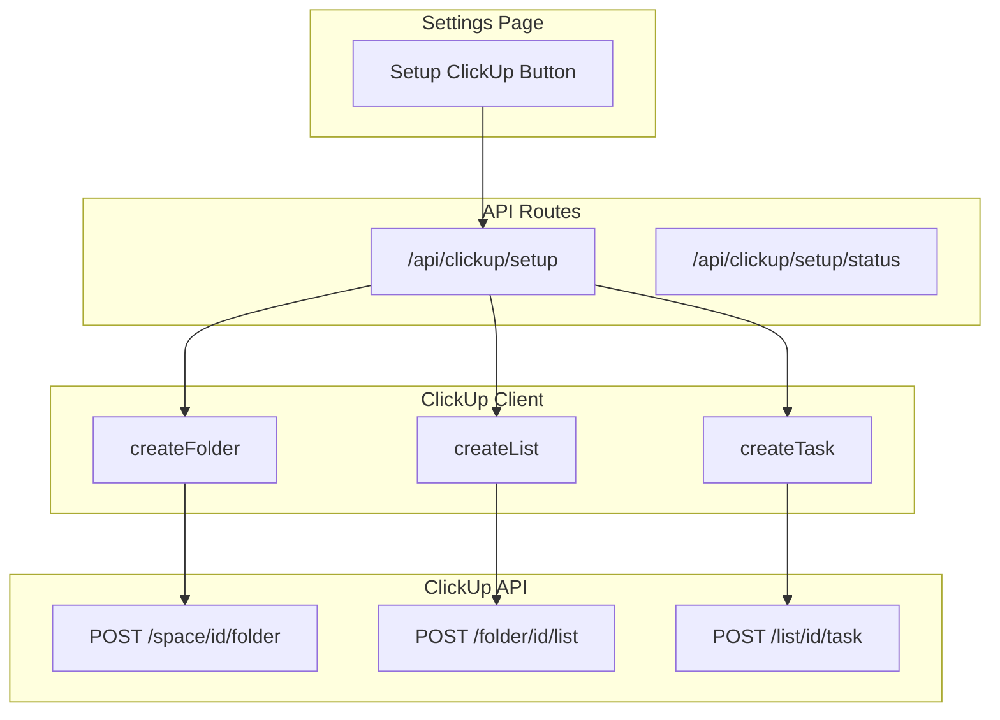

# ClickUp Full Setup Automation

## Current State

- ClickUp API key connected and working
- Client in [`lib/integrations/clickup.ts`](runalnur-app/lib/integrations/clickup.ts) supports read operations + task CRUD
- Missing: folder creation, list creation, bulk seeding

## Architecture



## Implementation

### 1. Extend ClickUp Client

Add to [`lib/integrations/clickup.ts`](runalnur-app/lib/integrations/clickup.ts):

```typescript
// Create folder in a space
async createFolder(spaceId: string, name: string) {
  return this.request<{ id: string; name: string }>(`/space/${spaceId}/folder`, {
    method: 'POST',
    body: JSON.stringify({ name }),
  });
}

// Create list in a folder
async createList(folderId: string, name: string, options?: { status?: string }) {
  return this.request<ClickUpList>(`/folder/${folderId}/list`, {
    method: 'POST',
    body: JSON.stringify({ name, ...options }),
  });
}

// Create folderless list in a space
async createFolderlessList(spaceId: string, name: string) {
  return this.request<ClickUpList>(`/space/${spaceId}/list`, {
    method: 'POST',
    body: JSON.stringify({ name }),
  });
}
```

### 2. Create Setup Spec Data File

New file: `lib/clickup/house-al-nur-spec.ts`

Contains the complete structure as typed data:

- Spaces with their IDs (fetched dynamically by name)
- Folders per space
- Lists per folder
- Seed tasks per list
- Custom field defaults

### 3. Create Setup Executor

New file: `lib/clickup/setup-executor.ts`

Logic to:

1. Fetch existing spaces by name to get IDs
2. For each space: check existing folders, create missing ones
3. For each folder: check existing lists, create missing ones  
4. For each list: create seed tasks (skip if task name exists)
5. Return progress/results

### 4. Create API Endpoint

New file: `app/api/clickup/setup/route.ts`

- `POST` - Execute setup (returns job ID for long-running)
- `GET` - Check setup status / what's already done

### 5. Add UI Trigger

Update [`app/settings/page.tsx`](runalnur-app/app/settings/page.tsx):

- Add "Setup ClickUp Structure" button in ClickUp integration card
- Shows progress modal during execution
- Reports what was created vs already existed

## Scope

**Will automate:**

- All folders in all 5 spaces (Corporate, Nova, Janna, ATW, OBX)
- All lists inside each folder
- All seed tasks with names from the spec

**Will NOT automate (ClickUp API limitations):**

- Status templates (must be created manually once, then applied)
- Views (List/Board/Gantt/Calendar) - API doesn't support view creation
- Custom field defaults per space - must be set in UI
- Dependencies on tasks - can add after initial setup

**Skip entirely:**

- Personal space (as specified)