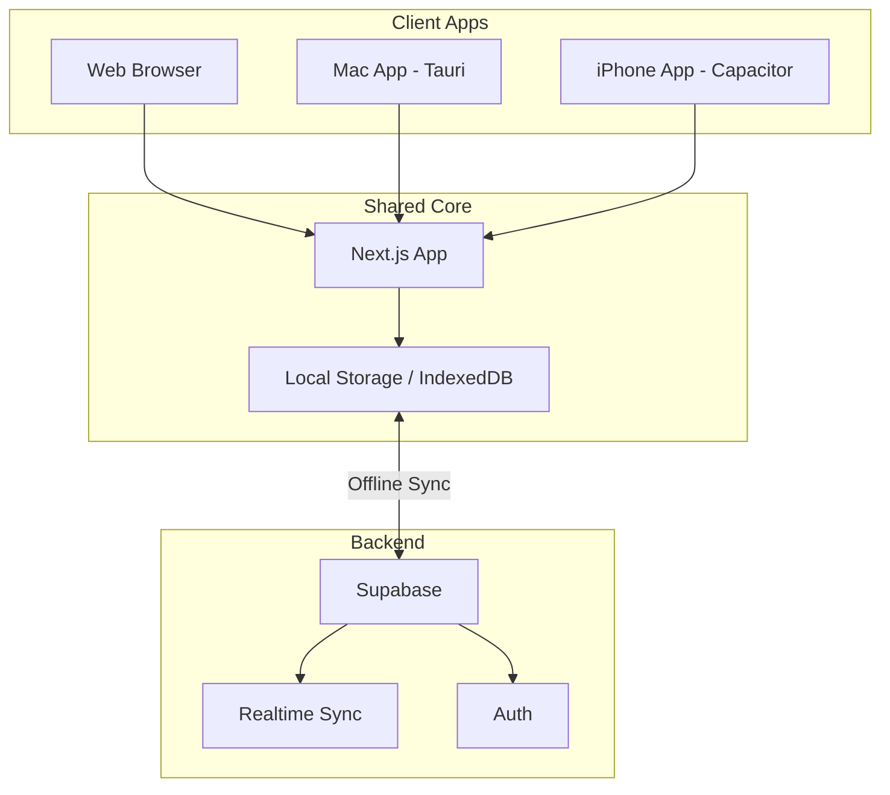
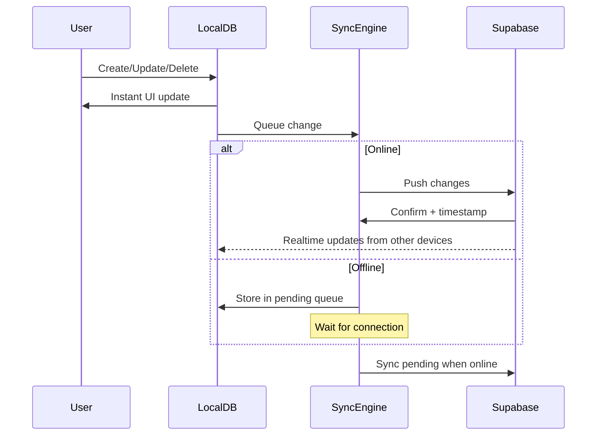

# Cross-Platform RunAlNur: Web + Mac + iPhone

## Architecture Overview



## Recommended Stack

| Platform | Technology | Why |

|----------|------------|-----|

| Web | Next.js (existing) | Already built, works great |

| Mac | Tauri | Small bundle, native performance, uses your web code |

| iPhone | Capacitor | Wraps web app, provides native APIs (push, offline) |

| Sync | Supabase Realtime | Already integrated, handles conflict resolution |

| Offline | IndexedDB + Supabase offline | Works across all platforms |

## Phase 1: Offline-First Architecture

Before adding native apps, make the web app work offline:

### 1.1 Service Worker Setup

- Add `next-pwa` for service worker generation
- Cache static assets and API responses
- Enable app to load without internet

### 1.2 Local Database Layer

- Add `Dexie.js` (IndexedDB wrapper) for local storage
- Mirror Supabase schema locally
- All reads/writes go to local DB first

### 1.3 Sync Engine

- Queue changes when offline
- Sync to Supabase when online
- Handle conflict resolution (last-write-wins or custom)
- Use Supabase Realtime for live updates

**Key Files:**

- `lib/db/local.ts` - Dexie.js local database
- `lib/db/sync.ts` - Sync engine
- `lib/hooks/useOfflineFirst.ts` - Hook for offline-first data
- `public/sw.js` - Service worker (auto-generated)

---

## Phase 2: Mac Desktop App (Tauri)

Tauri wraps your Next.js app in a native Mac window with minimal overhead.

### 2.1 Tauri Setup

```
runalnur-app/
  src-tauri/           # Tauri native code
    src/
      main.rs          # Rust entry point
    tauri.conf.json    # App config
    Cargo.toml
```

### 2.2 Features

- Native Mac menu bar
- Keyboard shortcuts (Cmd+K for command palette)
- System notifications
- Auto-updater
- Menu bar quick access (optional)

### 2.3 Build & Distribution

- `npm run tauri build` produces `.dmg` installer
- Can notarize for Mac App Store later
- Direct download initially (fastest)

**Commands:**

```bash
npm install -D @tauri-apps/cli
npm run tauri init
npm run tauri dev   # Development
npm run tauri build # Production .dmg
```

---

## Phase 3: iPhone App (Capacitor)

Capacitor wraps your web app but provides native iOS capabilities.

### 3.1 Capacitor Setup

```
runalnur-app/
  ios/                 # Native iOS project
    App/
      AppDelegate.swift
      Info.plist
  capacitor.config.ts
```

### 3.2 Native Plugins Needed

- `@capacitor/push-notifications` - Push notifications
- `@capacitor/local-notifications` - Local alerts
- `@capacitor/network` - Online/offline detection
- `@capacitor/preferences` - Local storage
- `@capacitor/haptics` - Tactile feedback

### 3.3 Push Notifications

- Set up Apple Push Notification service (APNs)
- Backend sends notifications via Supabase Edge Functions
- Token stored in user profile

### 3.4 iOS-Specific UI Polish

- Safe area handling for notch/Dynamic Island
- iOS-style navigation gestures
- Native status bar integration
- Haptic feedback on actions

### 3.5 Build & Distribution

- Open `ios/` folder in Xcode
- TestFlight for beta testing
- App Store submission when ready

**Commands:**

```bash
npm install @capacitor/core @capacitor/cli
npx cap init RunAlNur com.runalnur.app
npx cap add ios
npx cap sync
npx cap open ios  # Opens in Xcode
```

---

## Phase 4: Unified Sync System

All three platforms use the same sync logic:



### Conflict Resolution Strategy

- Each record has `updated_at` timestamp
- Last-write-wins for most fields
- Special handling for critical data (show conflict UI)

---

## Phase 5: Push Notification Infrastructure

### 5.1 Notification Types

- Task due reminders
- Project status changes
- AI briefing ready
- @mentions from team

### 5.2 Backend Setup

- Supabase Edge Function for sending notifications
- Store device tokens per user
- Notification preferences in user settings

### 5.3 APNs Configuration

- Create Apple Developer certificate
- Configure in Capacitor
- Test with TestFlight

---

## Implementation Priority

| Order | Phase | Effort | Impact |

|-------|-------|--------|--------|

| 1 | Offline-First Architecture | 6-8 hrs | Enables everything else |

| 2 | Mac App (Tauri) | 4-6 hrs | Quick win, you use Mac daily |

| 3 | iPhone App (Capacitor) | 6-8 hrs | Mobile access |

| 4 | Push Notifications | 4-6 hrs | Stay informed |

| 5 | Polish & Optimize | 4-6 hrs | Native feel refinements |

**Total: ~24-34 hours additional development**

---

## Alternative: Full Native (Future Option)

If you later want the absolute best native experience, you could build:

- **SwiftUI app for iOS/Mac** (shared codebase via Swift)
- Keep Next.js for web only
- Same Supabase backend

This would be ~80-120 hours but give you App Store-quality native apps. The Capacitor/Tauri approach gets you 80% of the way there in 25% of the time.

---

## What You'll Need

1. **Apple Developer Account** ($99/year) - Required for iOS app distribution
2. **Rust installed** - For Tauri (`curl --proto '=https' --tlsv1.2 -sSf https://sh.rustup.rs | sh`)
3. **Xcode installed** - For iOS builds
4. **Push notification certificate** - From Apple Developer portal

---

## Sync Guarantee

With Supabase Realtime + offline-first architecture:

- Changes on iPhone appear on Mac within seconds (when online)
- Changes made offline sync automatically when connection returns
- No data loss - everything is persisted locally first