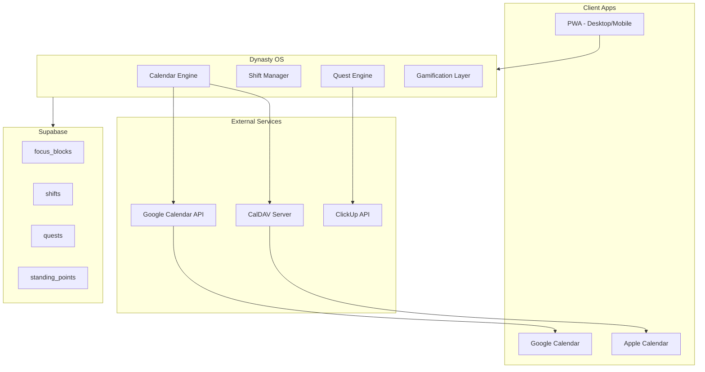
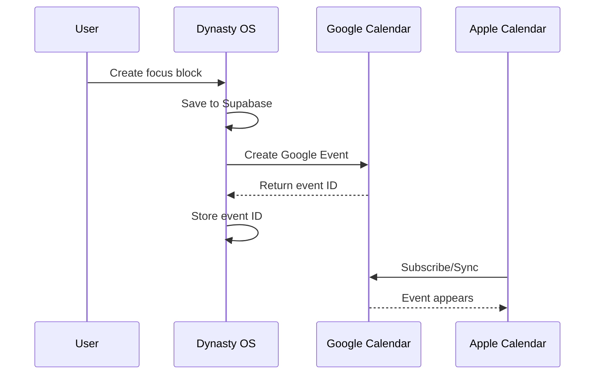

# Dynasty Calendar & Quest System

A complete time management and gamified productivity system for House Al Nur - covering the Chairman's multi-venture focus blocks, employee shift scheduling, Apple/Google Calendar sync, and an RPG-inspired quest system.

---

## Architecture Overview



---

## Phase 1: PWA Foundation & Calendar Infrastructure

**Goal**: Make Dynasty OS installable on desktop and phone, set up calendar sync infrastructure.

### 1.1 PWA Setup

- Add `next-pwa` configuration to [`next.config.ts`](runalnur-app/next.config.ts)
- Enhance existing [`manifest.json`](runalnur-app/public/manifest.json) with full PWA capabilities
- Add service worker for offline support
- Configure install prompts for desktop and mobile
- Test installation on macOS, iOS, Android

### 1.2 Calendar Sync Infrastructure

- **Google Calendar API** integration:
  - OAuth2 flow for user authorization
  - Create/update/delete events
  - Watch for changes (webhooks)

- **Apple Calendar** via CalDAV:
  - Option A: Use Google Calendar as hub, Apple subscribes (simpler)
  - Option B: Direct CalDAV support via `tsdav` library (more complex but bi-directional)

- **Recommendation**: Start with Google Calendar API as the sync target. Users can subscribe to it from Apple Calendar for read access. Add direct CalDAV later for full bi-directional sync.

### 1.3 Database Schema Additions

```sql
-- Focus blocks for Chairman
CREATE TABLE focus_blocks (
  id UUID PRIMARY KEY,
  user_id UUID REFERENCES auth.users,
  title VARCHAR(255) NOT NULL,
  context VARCHAR(50) NOT NULL, -- 'nova', 'janna', 'obx', 'house', 'personal', 'admin', 'training'
  start_time TIMESTAMPTZ NOT NULL,
  end_time TIMESTAMPTZ NOT NULL,
  recurrence_rule TEXT, -- iCal RRULE format
  color VARCHAR(7), -- hex color per context
  google_event_id TEXT, -- sync reference
  notes TEXT,
  completed BOOLEAN DEFAULT FALSE,
  created_at TIMESTAMPTZ DEFAULT NOW()
);

-- Employee shifts
CREATE TABLE employee_shifts (
  id UUID PRIMARY KEY,
  employee_id UUID REFERENCES auth.users,
  arm VARCHAR(50), -- which business arm
  shift_type VARCHAR(50), -- 'morning', 'evening', 'night', 'custom'
  start_time TIMESTAMPTZ NOT NULL,
  end_time TIMESTAMPTZ NOT NULL,
  break_minutes INTEGER DEFAULT 0,
  status VARCHAR(20) DEFAULT 'scheduled', -- 'scheduled', 'completed', 'missed', 'swapped'
  google_event_id TEXT,
  notes TEXT,
  created_at TIMESTAMPTZ DEFAULT NOW()
);

-- Gamification: Standing points
CREATE TABLE standing_points (
  id UUID PRIMARY KEY,
  user_id UUID REFERENCES auth.users,
  domain VARCHAR(50) NOT NULL, -- 'command', 'capital', 'influence', 'reliability', 'growth'
  points INTEGER DEFAULT 0,
  level INTEGER DEFAULT 1,
  streak_days INTEGER DEFAULT 0,
  last_activity_at TIMESTAMPTZ,
  updated_at TIMESTAMPTZ DEFAULT NOW()
);

-- Quests/Tasks with gamification
CREATE TABLE quests (
  id UUID PRIMARY KEY,
  user_id UUID REFERENCES auth.users,
  title VARCHAR(255) NOT NULL,
  description TEXT,
  context VARCHAR(50), -- which venture/mode
  quest_type VARCHAR(20) DEFAULT 'task', -- 'task', 'daily', 'weekly', 'milestone'
  points_reward INTEGER DEFAULT 10,
  domain VARCHAR(50), -- which standing domain
  due_date TIMESTAMPTZ,
  completed_at TIMESTAMPTZ,
  clickup_task_id TEXT, -- sync reference
  created_at TIMESTAMPTZ DEFAULT NOW()
);

-- Achievements
CREATE TABLE achievements (
  id UUID PRIMARY KEY,
  user_id UUID REFERENCES auth.users,
  achievement_key VARCHAR(100) NOT NULL,
  title VARCHAR(255) NOT NULL,
  description TEXT,
  unlocked_at TIMESTAMPTZ DEFAULT NOW(),
  UNIQUE(user_id, achievement_key)
);
```

---

## Phase 2: Chairman's Focus Block System

**Goal**: Build a comprehensive time allocation system across all ventures.

### 2.1 Context Definitions

| Context | Color | Description |

|---------|-------|-------------|

| **Nova** | `#3B82F6` (Blue) | Technology, AI, hardware |

| **Janna** | `#10B981` (Green) | Real estate development |

| **OBX** | `#8B5CF6` (Purple) | Music, creative |

| **House** | `#F59E0B` (Amber) | Family office, dynasty matters |

| **Personal** | `#EC4899` (Pink) | Health, relationships, self |

| **Admin** | `#6B7280` (Gray) | Operations, paperwork |

| **Training** | `#EF4444` (Red) | Real estate broker training |

### 2.2 Focus Block UI Components

**Weekly View** (`components/calendar/WeekView.tsx`):

- Time grid showing all 7 days
- Color-coded blocks by context
- Drag to create new blocks
- Click to edit
- Current time indicator

**Block Editor** (`components/calendar/BlockEditor.tsx`):

- Context selector with colors
- Start/end time pickers
- Recurrence options (daily, weekly, custom)
- Notes field
- Sync status indicator

**Context Switcher** (in sidebar):

- Filter view by context
- See time allocation stats
- "This week you've allocated: Nova 12h, Janna 8h, ..."

### 2.3 Calendar Sync Flow



---

## Phase 3: Employee Shift System

**Goal**: Proper shift scheduling for House Al Nur employees.

### 3.1 Shift Management Features

- **Shift Templates**: Define recurring shift patterns
- **Shift Assignment**: Assign employees to shifts
- **Shift Calendar**: Visual calendar of all employee shifts
- **Swap Requests**: Employees can request shift swaps
- **Availability**: Employees set their availability
- **Notifications**: Reminders before shifts

### 3.2 Employee Portal (Simplified View)

Employees see a simplified version:

- Their upcoming shifts
- Ability to mark availability
- Request time off / swap
- See their Standing (gamification)
- Basic achievements

### 3.3 Admin View (Chairman)

You see:

- All employee shifts at a glance
- Coverage gaps
- Approve/deny swap requests
- Shift analytics

---

## Phase 4: Gamification - The Quest System

**Goal**: Make productivity addictive without being cringe.

### 4.1 Standing System (Not "XP")

| Domain | Earned By | Tied To |

|--------|-----------|---------|

| **Command** | Completing tasks, decisions made | Command mode activities |

| **Capital** | Financial tasks, investment reviews | Capital mode activities |

| **Influence** | Relationship touchpoints, meetings | Influence mode activities |

| **Reliability** | Shift completion, consistency | Showing up |

| **Growth** | Learning, training, skill development | Personal development |

### 4.2 Titles Progression

| Level | Title | Standing Required |

|-------|-------|-------------------|

| 1 | Initiate | 0 |

| 2 | Steward | 100 |

| 3 | Chamberlain | 500 |

| 4 | Vizier | 1,500 |

| 5 | Regent | 5,000 |

| 6 | **Chairman** | (Your permanent title) |

Employees progress through titles. You're always Chairman.

### 4.3 Quest Types

- **Daily Quests**: Small recurring tasks (review inbox, check metrics)
- **Weekly Quests**: Larger objectives (complete project milestone)
- **Milestone Quests**: Major achievements (launch product, close deal)
- **Side Quests**: Optional bonus objectives

### 4.4 ClickUp Integration

- Pull tasks from ClickUp into Dynasty OS
- Completing in either system syncs
- Dynasty OS adds the Standing reward layer
- Tasks display with context coloring and point values

### 4.5 Streak System

- **Days of Continuity**: Consecutive days completing daily quests
- Visual streak counter (like GitHub contribution graph)
- Streak milestones unlock achievements
- "Streak Shields" - miss one day without losing streak (earned through consistency)

### 4.6 Achievement Examples

| Achievement | Condition | Rarity |

|-------------|-----------|--------|

| **First Blood** | Complete first quest | Common |

| **Week Warrior** | 7-day streak | Common |

| **Month of Focus** | 30-day streak | Rare |

| **Century** | 100-day streak | Epic |

| **Domain Master** | Max out one Standing domain | Legendary |

| **Renaissance** | High standing in all domains | Legendary |

---

## Phase 5: UI/UX & Animations

**Goal**: Polish, professional feel with satisfying micro-interactions.

### 5.1 Animation Tokens (extend existing [`lib/motion/tokens.ts`](runalnur-app/lib/motion/tokens.ts))

- Block drag animations
- Standing point increment animations (numbers ticking up)
- Achievement unlock animation (subtle, satisfying)
- Streak fire effect (minimal, not cartoonish)
- Level up transition

### 5.2 Mobile Optimization

- Responsive calendar views
- Touch-friendly block creation
- Swipe gestures for navigation
- Bottom sheet for block editor
- Pull to refresh

### 5.3 Desktop Experience

- Keyboard shortcuts (n for new block, etc.)
- Multi-select blocks
- Drag and drop
- Side panel for quick stats

---

## Implementation Order

### Today's Priority (Get it Running)

1. **PWA Setup** - Make it installable
2. **Focus Block Schema** - Database tables
3. **Basic Calendar UI** - Week view with blocks
4. **Google Calendar OAuth** - Connect account
5. **Sync Flow** - Create blocks → sync to Google

### This Week

6. **Block Editor** - Full CRUD for focus blocks
7. **Context System** - Colors, filtering
8. **Apple Calendar** - Subscribe instructions or CalDAV
9. **Standing System** - Basic points tracking
10. **Quest List** - Simple task list with rewards

### Next Week

11. **Employee Shifts** - Full shift management
12. **ClickUp Sync** - Pull tasks, add game layer
13. **Achievements** - Unlock system
14. **Streak Tracking** - Visual streak display
15. **Polish** - Animations, mobile refinement

---

## Key Files to Create/Modify

| File | Purpose |

|------|---------|

| `lib/calendar/google.ts` | Google Calendar API client |

| `lib/calendar/sync.ts` | Sync logic between Dynasty OS and calendars |

| `components/calendar/WeekView.tsx` | Main calendar interface |

| `components/calendar/BlockEditor.tsx` | Create/edit focus blocks |

| `components/calendar/ContextPicker.tsx` | Select Nova/Janna/etc. |

| `components/gamification/StandingCard.tsx` | Display standing points |

| `components/gamification/QuestList.tsx` | Task list with rewards |

| `components/gamification/StreakDisplay.tsx` | Streak counter |

| `components/gamification/AchievementToast.tsx` | Achievement unlock notification |

| `app/calendar/page.tsx` | Calendar page |

| `app/quests/page.tsx` | Quest/task management |

| `app/api/calendar/sync/route.ts` | Calendar sync API |

| `app/api/gamification/complete/route.ts` | Quest completion API |

---

## Success Criteria

- [ ] Dynasty OS installable as PWA on desktop and phone
- [ ] Focus blocks sync to Google Calendar → visible in Apple Calendar
- [ ] Chairman can schedule time across all ventures with visual clarity
- [ ] Basic Standing system tracks progress
- [ ] Completing tasks feels satisfying (animations, point rewards)
- [ ] System feels professional, not cringe
- [ ] Works smoothly on mobile