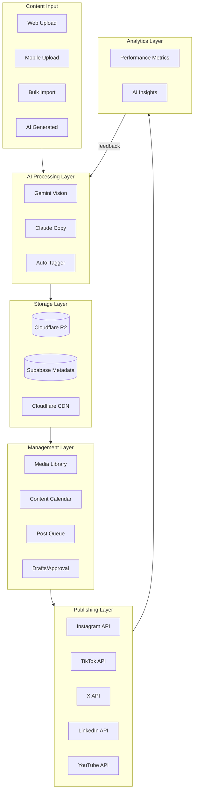

# Dynasty Media Pool & Social Media Command Center

A complete media management and social publishing system built into RunAlNur, designed for multi-entity scale with AI-powered automation.

---

## System Architecture



---

## Part 1: Storage Architecture

### Cloudflare R2 Setup

**Bucket Structure:**

```
runalnur-media/
├── originals/           # Full resolution originals (never deleted)
│   ├── {user_id}/
│   │   └── {year}/{month}/{uuid}.{ext}
├── processed/           # Optimized versions for web/app
│   ├── thumbnails/      # 400x400 for grid views
│   ├── preview/         # 1200px for preview
│   └── social/          # Platform-optimized sizes
├── videos/
│   ├── originals/
│   └── transcoded/      # Multiple qualities (480p, 720p, 1080p)
└── temp/                # Upload staging (auto-cleanup after 24h)
```

**Cost Projection:**

| Year | Est. Storage | Monthly Cost (R2) |

|------|--------------|-------------------|

| Year 1 | 500GB | ~$7.50 |

| Year 2 | 1.5TB | ~$22.50 |

| Year 3 | 3TB | ~$45 |

| Year 5 | 7TB | ~$105 |

**R2 Configuration:**

- Enable Cloudflare CDN for fast global delivery
- Set lifecycle rules: move `originals/` older than 2 years to infrequent access
- Enable versioning for accidental deletion protection
- CORS configured for direct browser uploads

### Environment Variables

```env
CLOUDFLARE_ACCOUNT_ID=xxx
CLOUDFLARE_R2_ACCESS_KEY=xxx
CLOUDFLARE_R2_SECRET_KEY=xxx
CLOUDFLARE_R2_BUCKET=runalnur-media
CLOUDFLARE_R2_PUBLIC_URL=https://media.runalnur.com
```

---

## Part 2: Database Schema

### Core Tables

```sql
-- ============================================================================
-- MEDIA ASSETS - Core media storage metadata
-- ============================================================================
CREATE TABLE media_assets (
  id UUID PRIMARY KEY DEFAULT uuid_generate_v4(),
  owner_id UUID NOT NULL REFERENCES auth.users(id) ON DELETE CASCADE,
  
  -- File info
  file_name VARCHAR(500) NOT NULL,
  file_type VARCHAR(50) NOT NULL, -- 'image', 'video', 'audio', 'document'
  mime_type VARCHAR(100) NOT NULL,
  file_size BIGINT NOT NULL, -- bytes
  
  -- Storage paths (R2)
  original_path TEXT NOT NULL,
  thumbnail_path TEXT,
  preview_path TEXT,
  
  -- Dimensions (for images/videos)
  width INTEGER,
  height INTEGER,
  duration_seconds INTEGER, -- for video/audio
  
  -- Organization
  entity_id TEXT REFERENCES arms(id), -- Which arm/entity owns this
  collection_id UUID REFERENCES media_collections(id),
  
  -- AI-generated metadata
  ai_description TEXT, -- Gemini-generated description
  ai_tags TEXT[] DEFAULT '{}', -- Auto-detected tags
  ai_people TEXT[] DEFAULT '{}', -- Detected people/faces
  ai_location TEXT, -- Detected or EXIF location
  ai_mood VARCHAR(50), -- luxury, casual, professional, etc.
  ai_colors TEXT[] DEFAULT '{}', -- Dominant colors
  ai_text_content TEXT, -- OCR extracted text
  
  -- Manual metadata
  title VARCHAR(500),
  description TEXT,
  manual_tags TEXT[] DEFAULT '{}',
  location_name VARCHAR(255),
  shot_date DATE,
  photographer VARCHAR(255),
  
  -- Usage tracking
  usage_count INTEGER DEFAULT 0,
  last_used_at TIMESTAMPTZ,
  
  -- Status
  status VARCHAR(20) DEFAULT 'active' CHECK (status IN (
    'processing', 'active', 'archived', 'deleted'
  )),
  is_favorite BOOLEAN DEFAULT false,
  is_brand_asset BOOLEAN DEFAULT false, -- Logos, brand elements
  
  -- Timestamps
  created_at TIMESTAMPTZ DEFAULT NOW(),
  updated_at TIMESTAMPTZ DEFAULT NOW(),
  archived_at TIMESTAMPTZ
);

-- ============================================================================
-- MEDIA COLLECTIONS - Folders/Albums
-- ============================================================================
CREATE TABLE media_collections (
  id UUID PRIMARY KEY DEFAULT uuid_generate_v4(),
  owner_id UUID NOT NULL REFERENCES auth.users(id) ON DELETE CASCADE,
  parent_id UUID REFERENCES media_collections(id), -- For nested folders
  
  name VARCHAR(255) NOT NULL,
  description TEXT,
  entity_id TEXT REFERENCES arms(id),
  
  cover_asset_id UUID REFERENCES media_assets(id),
  asset_count INTEGER DEFAULT 0,
  
  is_smart BOOLEAN DEFAULT false, -- Smart collection based on rules
  smart_rules JSONB, -- {"tags": ["dubai"], "entity": "janna", "date_range": {...}}
  
  created_at TIMESTAMPTZ DEFAULT NOW(),
  updated_at TIMESTAMPTZ DEFAULT NOW()
);

-- ============================================================================
-- SOCIAL ACCOUNTS - Connected social media accounts
-- ============================================================================
CREATE TABLE social_accounts (
  id UUID PRIMARY KEY DEFAULT uuid_generate_v4(),
  owner_id UUID NOT NULL REFERENCES auth.users(id) ON DELETE CASCADE,
  
  platform VARCHAR(20) NOT NULL CHECK (platform IN (
    'instagram', 'tiktok', 'x', 'linkedin', 'youtube', 'facebook', 'threads'
  )),
  
  -- Account info
  account_id VARCHAR(255) NOT NULL, -- Platform's user ID
  username VARCHAR(255) NOT NULL,
  display_name VARCHAR(255),
  profile_image_url TEXT,
  
  -- Which entity this account belongs to
  entity_id TEXT REFERENCES arms(id),
  account_type VARCHAR(50), -- 'personal', 'business', 'creator'
  
  -- OAuth tokens (encrypted)
  access_token_enc TEXT NOT NULL,
  refresh_token_enc TEXT,
  token_expires_at TIMESTAMPTZ,
  
  -- Account stats (cached)
  followers_count INTEGER,
  following_count INTEGER,
  posts_count INTEGER,
  stats_updated_at TIMESTAMPTZ,
  
  -- Status
  is_active BOOLEAN DEFAULT true,
  last_post_at TIMESTAMPTZ,
  last_sync_at TIMESTAMPTZ,
  
  created_at TIMESTAMPTZ DEFAULT NOW(),
  updated_at TIMESTAMPTZ DEFAULT NOW(),
  
  UNIQUE(owner_id, platform, account_id)
);

-- ============================================================================
-- SOCIAL POSTS - Scheduled and published posts
-- ============================================================================
CREATE TABLE social_posts (
  id UUID PRIMARY KEY DEFAULT uuid_generate_v4(),
  owner_id UUID NOT NULL REFERENCES auth.users(id) ON DELETE CASCADE,
  
  -- Content
  caption TEXT,
  hashtags TEXT[] DEFAULT '{}',
  
  -- Media attachments (ordered)
  media_ids UUID[] DEFAULT '{}', -- References media_assets
  
  -- Scheduling
  scheduled_for TIMESTAMPTZ,
  timezone VARCHAR(50) DEFAULT 'America/Chicago',
  
  -- Target accounts (can post to multiple at once)
  account_ids UUID[] NOT NULL, -- References social_accounts
  
  -- AI assistance
  ai_generated_captions JSONB, -- Array of AI suggestions
  ai_best_time_suggestion TIMESTAMPTZ,
  ai_hashtag_suggestions TEXT[],
  
  -- Status tracking per platform
  post_status JSONB DEFAULT '{}', 
  -- {"account_uuid": {"status": "published", "post_id": "xxx", "url": "xxx", "published_at": "xxx"}}
  
  -- Overall status
  status VARCHAR(20) DEFAULT 'draft' CHECK (status IN (
    'draft', 'pending_approval', 'approved', 'scheduled', 
    'publishing', 'published', 'failed', 'cancelled'
  )),
  
  -- Approval workflow
  submitted_by UUID REFERENCES auth.users(id),
  approved_by UUID REFERENCES auth.users(id),
  approved_at TIMESTAMPTZ,
  rejection_reason TEXT,
  
  -- Analytics (aggregated across platforms)
  total_likes INTEGER DEFAULT 0,
  total_comments INTEGER DEFAULT 0,
  total_shares INTEGER DEFAULT 0,
  total_views INTEGER DEFAULT 0,
  total_reach INTEGER DEFAULT 0,
  engagement_rate DECIMAL(5,2),
  analytics_updated_at TIMESTAMPTZ,
  
  created_at TIMESTAMPTZ DEFAULT NOW(),
  updated_at TIMESTAMPTZ DEFAULT NOW(),
  published_at TIMESTAMPTZ
);

-- ============================================================================
-- POST TEMPLATES - Reusable post templates
-- ============================================================================
CREATE TABLE post_templates (
  id UUID PRIMARY KEY DEFAULT uuid_generate_v4(),
  owner_id UUID NOT NULL REFERENCES auth.users(id) ON DELETE CASCADE,
  
  name VARCHAR(255) NOT NULL,
  description TEXT,
  entity_id TEXT REFERENCES arms(id),
  
  -- Template content
  caption_template TEXT, -- With placeholders like {{product_name}}
  default_hashtags TEXT[] DEFAULT '{}',
  
  -- Suggested media
  suggested_collection_id UUID REFERENCES media_collections(id),
  
  -- Scheduling preferences
  preferred_days TEXT[] DEFAULT '{}', -- ['monday', 'wednesday', 'friday']
  preferred_times TIME[] DEFAULT '{}', -- ['09:00', '18:00']
  
  usage_count INTEGER DEFAULT 0,
  
  created_at TIMESTAMPTZ DEFAULT NOW(),
  updated_at TIMESTAMPTZ DEFAULT NOW()
);

-- ============================================================================
-- CONTENT CALENDAR - High-level planning
-- ============================================================================
CREATE TABLE content_calendar (
  id UUID PRIMARY KEY DEFAULT uuid_generate_v4(),
  owner_id UUID NOT NULL REFERENCES auth.users(id) ON DELETE CASCADE,
  
  -- Planning
  title VARCHAR(255) NOT NULL,
  description TEXT,
  date DATE NOT NULL,
  entity_id TEXT REFERENCES arms(id),
  
  -- Content type
  content_type VARCHAR(50), -- 'photo', 'video', 'carousel', 'story', 'reel'
  theme VARCHAR(100), -- 'product launch', 'behind the scenes', 'educational'
  
  -- Linked post (if created)
  post_id UUID REFERENCES social_posts(id),
  
  -- Status
  status VARCHAR(20) DEFAULT 'planned' CHECK (status IN (
    'idea', 'planned', 'in_production', 'ready', 'posted'
  )),
  
  notes TEXT,
  
  created_at TIMESTAMPTZ DEFAULT NOW(),
  updated_at TIMESTAMPTZ DEFAULT NOW()
);

-- ============================================================================
-- ANALYTICS SNAPSHOTS - Historical performance data
-- ============================================================================
CREATE TABLE social_analytics (
  id UUID PRIMARY KEY DEFAULT uuid_generate_v4(),
  account_id UUID NOT NULL REFERENCES social_accounts(id) ON DELETE CASCADE,
  
  date DATE NOT NULL,
  
  -- Account metrics
  followers INTEGER,
  followers_change INTEGER,
  
  -- Content metrics (for the day)
  posts_count INTEGER DEFAULT 0,
  total_likes INTEGER DEFAULT 0,
  total_comments INTEGER DEFAULT 0,
  total_shares INTEGER DEFAULT 0,
  total_reach INTEGER DEFAULT 0,
  total_impressions INTEGER DEFAULT 0,
  
  -- Engagement
  engagement_rate DECIMAL(5,2),
  
  -- Best performing post of the day
  top_post_id UUID REFERENCES social_posts(id),
  
  created_at TIMESTAMPTZ DEFAULT NOW(),
  
  UNIQUE(account_id, date)
);

-- ============================================================================
-- INDEXES
-- ============================================================================
CREATE INDEX idx_media_assets_owner ON media_assets(owner_id);
CREATE INDEX idx_media_assets_entity ON media_assets(entity_id);
CREATE INDEX idx_media_assets_status ON media_assets(status);
CREATE INDEX idx_media_assets_tags ON media_assets USING GIN(ai_tags);
CREATE INDEX idx_media_assets_manual_tags ON media_assets USING GIN(manual_tags);
CREATE INDEX idx_media_assets_created ON media_assets(created_at DESC);
CREATE INDEX idx_media_assets_file_type ON media_assets(file_type);

CREATE INDEX idx_social_posts_owner ON social_posts(owner_id);
CREATE INDEX idx_social_posts_status ON social_posts(status);
CREATE INDEX idx_social_posts_scheduled ON social_posts(scheduled_for);
CREATE INDEX idx_social_posts_published ON social_posts(published_at DESC);

CREATE INDEX idx_social_accounts_owner ON social_accounts(owner_id);
CREATE INDEX idx_social_accounts_platform ON social_accounts(platform);
CREATE INDEX idx_social_accounts_entity ON social_accounts(entity_id);

CREATE INDEX idx_content_calendar_date ON content_calendar(date);
CREATE INDEX idx_content_calendar_entity ON content_calendar(entity_id);

-- ============================================================================
-- ROW LEVEL SECURITY
-- ============================================================================
ALTER TABLE media_assets ENABLE ROW LEVEL SECURITY;
ALTER TABLE media_collections ENABLE ROW LEVEL SECURITY;
ALTER TABLE social_accounts ENABLE ROW LEVEL SECURITY;
ALTER TABLE social_posts ENABLE ROW LEVEL SECURITY;
ALTER TABLE post_templates ENABLE ROW LEVEL SECURITY;
ALTER TABLE content_calendar ENABLE ROW LEVEL SECURITY;
ALTER TABLE social_analytics ENABLE ROW LEVEL SECURITY;

-- Policies (users can only access their own data)
CREATE POLICY "Users can manage own media" ON media_assets 
  FOR ALL USING (auth.uid() = owner_id);
CREATE POLICY "Users can manage own collections" ON media_collections 
  FOR ALL USING (auth.uid() = owner_id);
CREATE POLICY "Users can manage own social accounts" ON social_accounts 
  FOR ALL USING (auth.uid() = owner_id);
CREATE POLICY "Users can manage own posts" ON social_posts 
  FOR ALL USING (auth.uid() = owner_id);
CREATE POLICY "Users can manage own templates" ON post_templates 
  FOR ALL USING (auth.uid() = owner_id);
CREATE POLICY "Users can manage own calendar" ON content_calendar 
  FOR ALL USING (auth.uid() = owner_id);
CREATE POLICY "Users can view own analytics" ON social_analytics 
  FOR SELECT USING (
    EXISTS (SELECT 1 FROM social_accounts WHERE id = account_id AND owner_id = auth.uid())
  );
```

---

## Part 3: API Routes

### Media APIs

| Route | Method | Purpose |

|-------|--------|---------|

| `/api/media` | GET | List media with filters |

| `/api/media` | POST | Upload new media (multipart) |

| `/api/media/[id]` | GET | Get single asset details |

| `/api/media/[id]` | PATCH | Update metadata |

| `/api/media/[id]` | DELETE | Soft delete asset |

| `/api/media/bulk-upload` | POST | Bulk upload with progress |

| `/api/media/bulk-tag` | POST | Tag multiple assets |

| `/api/media/collections` | GET/POST | Manage collections |

| `/api/media/search` | GET | AI-powered search |

| `/api/media/upload-url` | POST | Get presigned R2 upload URL |

| `/api/media/process` | POST | Trigger AI processing |

### Social APIs

| Route | Method | Purpose |

|-------|--------|---------|

| `/api/social/accounts` | GET/POST | Manage connected accounts |

| `/api/social/accounts/[id]/auth` | GET | OAuth flow for platform |

| `/api/social/accounts/[id]/refresh` | POST | Refresh account stats |

| `/api/social/posts` | GET | List posts (drafts, scheduled, published) |

| `/api/social/posts` | POST | Create new post |

| `/api/social/posts/[id]` | PATCH | Update post |

| `/api/social/posts/[id]/schedule` | POST | Schedule post |

| `/api/social/posts/[id]/publish` | POST | Publish immediately |

| `/api/social/posts/[id]/approve` | POST | Approve for publishing |

| `/api/social/calendar` | GET | Get calendar view |

| `/api/social/analytics` | GET | Get analytics data |

| `/api/social/ai/caption` | POST | Generate AI captions |

| `/api/social/ai/hashtags` | POST | Generate hashtag suggestions |

| `/api/social/ai/best-time` | GET | Get optimal posting times |

### Webhook Endpoints (for platform callbacks)

| Route | Method | Purpose |

|-------|--------|---------|

| `/api/webhooks/instagram` | POST | Instagram webhook events |

| `/api/webhooks/tiktok` | POST | TikTok webhook events |

| `/api/webhooks/youtube` | POST | YouTube webhook events |

---

## Part 4: Platform API Integrations

### Instagram (Meta Graph API)

**Capabilities:**

- Post photos, carousels, reels, stories
- Read comments, insights
- Reply to comments
- Business/Creator accounts only

**Requirements:**

- Meta Business Account
- Facebook Page linked to Instagram
- App Review for permissions

**Key Endpoints:**

```typescript
// Post a photo
POST /{ig-user-id}/media
  image_url, caption, location_id

// Publish the media
POST /{ig-user-id}/media_publish
  creation_id

// Get insights
GET /{media-id}/insights
  metric=engagement,impressions,reach
```

### TikTok (Content Posting API)

**Capabilities:**

- Post videos
- Read video stats
- Limited compared to Instagram

**Requirements:**

- TikTok Developer Account
- Creator/Business account
- App review

**Key Endpoints:**

```typescript
// Initialize video upload
POST /v2/post/publish/video/init/

// Upload video chunks
POST /v2/post/publish/video/

// Get video info
GET /v2/video/query/
```

### X/Twitter (API v2)

**Capabilities:**

- Post tweets, threads
- Post images, videos
- Read engagement metrics

**Requirements:**

- Twitter Developer Account
- Pro tier ($100/month) for full posting

**Key Endpoints:**

```typescript
// Create tweet
POST /2/tweets
  {text, media: {media_ids}}

// Upload media
POST /1.1/media/upload.json
```

### LinkedIn (Marketing API)

**Capabilities:**

- Post to personal or company pages
- Images, videos, documents, articles
- Read analytics

**Requirements:**

- LinkedIn Developer App
- Marketing Developer Platform access

**Key Endpoints:**

```typescript
// Create post
POST /rest/posts
  {author, commentary, content, distribution}

// Upload image
POST /rest/images?action=initializeUpload
```

### YouTube (Data API v3)

**Capabilities:**

- Upload videos
- Manage playlists
- Read analytics (via YouTube Analytics API)

**Requirements:**

- Google Cloud Project
- YouTube channel
- OAuth 2.0

**Key Endpoints:**

```typescript
// Upload video
POST /upload/youtube/v3/videos
  snippet, status

// Get video stats
GET /youtube/v3/videos
  part=statistics
```

---

## Part 5: AI Integration

### Gemini Vision - Auto-Tagging Pipeline

```typescript
// lib/ai/media-tagger.ts

interface MediaAnalysis {
  description: string;
  tags: string[];
  people: string[];
  location: string | null;
  mood: 'luxury' | 'casual' | 'professional' | 'energetic' | 'calm';
  colors: string[];
  textContent: string | null;
  suggestedEntities: string[]; // Which arms this fits
  contentWarnings: string[]; // Any flags
}

async function analyzeMedia(imageUrl: string): Promise<MediaAnalysis> {
  const response = await gemini.generateContent({
    model: "gemini-2.0-flash",
    contents: [{
      parts: [
        { 
          text: `Analyze this image for a luxury lifestyle brand portfolio.
          
          Return JSON with:
        - description: Brief description of what's in the image
        - tags: Array of relevant tags (max 20)
        - people: Names if recognizable, or descriptions ("man in suit")
        - location: Where this was taken if identifiable
        - mood: One of: luxury, casual, professional, energetic, calm
        - colors: Dominant colors (hex codes)
        - textContent: Any text visible in the image
        - suggestedEntities: Which brands this fits (nova=tech, janna=realestate, 
            silk=ecommerce, atw=media, obx=music, nurullah=personal)
        - contentWarnings: Any potential issues (blurry, sensitive content, etc.)
          
          Respond with valid JSON only.`
        },
        { inlineData: { mimeType: "image/jpeg", data: imageBase64 } }
      ]
    }]
  });
  
  return JSON.parse(response.text());
}
```

### Claude - Caption Generation

```typescript
// lib/ai/caption-generator.ts

interface CaptionRequest {
  mediaDescription: string;
  entity: string;
  platform: 'instagram' | 'tiktok' | 'x' | 'linkedin' | 'youtube';
  tone: 'professional' | 'casual' | 'luxury' | 'educational';
  includeHashtags: boolean;
  maxLength?: number;
}

interface CaptionSuggestion {
  caption: string;
  hashtags: string[];
  estimatedEngagement: 'low' | 'medium' | 'high';
  reasoning: string;
}

async function generateCaptions(request: CaptionRequest): Promise<CaptionSuggestion[]> {
  const platformGuidelines = {
    instagram: "2200 char max, hashtags in caption or first comment, emojis welcome",
    tiktok: "150 char ideal, trending sounds matter, hook in first line",
    x: "280 char max, threads for longer content, minimal hashtags",
    linkedin: "Professional tone, 1300 char ideal, no hashtags in body",
    youtube: "Title 60 char, description 5000 char, keywords important"
  };

  const response = await anthropic.messages.create({
    model: "claude-opus-4-20250514",
    messages: [{
      role: "user",
      content: `Generate 3 caption options for this social media post.

Media: ${request.mediaDescription}
Brand/Entity: ${request.entity}
Platform: ${request.platform}
Platform Guidelines: ${platformGuidelines[request.platform]}
Tone: ${request.tone}

For each caption, provide:
- The caption text
- Relevant hashtags (if requested)
- Estimated engagement potential
- Brief reasoning

Respond with JSON array of 3 suggestions.`
    }]
  });
  
  return JSON.parse(response.content[0].text);
}
```

### Optimal Posting Time Analysis

```typescript
// lib/ai/posting-optimizer.ts

interface PostingTimeRecommendation {
  recommendedTime: Date;
  confidence: 'low' | 'medium' | 'high';
  reasoning: string;
  alternativeTimes: Date[];
}

async function getOptimalPostingTime(
  accountId: string,
  platform: string,
  contentType: string
): Promise<PostingTimeRecommendation> {
  // Fetch historical performance data
  const analytics = await getAccountAnalytics(accountId, 90); // Last 90 days
  
  // Analyze patterns
  const response = await anthropic.messages.create({
    model: "claude-opus-4-20250514",
    messages: [{
      role: "user", 
      content: `Analyze this social media performance data and recommend optimal posting times.

Platform: ${platform}
Content Type: ${contentType}
Historical Data: ${JSON.stringify(analytics)}

Consider:
- Day of week patterns
- Time of day patterns
- Content type performance
- Audience timezone (assume mix of US, UAE, UK)

Recommend the single best time and 3 alternatives.`
    }]
  });
  
  return JSON.parse(response.content[0].text);
}
```

---

## Part 6: Frontend Pages & Components

### Page Structure

```
/media                          → Media library grid view
/media/upload                   → Bulk upload page
/media/[id]                     → Single asset detail/edit
/media/collections              → Collections browser
/media/collections/[id]         → Single collection view

/social                         → Social dashboard (overview)
/social/accounts                → Manage connected accounts
/social/calendar                → Content calendar view
/social/posts                   → All posts list
/social/posts/new               → Create new post
/social/posts/[id]              → Edit/view post
/social/drafts                  → Drafts awaiting action
/social/analytics               → Performance analytics
/social/templates               → Post templates
```

### Key Components

```
components/media/
├── MediaGrid.tsx              → Infinite scroll grid with filters
├── MediaCard.tsx              → Single media thumbnail
├── MediaUploader.tsx          → Drag-drop upload with progress
├── MediaDetail.tsx            → Full asset view with metadata
├── MediaFilters.tsx           → Entity, date, tags, type filters
├── MediaSearch.tsx            → AI-powered search bar
├── CollectionPicker.tsx       → Select/create collections
├── BulkActions.tsx            → Tag, move, delete multiple
└── TagEditor.tsx              → Add/remove tags

components/social/
├── AccountCard.tsx            → Connected account display
├── AccountConnector.tsx       → OAuth flow UI
├── PostComposer.tsx           → Create/edit post with media
├── PostPreview.tsx            → Platform-specific preview
├── CaptionEditor.tsx          → Caption with AI suggestions
├── HashtagSuggester.tsx       → AI hashtag recommendations
├── SchedulePicker.tsx         → Date/time with optimal suggestions
├── CalendarView.tsx           → Month/week content calendar
├── PostCard.tsx               → Post in list view
├── AnalyticsChart.tsx         → Performance graphs
├── EngagementMetrics.tsx      → Likes, comments, reach display
└── ApprovalWorkflow.tsx       → Approve/reject UI
```

---

## Part 7: COO/AI Integration

### New AI Tools for Social Media

```typescript
// Add to lib/ai/tools.ts

export const SOCIAL_MEDIA_TOOLS = [
  {
    type: "function",
    function: {
      name: "upload_media",
      description: "Upload images or videos to the media library",
      parameters: {
        type: "object",
        properties: {
          urls: { type: "array", items: { type: "string" }, description: "URLs of media to upload" },
          entity: { type: "string", description: "Entity/arm to assign to (nova, janna, nurullah, etc.)" },
          tags: { type: "array", items: { type: "string" } },
          collection: { type: "string", description: "Collection name to add to" }
        },
        required: ["urls"]
      }
    }
  },
  {
    type: "function",
    function: {
      name: "search_media",
      description: "Search the media library for assets",
      parameters: {
        type: "object",
        properties: {
          query: { type: "string", description: "Search query (natural language)" },
          entity: { type: "string" },
          tags: { type: "array", items: { type: "string" } },
          type: { type: "string", enum: ["image", "video", "all"] },
          limit: { type: "number", default: 20 }
        },
        required: ["query"]
      }
    }
  },
  {
    type: "function",
    function: {
      name: "create_social_post",
      description: "Create a new social media post",
      parameters: {
        type: "object",
        properties: {
          caption: { type: "string" },
          media_ids: { type: "array", items: { type: "string" } },
          platforms: { type: "array", items: { type: "string" } },
          entity: { type: "string" },
          scheduled_for: { type: "string", description: "ISO datetime or 'now' or 'optimal'" },
          generate_caption: { type: "boolean", description: "Use AI to generate caption" }
        },
        required: ["platforms"]
      }
    }
  },
  {
    type: "function", 
    function: {
      name: "get_social_analytics",
      description: "Get social media performance analytics",
      parameters: {
        type: "object",
        properties: {
          account: { type: "string", description: "Account username or entity" },
          platform: { type: "string" },
          period: { type: "string", enum: ["today", "week", "month", "quarter"] }
        },
        required: ["period"]
      }
    }
  },
  {
    type: "function",
    function: {
      name: "schedule_content_batch",
      description: "Schedule multiple posts at once",
      parameters: {
        type: "object",
        properties: {
          posts: {
            type: "array",
            items: {
              type: "object",
              properties: {
                media_id: { type: "string" },
                caption: { type: "string" },
                platform: { type: "string" },
                scheduled_for: { type: "string" }
              }
            }
          }
        },
        required: ["posts"]
      }
    }
  }
];
```

### Example COO Conversations

**Uploading Media:**

```
User: "Here are photos from today's Dubai property tour"
[uploads 15 images]

COO: "Processing 15 images... Done. 

I've analyzed them and suggest:
- 8 → Janna (real estate shots)
- 4 → Nurullah personal (you in the shots)
- 3 → Could work for both

Auto-tagged with: dubai, luxury, real-estate, property-tour, 2026

Should I create a 'Dubai Property Tour Jan 2026' collection?"
```

**Creating Posts:**

```
User: "Post that sunset photo from yesterday to my Instagram"

COO: "Found the Dubai Marina sunset shot. Here are 3 caption options:

1. "Golden hour in Dubai Marina. This city never stops inspiring. 🌅"
   Hashtags: #DubaiLife #GoldenHour #DubaiMarina

2. "Some views never get old. Dubai, you have my heart."
   Hashtags: #Dubai #Sunset #CityViews

3. "Building an empire, one sunset at a time."
   Hashtags: #Entrepreneur #DubaiSunset #LuxuryLife

Best posting time: Today 6:30 PM (your followers most active)

Which caption? Or should I post now?"
```

**Analytics Check:**

```
User: "How's Nurullah's Instagram doing this week?"

COO: "Nurullah Instagram - Week Summary:

📊 Followers: 45,231 (+342 this week, +0.76%)
❤️ Total Engagement: 12,847 (up 23% from last week)
👁️ Reach: 89,420 accounts

Top Performing Post:
- Dubai skyline reel: 8.2K likes, 234 comments, 45K views
- Posted Tuesday 7 PM

Recommendation: Your reels are outperforming static posts 3x. 
Consider posting 2 more reels this week. I found 3 video clips 
in your library that could work. Want to see them?"
```

---

## Part 8: Implementation Phases

### Phase 1: Foundation (Week 1-2)

- Set up Cloudflare R2 bucket and CDN
- Create database migration
- Build media upload API with R2 integration
- Basic media library UI (grid, filters)
- Integrate Gemini for auto-tagging

### Phase 2: Media Management (Week 2-3)

- Collections and folders
- Bulk upload with progress
- Search functionality
- Media detail/edit page
- Tag management

### Phase 3: Social Accounts (Week 3-4)

- Instagram OAuth integration
- TikTok OAuth integration
- X/Twitter OAuth integration
- LinkedIn OAuth integration
- YouTube OAuth integration
- Account management UI

### Phase 4: Post Creation (Week 4-5)

- Post composer with media picker
- Platform-specific previews
- Caption editor with AI suggestions
- Hashtag generator
- Schedule picker with optimal times

### Phase 5: Publishing & Calendar (Week 5-6)

- Publishing queue system
- Background job for scheduled posts
- Content calendar UI
- Draft/approval workflow
- Post templates

### Phase 6: Analytics (Week 6-7)

- Fetch analytics from platforms
- Analytics dashboard
- Performance trends
- AI insights generation

### Phase 7: COO Integration (Week 7-8)

- Add social media tools to AI
- Natural language media search
- Conversational post creation
- Analytics queries via chat

---

## Part 9: Files to Create

**New Files:**

```
lib/
├── r2/
│   ├── client.ts              # R2 client setup
│   ├── upload.ts              # Upload utilities
│   └── presign.ts             # Presigned URLs
├── social/
│   ├── instagram.ts           # Instagram API client
│   ├── tiktok.ts              # TikTok API client
│   ├── x.ts                   # X/Twitter API client
│   ├── linkedin.ts            # LinkedIn API client
│   ├── youtube.ts             # YouTube API client
│   └── publisher.ts           # Unified publishing logic
├── ai/
│   ├── media-tagger.ts        # Gemini image analysis
│   ├── caption-generator.ts   # Claude captions
│   └── posting-optimizer.ts   # Optimal time analysis
├── hooks/
│   ├── useMedia.ts            # Media library hooks
│   ├── useMediaUpload.ts      # Upload with progress
│   ├── useSocialAccounts.ts   # Connected accounts
│   └── useSocialPosts.ts      # Posts management

app/
├── media/
│   ├── page.tsx
│   ├── upload/page.tsx
│   ├── [id]/page.tsx
│   └── collections/
│       ├── page.tsx
│       └── [id]/page.tsx
├── social/
│   ├── page.tsx
│   ├── accounts/page.tsx
│   ├── calendar/page.tsx
│   ├── posts/
│   │   ├── page.tsx
│   │   ├── new/page.tsx
│   │   └── [id]/page.tsx
│   ├── drafts/page.tsx
│   ├── analytics/page.tsx
│   └── templates/page.tsx
├── api/
│   ├── media/...
│   ├── social/...
│   └── webhooks/...

components/
├── media/...
└── social/...

supabase/migrations/
└── 20260120_media_social.sql
```

---

## Estimated Costs

| Service | Monthly Cost |

|---------|--------------|

| Cloudflare R2 (500GB) | ~$7.50 |

| Cloudflare CDN | Free (included) |

| X/Twitter API (Pro) | $100 |

| Meta API | Free |

| TikTok API | Free |

| LinkedIn API | Free |

| YouTube API | Free |

| Gemini API (~10K images/mo) | ~$5 |

| Claude API (~1K captions/mo) | ~$10 |

| **Total** | **~$125/month** |

As storage grows, R2 costs scale linearly. At 5TB, expect ~$75/month for storage alone.