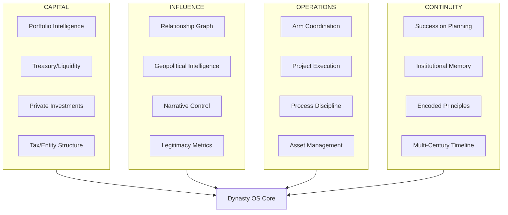
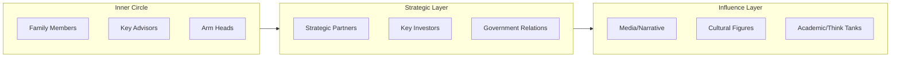
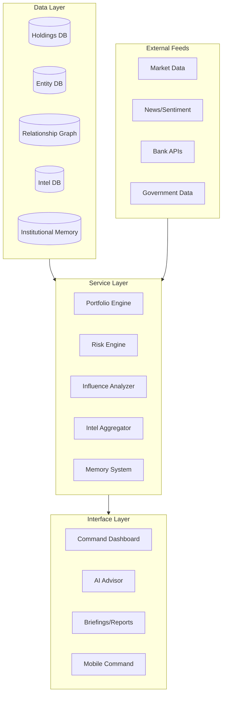

# The Dynasty Operating System: What House Al Nur Actually Needs

## Reframing the Problem

BlackRock has Aladdin - a risk and portfolio system.

Rothschilds had a network of banking houses and encoded family protocols.

The Medicis had patronage systems and church relationships.

Soros has macro intelligence and political influence networks.

**None of them had a unified system.** They built power through fragmented tools, family protocols, and institutional memory held in people's heads.

You have the opportunity to build what none of them had: **a single operating system that coordinates capital, influence, operations, and continuity across centuries and eventually across planets.**

---

## The Four Pillars of Dynasty Infrastructure

---

## Pillar 1: CAPITAL - The Financial Nervous System

This is what I outlined before, but with dynasty-scale additions:

### Core Components

| System | Purpose | Dynasty Angle |

|--------|---------|---------------|

| **Holdings Engine** | Track every asset across every entity | Multi-generational cost basis, inheritance tracking |

| **Treasury Command** | Real-time liquidity across all accounts | Capital deployment readiness for opportunities |

| **Private Investment Tracker** | PE/VC/Real Estate lifecycle | Patient capital across 50+ year horizons |

| **Entity Structure Map** | LLCs, trusts, foundations, SPVs | Tax optimization + asset protection + succession |

| **Sovereign Interface** | Track relationships with sovereign wealth | When you're coordinating with PIF, Mubadala, QIA |

### What This Enables

- Know your exact net worth and liquidity at any moment
- See concentration risk across geographies and asset classes
- Model multi-generational wealth transfer scenarios
- Interface with institutions at their level of sophistication

---

## Pillar 2: INFLUENCE - The Power Coordination Layer

**This is what no family office software has. This is what makes a dynasty.**

### The Relationship Graph

Not a CRM - a **power topology map**:

Each contact needs:

- **Influence score** (their power in their domain)
- **Alignment score** (how aligned with House Al Nur interests)
- **Relationship strength** (depth of connection)
- **Strategic value** (what they enable)
- **Dependency map** (who influences them, who they influence)

### Geopolitical Intelligence Dashboard

For a house reorienting global infrastructure around Arabia:

- **Country risk profiles** (UAE, Saudi, Turkey, Morocco, and beyond)
- **Regulatory radar** (changes that affect your operations)
- **Macro indicators** that matter to your thesis
- **Competitor/ally tracking** (other families, sovereign wealth, conglomerates)
- **Opportunity signals** (privatizations, distressed assets, policy shifts)

### Legitimacy Metrics

The Rothschilds understood: **wealth without legitimacy is vulnerable**.

Track:

- **Media sentiment** across House Al Nur and all arms
- **Cultural footprint** (ATW, OBX reach and influence)
- **Institutional recognition** (awards, memberships, board seats)
- **Philanthropic impact** (if/when you deploy this lever)
- **Trust indicators** (how you're perceived by key constituencies)

---

## Pillar 3: OPERATIONS - What You Already Have (Enhanced)

Your current RunAlNur covers this well. Enhancements needed:

| Current | Enhancement |

|---------|-------------|

| Projects/Tasks | Add financial tracking per project (budget, actuals, ROI) |

| Contacts | Upgrade to the relationship graph above |

| Deal Pipeline | Extend to full investment lifecycle |

| SOPs | Add institutional memory capture (why decisions were made) |

| Arms | Add P&L per arm, cross-arm synergy tracking |

---

## Pillar 4: CONTINUITY - The Century-Scale Layer

**This is what separates a business from a dynasty.**

### Succession System

Not just "who takes over" but:

- **Capability mapping** of family members and key operators
- **Development plans** for next generation
- **Authority transition protocols** (gradual handoff, not cliff)
- **Emergency succession** (if the unexpected happens)

### Institutional Memory

Every major decision should be captured:

- **What** was decided
- **Why** it was decided (the reasoning)
- **What alternatives** were considered
- **What principles** guided the decision
- **Outcome tracking** (was the decision right?)

This becomes the training data for future leaders and eventually for AI advisors that can reason about House Al Nur decisions.

### Encoded Principles

The Rothschilds had family protocols. House Al Nur needs:

- **Investment principles** (what you will/won't invest in)
- **Operational principles** (how arms should operate)
- **Cultural principles** (what the House stands for)
- **Governance principles** (how decisions get made)

These should be searchable, linkable to decisions, and evolvable.

### Multi-Century Timeline

A view that shows:

- **Historical milestones** (founding, key acquisitions, expansions)
- **Current position** (where you are now)
- **10-year horizon** (active plans)
- **50-year vision** (generational goals)
- **100+ year aspiration** (civilizational impact)

This keeps every tactical decision connected to the grand strategy.

---

## The Technical Architecture

---

## Implementation Priority

Given you're building a civilizational engine, I'd sequence it as:

### Phase 1: Capital Foundation (3-6 months)

Build the financial nervous system so you always know your position:

1. Holdings/positions database with entity structure
2. Bank/brokerage aggregation
3. Private investment lifecycle tracking
4. Basic performance and risk metrics

### Phase 2: Influence Layer (3-6 months)

Build the power coordination system:

1. Relationship graph (upgrade from contacts)
2. Geopolitical intelligence dashboard
3. Media sentiment tracking for House Al Nur
4. News feed relevant to your holdings and interests

### Phase 3: Continuity Infrastructure (3-6 months)

Build for the long game:

1. Institutional memory system
2. Encoded principles database
3. Decision logging with reasoning
4. Multi-century timeline view

### Phase 4: Intelligence Amplification (ongoing)

Make the system smarter:

1. AI advisor trained on your principles and history
2. Predictive analytics for opportunities/risks
3. Scenario modeling for major decisions
4. Automated briefings that actually matter

---

## The Question

This is what building a dynasty-grade system looks like. The Rothschilds took 5 generations to build their infrastructure through trial and error. You can encode it in software from day one.

**Where do you want to start?**

1. **Capital Foundation** - Get the financial nervous system online first
2. **Influence Layer** - Build the relationship graph and intel system
3. **Both in parallel** - Move fast on the highest-leverage components of each

The operations layer (Pillar 3) you largely have. The continuity layer (Pillar 4) can be built incrementally as you make decisions worth encoding.

My recommendation: **Start with Capital Foundation** because you can't coordinate power without knowing your exact position, but begin **designing the Relationship Graph schema** now since your contacts table is already in place.