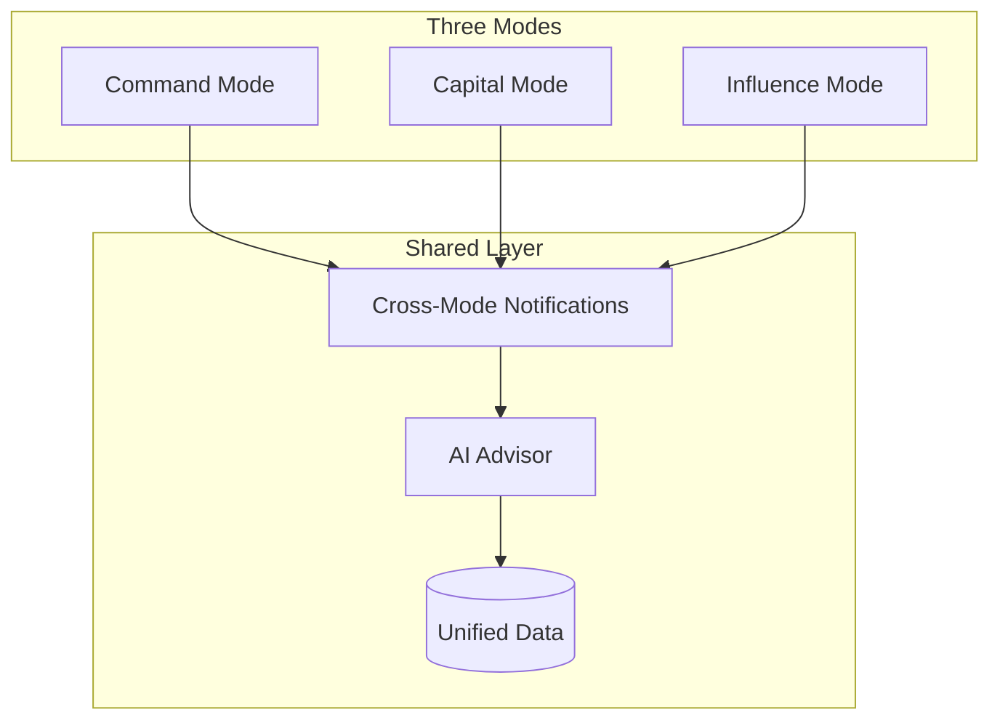

# Dynasty OS: Three Mode System with Cross-Mode Intelligence

## Overview

Transform RunAlNur into a 3-mode dynasty operating system where clicking the RN logo switches between Command, Capital, and Influence modes. Each mode has its own navigation while sharing a unified data layer and **cross-mode notification system** that ensures nothing falls through the cracks.

---

## Core Architecture



---

## Cross-Mode Notification System

**Key principle:** No matter which mode you're in, critical items from other modes surface. You can't hide from your responsibilities.

### Notification Types

| Type | Source Mode | Surfaces In | Priority |

|------|-------------|-------------|----------|

| Relationship Decay | Influence | All modes | Medium |

| Capital Call Due | Capital | All modes | High |

| Task Overdue | Command | All modes | High |

| Intel Alert | Influence | All modes | Varies |

| Cash Low | Capital | All modes | Critical |

| Meeting Prep Needed | Influence | Command | Medium |

### Notification Bell (Mode-Agnostic)

The existing notification bell in TopBar becomes mode-aware:

```
┌─────────────────────────────────────┐
│ 🔔 NOTIFICATIONS                    │
├─────────────────────────────────────┤
│                                     │
│ COMMAND                         (2) │
│ ├─ Task "Q1 Report" overdue         │
│ └─ Approval needed: Nova budget     │
│                                     │
│ CAPITAL                         (1) │
│ └─ Capital call due in 5 days       │
│                                     │
│ INFLUENCE                       (3) │
│ ├─ ⚠️ Ahmed Al-Rashid: 45 days      │
│ ├─ ⚠️ Sarah Chen: 30 days           │
│ └─ News: Mentioned in Bloomberg     │
│                                     │
└─────────────────────────────────────┘
```

Clicking a notification switches to that mode and navigates to the relevant item.

### Cross-Mode Dashboard Widgets

Each mode's dashboard shows a summary of other modes:

**In Command Mode:**

```
┌─────────────────────────────────────┐
│ CAPITAL SNAPSHOT                 →  │
│ NAV: $X.XM  •  Liquidity: $XXK     │
│ ⚠️ 1 capital call due this week    │
└─────────────────────────────────────┘

┌─────────────────────────────────────┐
│ RELATIONSHIP HEALTH              →  │
│ Score: 72/100  •  3 need attention │
│ Next: Call with Ahmed (Thursday)   │
└─────────────────────────────────────┘
```

**In Capital Mode:**

```
┌─────────────────────────────────────┐
│ OPERATIONS SNAPSHOT              →  │
│ 5 active projects  •  2 overdue    │
└─────────────────────────────────────┘

┌─────────────────────────────────────┐
│ RELATIONSHIP HEALTH              →  │
│ Score: 72/100  •  3 need attention │
└─────────────────────────────────────┘
```

---

## Influence Mode: Relationship Hand-Holding System

Since relationship maintenance doesn't come naturally, the system actively coaches:

### 1. Relationship Decay Engine

Every contact has:

- `last_contacted_at` - timestamp of last interaction
- `ideal_contact_frequency` - days between contacts (default: 30)
- `relationship_strength` - 1-100 score that decays over time
- `strategic_tier` - inner_circle, strategic, general

**Decay formula:**

```
strength = base_strength * (1 - days_since_contact / (ideal_frequency * 2))
```

Contacts drop into "needs attention" when strength falls below threshold.

### 2. Weekly Engagement List

Every Monday, auto-generated list:

```
┌─────────────────────────────────────────────────────┐
│ THIS WEEK'S ENGAGEMENTS                     Jan 20  │
├─────────────────────────────────────────────────────┤
│                                                     │
│ PRIORITY OUTREACH                                   │
│ ┌─────────────────────────────────────────────────┐ │
│ │ 1. Ahmed Al-Rashid                              │ │
│ │    Abu Dhabi Investment Authority               │ │
│ │    Last: 45 days ago  •  Strength: 62/100      │ │
│ │    Suggested: Coffee catch-up                   │ │
│ │    [Schedule] [Log Interaction] [Snooze]        │ │
│ └─────────────────────────────────────────────────┘ │
│                                                     │
│ ┌─────────────────────────────────────────────────┐ │
│ │ 2. Sarah Chen                                   │ │
│ │    Sequoia Capital                              │ │
│ │    Last: 30 days ago  •  Strength: 71/100      │ │
│ │    Suggested: Share Nova update                 │ │
│ │    [Email] [Log Interaction] [Snooze]           │ │
│ └─────────────────────────────────────────────────┘ │
│                                                     │
│ UPCOMING                                            │
│ • Thu: Call with Minister Khalid (scheduled)       │
│ • Fri: Dubai Finance Forum (3 contacts attending)  │
│                                                     │
│ IMPORTANT DATES THIS WEEK                           │
│ • Jan 22: Ahmed's birthday 🎂                       │
│ • Jan 24: Anniversary of Janna partnership         │
│                                                     │
└─────────────────────────────────────────────────────┘
```

### 3. Pre-Meeting Intelligence Brief

Before any scheduled meeting, auto-generated brief:

```
┌─────────────────────────────────────────────────────┐
│ MEETING BRIEF: Ahmed Al-Rashid           Thu 2:00pm│
├─────────────────────────────────────────────────────┤
│                                                     │
│ RELATIONSHIP                                        │
│ • Last met: Dec 5, 2025 (Dubai)                    │
│ • Relationship strength: 62/100 ⚠️                 │
│ • Your notes: "Interested in Nova Series B"        │
│                                                     │
│ RECENT NEWS                                         │
│ • ADIA announced $2B tech allocation (Jan 15)      │
│ • Ahmed promoted to Senior Director (Jan 8)        │
│                                                     │
│ TALKING POINTS                                      │
│ • Congratulate on promotion                        │
│ • Nova progress update (Series B timeline)         │
│ • Ask about ADIA tech thesis changes               │
│                                                     │
│ HISTORY                                             │
│ • Met at Web Summit 2024                           │
│ • 3 previous meetings                              │
│ • Introduced you to Sarah Chen                     │
│                                                     │
│ [Add to Notes] [Set Follow-up]                     │
└─────────────────────────────────────────────────────┘
```

### 4. Quick Interaction Logging

After any interaction, simple logging modal:

```
┌─────────────────────────────────────┐
│ LOG INTERACTION                     │
├─────────────────────────────────────┤
│                                     │
│ Contact: Ahmed Al-Rashid            │
│                                     │
│ Type: ○ Call  ○ Meeting  ○ Email    │
│       ○ Event  ○ Message  ○ Other   │
│                                     │
│ How did it go?                      │
│ ○ Great  ○ Good  ○ Neutral  ○ Cold  │
│                                     │
│ Quick notes (optional):             │
│ ┌─────────────────────────────────┐ │
│ │                                 │ │
│ └─────────────────────────────────┘ │
│                                     │
│ Follow-up needed?                   │
│ ○ Yes, in [___] days                │
│ ○ No                                │
│                                     │
│ [Save]                              │
└─────────────────────────────────────┘
```

### 5. Relationship Health Score

Global score visible on Command dashboard:

```
RELATIONSHIP HEALTH: 72/100

Inner Circle:  ████████░░  82%  (5 contacts)
Strategic:     ██████░░░░  65%  (12 contacts)
General:       █████░░░░░  58%  (34 contacts)

⚠️ 3 relationships need attention
```

### 6. AI Nudges (Cross-Mode)

The AI advisor proactively reminds:

> **While in Command mode:**

> "You have 3 relationships that need attention. Ahmed Al-Rashid hasn't been contacted in 45 days - would you like me to draft a check-in message?"

> **While in Capital mode:**

> "Before the ADIA meeting on Thursday, you should review your relationship notes with Ahmed. Switch to Influence mode?"

### 7. Diplomatic Calendar

Important dates tracked:

- Contact birthdays
- Work anniversaries
- Partnership anniversaries
- National holidays (for international contacts)
- Industry events where contacts will attend

Auto-reminders 3 days before.

---

## Mode Definitions

### Command Mode (Default)

**Route prefix:** `/` (root)

**Purpose:** Run the empire, execute, remember

```
MONITOR
  Command Center  /
  Activity        /activity
  Live Status     /status
  Reports         /reports

ORCHESTRATE
  Nova            /arms/nova
  Janna           /arms/janna
  Silk            /arms/silk
  ATW             /arms/atw
  OBX Music       /arms/obx
  House           /arms/house
  Maison          /arms/maison

DELEGATE
  Projects        /projects
  Contacts        /contacts
  SOPs            /sops
  Knowledge       /knowledge
  AI Manager      /ai

CONTINUITY
  Decisions       /decisions
  Principles      /principles
  Timeline        /timeline
  Inbox           /inbox
```

### Capital Mode

**Route prefix:** `/capital`

**Purpose:** Know what you own

```
OVERVIEW
  Dashboard       /capital
  Net Worth       /capital/networth

HOLDINGS
  Portfolio       /capital/portfolio
  By Entity       /capital/by-entity
  By Asset Class  /capital/by-asset

TREASURY
  Accounts        /capital/accounts
  Cash Flow       /capital/cashflow

INVESTMENTS
  Commitments     /capital/investments
  Capital Calls   /capital/calls

STRUCTURE
  Entities        /capital/entities
  Ownership Map   /capital/ownership
```

### Influence Mode

**Route prefix:** `/influence`

**Purpose:** Know who you know, maintain relationships

```
OVERVIEW
  Dashboard       /influence
  This Week       /influence/week

RELATIONSHIPS
  All Contacts    /influence/contacts
  Inner Circle    /influence/inner
  Strategic       /influence/strategic
  Network Graph   /influence/graph

INTELLIGENCE
  News Feed       /influence/intel
  Alerts          /influence/alerts

LEGITIMACY
  Media Mentions  /influence/media
  Recognition     /influence/recognition

CALENDAR
  Diplomatic      /influence/calendar
```

---

## Database Schema Additions

### Cross-Mode Notifications

```sql
CREATE TABLE cross_mode_alerts (
  id UUID PRIMARY KEY,
  source_mode VARCHAR(20) NOT NULL, -- 'command', 'capital', 'influence'
  alert_type VARCHAR(50) NOT NULL,
  title VARCHAR(255) NOT NULL,
  description TEXT,
  priority VARCHAR(20) DEFAULT 'medium', -- 'critical', 'high', 'medium', 'low'
  entity_type VARCHAR(50), -- 'contact', 'holding', 'project', etc.
  entity_id UUID,
  action_url TEXT,
  read_at TIMESTAMP,
  dismissed_at TIMESTAMP,
  created_at TIMESTAMP DEFAULT NOW()
);
```

### Relationship Tracking (Influence)

```sql
-- Extend contacts table
ALTER TABLE contacts ADD COLUMN last_contacted_at TIMESTAMP;
ALTER TABLE contacts ADD COLUMN ideal_contact_frequency INTEGER DEFAULT 30;
ALTER TABLE contacts ADD COLUMN relationship_strength INTEGER DEFAULT 50;
ALTER TABLE contacts ADD COLUMN strategic_tier VARCHAR(20) DEFAULT 'general';
ALTER TABLE contacts ADD COLUMN birthday DATE;
ALTER TABLE contacts ADD COLUMN important_dates JSONB DEFAULT '[]';

-- Interaction log
CREATE TABLE interactions (
  id UUID PRIMARY KEY,
  contact_id UUID REFERENCES contacts(id),
  interaction_type VARCHAR(50), -- 'call', 'meeting', 'email', 'event', 'message'
  sentiment VARCHAR(20), -- 'great', 'good', 'neutral', 'cold'
  notes TEXT,
  follow_up_date DATE,
  follow_up_note TEXT,
  occurred_at TIMESTAMP DEFAULT NOW(),
  created_at TIMESTAMP DEFAULT NOW()
);

-- Relationship edges (who knows who)
CREATE TABLE relationship_edges (
  id UUID PRIMARY KEY,
  from_contact_id UUID REFERENCES contacts(id),
  to_contact_id UUID REFERENCES contacts(id),
  relationship_type VARCHAR(50),
  introduced_by UUID REFERENCES contacts(id),
  notes TEXT,
  created_at TIMESTAMP DEFAULT NOW()
);

-- Intel items
CREATE TABLE intel_items (
  id UUID PRIMARY KEY,
  source VARCHAR(100),
  source_url TEXT,
  title TEXT,
  summary TEXT,
  related_contacts UUID[],
  related_holdings UUID[],
  sentiment VARCHAR(20),
  relevance_score INTEGER,
  published_at TIMESTAMP,
  created_at TIMESTAMP DEFAULT NOW()
);
```

---

## Implementation Phases

### Phase 1: Mode Infrastructure (2 days)

1. Create mode context with localStorage persistence
2. Build ModeSwitcher component with animated popover
3. Update Sidebar to render mode-specific navigation
4. Add mode indicator to logo
5. Wrap app with ModeProvider

### Phase 2: Cross-Mode Notification System (2 days)

1. Create cross_mode_alerts table
2. Build unified notification service
3. Update NotificationBell to be mode-aware
4. Add cross-mode summary widgets to dashboards
5. Create notification click-through navigation

### Phase 3: Influence Mode + Hand-Holding (3-4 days)

1. Create /influence routes and pages
2. Add relationship columns to contacts
3. Build relationship decay calculation
4. Create interactions logging system
5. Build weekly engagement list generator
6. Build pre-meeting brief generator
7. Create relationship health score component
8. Add diplomatic calendar

### Phase 4: Capital Mode Shell (2-3 days)

1. Create /capital routes and pages
2. Build holdings table with manual entry
3. Build entity structure visualization
4. Create capital dashboard with NAV
5. Add capital call tracking

### Phase 5: Command Mode Enhancement (1-2 days)

1. Add Continuity section pages
2. Add cross-mode widgets to dashboard
3. Ensure all existing routes work

### Phase 6: AI Integration (2 days)

1. Add cross-mode awareness to AI advisor
2. Build relationship nudge system
3. Add pre-meeting brief generation to AI tools
4. Create suggested outreach drafts

---

## File Structure

```
app/
├── page.tsx                    # Command dashboard
├── capital/
│   ├── page.tsx               # Capital dashboard  
│   ├── portfolio/page.tsx
│   ├── accounts/page.tsx
│   ├── investments/page.tsx
│   └── entities/page.tsx
├── influence/
│   ├── page.tsx               # Influence dashboard
│   ├── week/page.tsx          # Weekly engagement
│   ├── contacts/page.tsx      # All relationships
│   ├── inner/page.tsx         # Inner circle
│   ├── graph/page.tsx         # Network visualization
│   ├── intel/page.tsx         # News feed
│   └── calendar/page.tsx      # Diplomatic calendar
├── decisions/page.tsx
├── principles/page.tsx
├── timeline/page.tsx
└── inbox/page.tsx

components/
├── layout/
│   ├── ModeSwitcher.tsx       # Logo click mode selector
│   └── Sidebar.tsx            # Updated for modes
├── notifications/
│   └── CrossModeNotifications.tsx
├── capital/
│   ├── HoldingsTable.tsx
│   ├── EntityTree.tsx
│   └── NAVSummary.tsx
├── influence/
│   ├── WeeklyEngagement.tsx
│   ├── RelationshipCard.tsx
│   ├── InteractionLogger.tsx
│   ├── MeetingBrief.tsx
│   ├── RelationshipHealth.tsx
│   └── NetworkGraph.tsx
└── widgets/
    ├── CapitalSnapshot.tsx    # For other mode dashboards
    └── RelationshipSnapshot.tsx

lib/
├── mode/
│   └── context.tsx            # Mode state management
├── notifications/
│   └── cross-mode.ts          # Cross-mode alert logic
└── influence/
    ├── decay.ts               # Relationship decay calculation
    └── engagement.ts          # Weekly list generation
```

---

Ready to begin implementation?