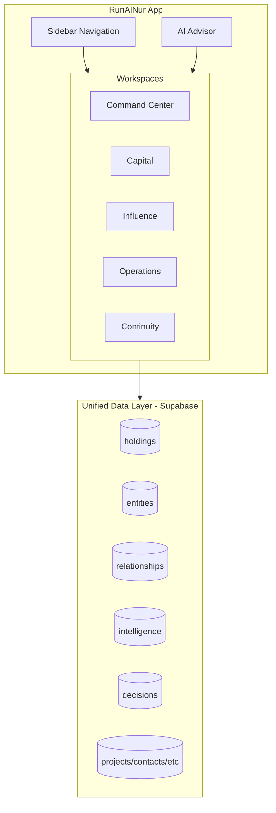

# Dynasty OS: Unified Implementation Plan

## Architecture: One App, Four Workspaces + AI Core

RunAlNur evolves from an operations tool into a dynasty command center. Single app, unified data layer, workspace-based navigation.



---

## Sidebar Evolution

Current sidebar structure in [components/layout/Sidebar.tsx](runalnur-app/components/layout/Sidebar.tsx) expands to:

```
Command Center (home)
─────────────────────
CAPITAL
  ├── Portfolio
  ├── Treasury
  ├── Investments
  └── Entities
─────────────────────
INFLUENCE  
  ├── Relationships
  ├── Intelligence
  └── Legitimacy
─────────────────────
OPERATIONS (existing)
  ├── Arms
  ├── Projects
  ├── Contacts
  ├── SOPs
  └── Knowledge
─────────────────────
CONTINUITY
  ├── Decisions
  ├── Principles
  └── Timeline
─────────────────────
AI Advisor
Settings
```

---

## Workspace 1: Command Center (Enhanced Dashboard)

**Route:** `/` (existing, enhanced)

**Purpose:** Single-glance view of the entire empire

**Panels:**

| Panel | Data Source | Shows |

|-------|-------------|-------|

| Net Worth | holdings + market data | Total NAV, daily change |

| Liquidity | treasury accounts | Cash available, runway |

| Active Deals | deals table | Pipeline across all arms |

| Key Relationships | relationships | People to engage this week |

| Intel Alerts | intelligence feed | Items requiring attention |

| Arm Health | projects/tasks | Status across all arms |

**Implementation:** Enhance existing [page.tsx](runalnur-app/app/page.tsx) and [MetricsPanel.tsx](runalnur-app/components/dashboard/MetricsPanel.tsx)

---

## Workspace 2: Capital

### 2.1 Portfolio (`/capital/portfolio`)

**New tables needed:**

```sql
-- Core holdings
CREATE TABLE holdings (
  id UUID PRIMARY KEY,
  entity_id UUID REFERENCES entities(id),
  asset_type VARCHAR(50), -- 'public_equity', 'private_equity', 'real_estate', 'crypto', 'cash', 'other'
  symbol VARCHAR(20),
  name VARCHAR(255),
  quantity NUMERIC,
  cost_basis NUMERIC,
  cost_basis_date DATE,
  current_value NUMERIC,
  last_priced_at TIMESTAMP,
  currency VARCHAR(3) DEFAULT 'USD',
  custodian VARCHAR(100),
  notes TEXT,
  metadata JSONB,
  created_at TIMESTAMP DEFAULT NOW()
);

-- Price history for tracking
CREATE TABLE price_history (
  id UUID PRIMARY KEY,
  holding_id UUID REFERENCES holdings(id),
  price NUMERIC,
  priced_at TIMESTAMP,
  source VARCHAR(50)
);
```

**UI Components:**

- Holdings table with grouping by asset class, entity, arm
- NAV chart over time
- Asset allocation donut
- Performance vs benchmarks

### 2.2 Treasury (`/capital/treasury`)

**New tables:**

```sql
CREATE TABLE accounts (
  id UUID PRIMARY KEY,
  entity_id UUID REFERENCES entities(id),
  institution VARCHAR(255),
  account_type VARCHAR(50), -- 'checking', 'savings', 'brokerage', 'credit'
  account_name VARCHAR(255),
  balance NUMERIC,
  currency VARCHAR(3) DEFAULT 'USD',
  last_synced_at TIMESTAMP,
  plaid_item_id VARCHAR(100),
  metadata JSONB,
  created_at TIMESTAMP DEFAULT NOW()
);

CREATE TABLE transactions (
  id UUID PRIMARY KEY,
  account_id UUID REFERENCES accounts(id),
  date DATE,
  description TEXT,
  amount NUMERIC,
  category VARCHAR(100),
  plaid_transaction_id VARCHAR(100),
  created_at TIMESTAMP DEFAULT NOW()
);
```

**UI Components:**

- Account balances overview
- Cash flow chart (in/out over time)
- Runway calculator
- Upcoming obligations

**Integration:** Plaid API for bank aggregation

### 2.3 Investments (`/capital/investments`)

**New tables:**

```sql
CREATE TABLE commitments (
  id UUID PRIMARY KEY,
  entity_id UUID REFERENCES entities(id),
  fund_name VARCHAR(255),
  manager VARCHAR(255),
  commitment_amount NUMERIC,
  called_amount NUMERIC DEFAULT 0,
  distributed_amount NUMERIC DEFAULT 0,
  nav NUMERIC,
  vintage_year INTEGER,
  asset_class VARCHAR(50),
  status VARCHAR(50) DEFAULT 'active',
  created_at TIMESTAMP DEFAULT NOW()
);

CREATE TABLE capital_calls (
  id UUID PRIMARY KEY,
  commitment_id UUID REFERENCES commitments(id),
  call_date DATE,
  due_date DATE,
  amount NUMERIC,
  status VARCHAR(50) DEFAULT 'pending',
  paid_date DATE,
  created_at TIMESTAMP DEFAULT NOW()
);

CREATE TABLE distributions (
  id UUID PRIMARY KEY,
  commitment_id UUID REFERENCES commitments(id),
  date DATE,
  amount NUMERIC,
  distribution_type VARCHAR(50), -- 'return_of_capital', 'gain', 'dividend'
  created_at TIMESTAMP DEFAULT NOW()
);
```

**UI Components:**

- Commitment tracker
- Capital call calendar
- J-curve visualization
- IRR/MOIC calculations

### 2.4 Entities (`/capital/entities`)

**New tables:**

```sql
CREATE TABLE entities (
  id UUID PRIMARY KEY,
  name VARCHAR(255),
  entity_type VARCHAR(50), -- 'llc', 'corp', 'trust', 'foundation', 'individual'
  jurisdiction VARCHAR(100),
  formation_date DATE,
  parent_id UUID REFERENCES entities(id),
  tax_id VARCHAR(50),
  purpose TEXT,
  metadata JSONB,
  created_at TIMESTAMP DEFAULT NOW()
);

CREATE TABLE entity_ownership (
  id UUID PRIMARY KEY,
  parent_entity_id UUID REFERENCES entities(id),
  child_entity_id UUID REFERENCES entities(id),
  ownership_percentage NUMERIC,
  created_at TIMESTAMP DEFAULT NOW()
);
```

**UI Components:**

- Entity structure tree/graph visualization
- Entity detail cards
- Ownership flow diagram

---

## Workspace 3: Influence

### 3.1 Relationships (`/influence/relationships`)

**Upgrade existing contacts table:**

```sql
-- Add to contacts or create relationship_profiles
ALTER TABLE contacts ADD COLUMN IF NOT EXISTS influence_score INTEGER DEFAULT 0;
ALTER TABLE contacts ADD COLUMN IF NOT EXISTS alignment_score INTEGER DEFAULT 0;
ALTER TABLE contacts ADD COLUMN IF NOT EXISTS relationship_strength INTEGER DEFAULT 0;
ALTER TABLE contacts ADD COLUMN IF NOT EXISTS strategic_value TEXT;
ALTER TABLE contacts ADD COLUMN IF NOT EXISTS last_contact_date DATE;
ALTER TABLE contacts ADD COLUMN IF NOT EXISTS next_action TEXT;
ALTER TABLE contacts ADD COLUMN IF NOT EXISTS next_action_date DATE;

-- Relationship connections (who knows who, who influences who)
CREATE TABLE relationship_edges (
  id UUID PRIMARY KEY,
  from_contact_id UUID REFERENCES contacts(id),
  to_contact_id UUID REFERENCES contacts(id),
  relationship_type VARCHAR(50), -- 'reports_to', 'influences', 'introduced_by', 'partner'
  strength INTEGER DEFAULT 5,
  notes TEXT,
  created_at TIMESTAMP DEFAULT NOW()
);
```

**UI Components:**

- Relationship graph visualization (force-directed or hierarchical)
- Contact cards with scores
- "Who to engage this week" prioritized list
- Introduction paths (how to reach someone through network)

### 3.2 Intelligence (`/influence/intelligence`)

**New tables:**

```sql
CREATE TABLE intel_items (
  id UUID PRIMARY KEY,
  source VARCHAR(100), -- 'news', 'manual', 'api'
  source_url TEXT,
  title VARCHAR(500),
  summary TEXT,
  full_content TEXT,
  relevance_score INTEGER,
  sentiment VARCHAR(20), -- 'positive', 'negative', 'neutral'
  tags TEXT[],
  related_holdings UUID[],
  related_contacts UUID[],
  related_entities UUID[],
  published_at TIMESTAMP,
  created_at TIMESTAMP DEFAULT NOW()
);

CREATE TABLE intel_alerts (
  id UUID PRIMARY KEY,
  intel_item_id UUID REFERENCES intel_items(id),
  alert_type VARCHAR(50), -- 'opportunity', 'risk', 'action_required'
  priority VARCHAR(20),
  status VARCHAR(50) DEFAULT 'new',
  notes TEXT,
  created_at TIMESTAMP DEFAULT NOW()
);
```

**UI Components:**

- News feed filtered by relevance to holdings/relationships
- Alert inbox with priority
- Geopolitical dashboard (key markets status)
- Macro indicators panel

**Integration:** News APIs (NewsAPI, Polygon news, or custom RSS aggregation)

### 3.3 Legitimacy (`/influence/legitimacy`)

**New tables:**

```sql
CREATE TABLE legitimacy_metrics (
  id UUID PRIMARY KEY,
  metric_type VARCHAR(50), -- 'media_mention', 'award', 'board_seat', 'publication'
  entity VARCHAR(100), -- which arm or 'house'
  title VARCHAR(255),
  source VARCHAR(255),
  sentiment VARCHAR(20),
  reach_estimate INTEGER,
  date DATE,
  url TEXT,
  created_at TIMESTAMP DEFAULT NOW()
);
```

**UI Components:**

- Media sentiment over time
- Legitimacy score by arm
- Recognition timeline
- Cultural footprint metrics (ATW/OBX reach)

---

## Workspace 4: Continuity

### 4.1 Decisions (`/continuity/decisions`)

**New tables:**

```sql
CREATE TABLE decisions (
  id UUID PRIMARY KEY,
  title VARCHAR(255),
  decision_type VARCHAR(50), -- 'investment', 'strategic', 'operational', 'personnel'
  context TEXT, -- what led to this decision
  options_considered JSONB, -- [{option, pros, cons}]
  decision_made TEXT,
  reasoning TEXT, -- why this choice
  principles_applied UUID[], -- links to principles
  outcome TEXT,
  outcome_rating INTEGER, -- 1-10 retrospective
  decided_at TIMESTAMP,
  reviewed_at TIMESTAMP,
  created_at TIMESTAMP DEFAULT NOW()
);
```

**UI Components:**

- Decision log timeline
- Decision detail view with full reasoning
- Outcome tracking
- "Similar past decisions" for new situations

### 4.2 Principles (`/continuity/principles`)

**New tables:**

```sql
CREATE TABLE principles (
  id UUID PRIMARY KEY,
  category VARCHAR(50), -- 'investment', 'operational', 'cultural', 'governance'
  title VARCHAR(255),
  statement TEXT,
  rationale TEXT,
  examples TEXT,
  exceptions TEXT,
  created_at TIMESTAMP DEFAULT NOW(),
  updated_at TIMESTAMP DEFAULT NOW()
);
```

**UI Components:**

- Principles by category
- Principle detail with linked decisions
- Principle search (for AI to reference)

### 4.3 Timeline (`/continuity/timeline`)

**New tables:**

```sql
CREATE TABLE milestones (
  id UUID PRIMARY KEY,
  title VARCHAR(255),
  description TEXT,
  milestone_type VARCHAR(50), -- 'founding', 'acquisition', 'expansion', 'goal'
  date DATE,
  horizon VARCHAR(20), -- 'past', '10_year', '50_year', '100_year'
  status VARCHAR(50), -- 'completed', 'in_progress', 'planned', 'aspirational'
  related_arm VARCHAR(50),
  created_at TIMESTAMP DEFAULT NOW()
);
```

**UI Components:**

- Horizontal timeline spanning past to 100+ years
- Zoom levels (decade, generation, century)
- Milestone cards with detail
- Connection lines between related milestones

---

## AI Advisor Enhancement

Upgrade existing AI in [lib/ai/](runalnur-app/lib/ai/) to access all workspaces:

**New tools to add to [tools.ts](runalnur-app/lib/ai/tools.ts):**

```typescript
// Capital tools
{ name: "get_net_worth", description: "Get current NAV across all holdings" },
{ name: "get_liquidity", description: "Get available cash and runway" },
{ name: "get_holdings", description: "Get holdings by asset class, entity, or arm" },
{ name: "get_upcoming_capital_calls", description: "Get pending capital calls" },

// Influence tools
{ name: "get_relationship", description: "Get details on a contact including scores" },
{ name: "find_connection_path", description: "Find how to reach someone through network" },
{ name: "get_intel_alerts", description: "Get current intelligence alerts" },
{ name: "get_relevant_news", description: "Get news relevant to holdings or contacts" },

// Continuity tools
{ name: "log_decision", description: "Record a decision with reasoning" },
{ name: "get_similar_decisions", description: "Find past decisions similar to current situation" },
{ name: "get_principle", description: "Retrieve relevant principles for a decision" },

// Cross-workspace
{ name: "daily_briefing", description: "Generate comprehensive briefing across all domains" },
{ name: "opportunity_scan", description: "Identify opportunities across capital and influence" },
```

---

## Implementation Phases

### Phase 1: Capital Foundation (4-6 weeks)

1. Create entity and holdings tables
2. Build Portfolio page with manual entry
3. Build Entities page with structure visualization
4. Add basic NAV calculation to Command Center
5. Integrate market data API for public holdings pricing

### Phase 2: Treasury and Investments (4-6 weeks)

1. Create accounts and transactions tables
2. Integrate Plaid for bank aggregation
3. Build Treasury page
4. Create commitments and capital calls tables
5. Build Investments page with J-curve

### Phase 3: Influence Layer (4-6 weeks)

1. Upgrade contacts with relationship scoring
2. Create relationship_edges table
3. Build Relationships page with graph visualization
4. Create intel tables
5. Build Intelligence page with news integration
6. Add Legitimacy tracking

### Phase 4: Continuity Layer (3-4 weeks)

1. Create decisions and principles tables
2. Build Decisions log page
3. Build Principles database page
4. Create milestones table
5. Build Timeline visualization

### Phase 5: AI Enhancement (2-3 weeks)

1. Add all new tools to AI
2. Enhance daily briefing with all domains
3. Add decision support (similar decisions, relevant principles)
4. Cross-domain opportunity identification

---

## File Structure Addition

```
runalnur-app/
├── app/
│   ├── capital/
│   │   ├── portfolio/page.tsx
│   │   ├── treasury/page.tsx
│   │   ├── investments/page.tsx
│   │   └── entities/page.tsx
│   ├── influence/
│   │   ├── relationships/page.tsx
│   │   ├── intelligence/page.tsx
│   │   └── legitimacy/page.tsx
│   ├── continuity/
│   │   ├── decisions/page.tsx
│   │   ├── principles/page.tsx
│   │   └── timeline/page.tsx
│   └── api/
│       ├── holdings/route.ts
│       ├── entities/route.ts
│       ├── accounts/route.ts
│       ├── commitments/route.ts
│       ├── intelligence/route.ts
│       └── decisions/route.ts
├── components/
│   ├── capital/
│   │   ├── HoldingsTable.tsx
│   │   ├── EntityTree.tsx
│   │   ├── NAVChart.tsx
│   │   └── JCurve.tsx
│   ├── influence/
│   │   ├── RelationshipGraph.tsx
│   │   ├── ContactScoreCard.tsx
│   │   └── IntelFeed.tsx
│   └── continuity/
│       ├── DecisionCard.tsx
│       ├── PrincipleCard.tsx
│       └── TimelineView.tsx
└── lib/
    ├── capital/
    │   ├── calculations.ts
    │   └── market-data.ts
    └── influence/
        └── graph.ts
```

---

## Ready to Begin

This plan transforms RunAlNur from an operations tool into a full dynasty command center.

**Recommended start:** Phase 1 (Capital Foundation) - specifically the entities and holdings tables, since knowing your structure and positions is foundational to everything else.

Confirm to begin implementation.