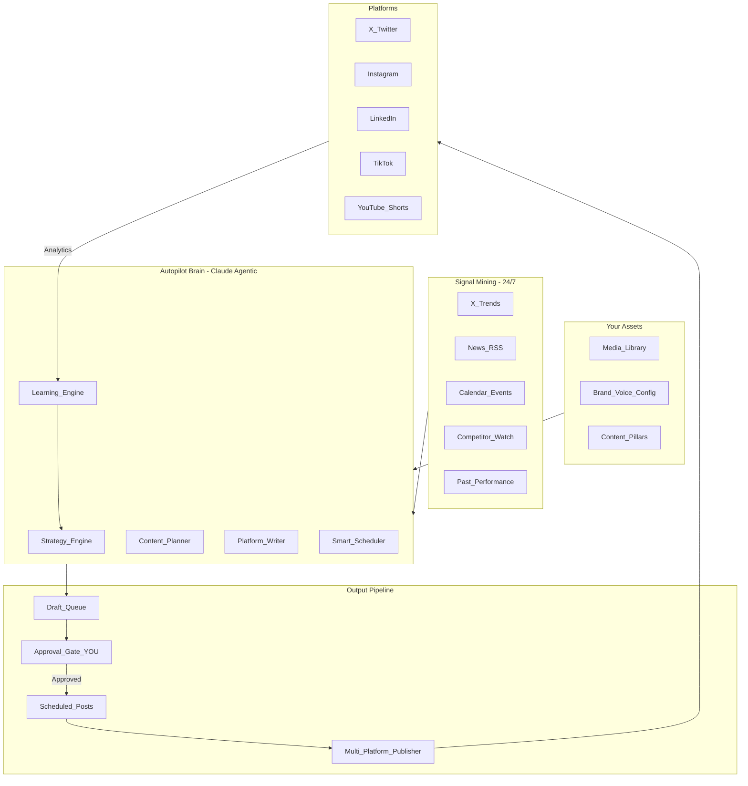

# Dynasty Social Autopilot — State of the Art

## The Promise

**You do nothing except tap "Approve."** The system handles:

- Watching trends and signals 24/7
- Deciding what to post and when
- Creating platform-native content
- Scheduling across all platforms
- Learning what works and adapting

Your daily involvement: 5-10 minutes reviewing an approval queue.

---

## Entities, Platforms, and Cross-Entity Rules (Your Setup)

You have **6 entities**, and you want **all major platforms for each**:

- **HouseAlNur** (umbrella / holding company)
- **Nurullah** (Chairman / personal brand)
- **OBX_ObiAlfred** (musician)
- **Nova**
- **Janna**
- **ATW** (Arabia and The World)

Platforms per entity:

- **X**, **Instagram**, **LinkedIn**, **TikTok**, **YouTube_Shorts**

### Cross-entity content policy (critical guardrails)

- **Mostly unique per entity**: the autopilot must avoid “copy/paste cross-posting” across entities.
- **HouseAlNur is selective**: HouseAlNur can *occasionally* amplify arms with **major announcements + recaps only**, rewritten in HouseAlNur’s voice (not a mirror feed).
- **Deconfliction**: scheduling must consider **cross-entity competition** (avoid multiple “hero posts” at the same moment across entities unless intentionally desired).

### Default cadence (sensible starting point; adjustable)

These defaults are designed to keep output high while keeping the approval queue manageable.

| Entity | X | IG | LinkedIn | TikTok | YT_Shorts |

|---|---:|---:|---:|---:|---:|

| **HouseAlNur** | 3/wk | 2/wk | 2/wk | 1/wk | 1/wk |

| **Nurullah** | 5/wk | 3/wk | 3/wk | 2/wk | 1/wk |

| **OBX_ObiAlfred** | 5/wk | 4/wk | 2/wk | 4/wk | 2/wk |

| **Nova** | 6/wk | 3/wk | 3/wk | 2/wk | 1/wk |

| **Janna** | 5/wk | 3/wk | 2/wk | 2/wk | 1/wk |

| **ATW** | 7/wk | 3/wk | 3/wk | 2/wk | 1/wk |

### Dual-timezone scheduling (Dubai + US) + bilingual output (EN+AR)

Defaults you requested:

- **Timezones**: account for **Dubai + US** using an **audience-optimized strategy** (learned per entity+platform over time).
- **Languages**: **English + Arabic** (auto-variant generation), with per-entity/per-platform control over which language is primary vs optional.

Practical behavior:

- Early on (no analytics), use a **heuristic** (e.g., LinkedIn biases toward US business hours; IG toward evening in the entity’s dominant region; X can split).
- After analytics accrue, scheduling becomes **data-driven**: each entity+platform picks Dubai-prime vs US-prime based on engagement outcomes.
- For bilingual: generate **EN and AR variants** for each draft (stored as variants), and you approve which goes out per platform.

## Architecture Overview



---

## Component Deep Dive

### 1. Signal Mining (The Eyes)

**What it watches:**

| Signal | Source | How it's used |

|--------|--------|---------------|

| Trending topics | X API, Google Trends | "This topic is heating up — draft a take" |

| Industry news | News APIs, RSS feeds | "Breaking news relevant to Nova — suggest a post" |

| Calendar events | Internal calendar + public holidays | "Dubai event in 3 days — prepare content" |

| Competitor activity | X monitoring | "Competitor just posted about X — consider responding" |

| Past performance | `social_analytics` table | "Posts about real estate at 6pm get 2x engagement" |

| Unused media | `media_assets` table | "You have 15 Dubai photos from last week — suggest using them" |

**Implementation:**

- Extend existing [`lib/integrations/intelligence.ts`](runalnur-app/lib/integrations/intelligence.ts) to add trend detection
- Add new `lib/social/signals.ts` for social-specific signal aggregation
- Store signals in new `social_signals` table with relevance scores
- Run signal mining every 15 minutes via cron

---

### 2. Autopilot Brain (Claude Agentic Core)

This is where the intelligence lives. The brain is a Claude agent with access to tools:

**Tools the agent has:**

```
- search_media(query, filters) → find assets from media library
- get_signals(timeframe, relevance_threshold) → get current signals
- get_calendar_gaps(entity, platform, days_ahead) → find posting gaps
- get_performance_insights(entity, platform, metric) → what's working
- create_draft(platform, caption, media_ids, scheduled_for) → create pending post
- update_calendar(date, entity, content_type, status) → plan content
- get_brand_voice(entity) → get voice/tone/pillars for entity
- get_posting_rules(entity, platform) → frequency, best times, constraints
```

**Agent modes:**

| Mode | Trigger | What it does |

|------|---------|--------------|

| **Weekly Planner** | Every Sunday midnight | Plans entire week: fills calendar, creates drafts for each slot |

| **Daily Optimizer** | Every morning 6am | Reviews today's scheduled posts, adjusts times, fills gaps |

| **Trend Reactor** | Signal threshold crossed | Creates reactive draft within 30 min of trend detection |

| **Performance Reviewer** | Weekly | Analyzes what worked, adjusts strategy parameters |

| **Gap Filler** | On-demand | When calendar has unexpected gaps, generates content |

**Implementation:**

- New `lib/social/autopilot/agent.ts` — Claude agent with tool definitions
- New `lib/social/autopilot/modes/` — Separate mode handlers (weekly, daily, reactive, etc.)
- New `lib/social/autopilot/tools/` — Tool implementations
- API routes: `/api/social/autopilot/run?mode=weekly|daily|reactive`

---

### 3. Platform-Native Content Generation

The brain doesn't just write generic captions — it writes **platform-native** content:

| Platform | Format | Constraints | Style |

|----------|--------|-------------|-------|

| **X** | Short, punchy, hooks | 280 chars, 4 images max | Conversational, hot takes, threads for long-form |

| **Instagram** | Visual-first, storytelling | 2200 chars, 30 hashtags, carousels up to 10 | Aspirational, lifestyle, emoji-friendly |

| **LinkedIn** | Professional, value-driven | 3000 chars, document posts | Thought leadership, insights, personal stories |

| **TikTok** | Hook in 3 sec, trends | 150 chars caption, video required | Trendy, casual, challenge-driven |

| **YouTube Shorts** | Entertainment/education | 100 chars title, 60 sec max | Value-packed, clear CTA |

**One idea → Multiple platform variants:**

When the brain decides "post about Dubai real estate market update":

- X: "Dubai real estate just hit a new record. Here's what's actually happening (thread) 🧵"
- LinkedIn: "The Dubai real estate market continues to defy expectations. As someone who's been in this market for years, here's my analysis of what's driving this growth and what it means for investors..."
- IG: "Dubai's skyline keeps growing 🏗️ Here's what's really happening in the market right now 👇 [carousel with stats]"

**Implementation:**

- New `lib/social/content/platform-adapters.ts` — Platform-specific writing rules
- New `lib/social/content/generator.ts` — Uses Claude with platform context
- Store templates in `post_templates` table with platform-specific variants

---

### 4. Smart Scheduling Engine

Not just "post at 9am" — actually intelligent scheduling:

**Factors considered:**

| Factor | How it's used |

|--------|---------------|

| **Your audience's active times** | Learned from past engagement data |

| **Platform-specific peaks** | X morning, LinkedIn business hours, IG evening |

| **Content type timing** | Educational morning, entertaining evening |

| **Competitor avoidance** | Don't post same time as major competitors |

| **Cross-account coordination** | Nova and Janna don't compete for attention |

| **Event awareness** | Post about events before/during, not after |

| **Posting frequency rules** | Don't spam (e.g., max 3 tweets/day, 1 LinkedIn/day) |

**Optimal time calculation:**

```
score = (
  audience_activity_score(time) * 0.3 +
  platform_peak_score(platform, time) * 0.2 +
  content_type_fit(content_type, time) * 0.15 +
  historical_performance(entity, platform, time) * 0.25 +
  competition_avoidance(time) * 0.1
)
```

**Implementation:**

- New `lib/social/scheduler/optimizer.ts` — Scheduling algorithm
- New `lib/social/scheduler/rules.ts` — Frequency and constraint rules
- Store scheduling preferences in new `autopilot_config` table
- `social_posts.ai_best_time_suggestion` already exists — use it

---

### 5. Multi-Platform Publishing (via Ayrshare)

**Why Ayrshare** (or similar aggregator):

- Single API for X, Instagram, LinkedIn, TikTok, Facebook, YouTube
- Handles OAuth complexity for each platform
- Media upload/processing handled
- Scheduling built-in
- Analytics retrieval
- $29-99/mo vs months of building platform integrations

**Integration approach:**

| Component | Our code | Ayrshare |

|-----------|----------|----------|

| Content planning | ✅ | |

| Draft management | ✅ | |

| Approval workflow | ✅ | |

| Platform posting | | ✅ |

| Media handling | | ✅ |

| Scheduling | Decides time | Executes |

| Analytics pull | Stores/analyzes | Provides data |

#### Multi-entity + bilingual publishing behavior (required)

- **Per entity**: posts always target the correct `social_accounts` via `entity_id` (no accidental posting to the wrong brand).
- **Per platform**: validate platform constraints before publish (text length, hashtag rules, media count, aspect ratios, video duration).
- **Per language (EN+AR)**: generate both variants when drafting; you approve which language variant is used per platform/entity (defaults can be configured).
- **HouseAlNur selective amplification**: when HouseAlNur “covers” an arm, it publishes a rewritten **announcement/recap**, and optionally links back to the arm’s canonical post.

**Implementation:**

- New `lib/social/platforms/ayrshare.ts` — Ayrshare API client
- New `lib/social/publisher.ts` — Publishing orchestrator
- Store Ayrshare API key in `user_integrations` with encryption
- Add platform accounts via Ayrshare dashboard (one-time setup)

**Fallback:** If Ayrshare doesn't work out, the architecture allows swapping to direct APIs or another aggregator. The intelligence layer stays the same.

---

### 6. Learning Engine (Gets Smarter Over Time)

**What it tracks:**

| Metric | Granularity | Used for |

|--------|-------------|----------|

| Engagement rate | Per post, per platform, per entity | Content quality scoring |

| Best performing topics | Tags/themes | Topic prioritization |

| Best performing times | Hour of day, day of week | Scheduling optimization |

| Best performing formats | Image vs video vs carousel vs text | Format recommendations |

| Audience growth | Daily | Strategy adjustment |

| Click-through rate | Per post | CTA effectiveness |

**Learning loop:**

1. Post goes live
2. After 24h, pull analytics from Ayrshare
3. Score post against predictions
4. Update model parameters:

   - Topic preference weights
   - Time slot scores
   - Format effectiveness
   - Entity-specific insights

5. Feed back into next planning cycle

**Implementation:**

- New `lib/social/learning/analyzer.ts` — Performance analysis
- New `lib/social/learning/model.ts` — Preference model (simple weighted scoring, not ML)
- Extend `social_analytics` table for detailed tracking
- Cron job to pull analytics daily and run learning updates

---

### 7. Approval Workflow (Your 5-Minute Daily Task)

**The Approval Queue UI:**

```
┌─────────────────────────────────────────────────────────────┐
│ 📋 Approval Queue                          [Bulk Approve]   │
├─────────────────────────────────────────────────────────────┤
│ Ready for Today (3)                                         │
│ ┌─────────────────────────────────────────────────────────┐ │
│ │ 🐦 X · Nova · 9:00 AM                    [Edit] [✓] [✗] │ │
│ │ "Dubai real estate just hit a new record..."            │ │
│ │ [image preview]                                          │ │
│ │ AI confidence: 94% · Similar post got 2.3K likes        │ │
│ └─────────────────────────────────────────────────────────┘ │
│ ┌─────────────────────────────────────────────────────────┐ │
│ │ 📸 Instagram · Nova · 6:00 PM            [Edit] [✓] [✗] │ │
│ │ "Behind the scenes at our latest property viewing..."   │ │
│ │ [carousel preview]                                       │ │
│ │ AI confidence: 87% · Suggested: add location tag        │ │
│ └─────────────────────────────────────────────────────────┘ │
├─────────────────────────────────────────────────────────────┤
│ This Week (12)                                              │
│ [Calendar view showing planned posts]                       │
├─────────────────────────────────────────────────────────────┤
│ 🔥 Trending Alert                                           │
│ "Dubai property prices" is trending. Draft ready for review │
│ [View Draft]                                                │
└─────────────────────────────────────────────────────────────┘
```

**Approval actions:**

| Action | What happens |

|--------|--------------|

| **Approve** | Moves to scheduled queue, will publish at planned time |

| **Edit** | Opens editor, can modify caption/media/time, then approve |

| **Reject** | Removed from queue, AI learns this wasn't good |

| **Bulk Approve** | Approve all with confidence > 90% |

| **Snooze** | Move to tomorrow's queue |

#### Weekly batches (generate → edit individually → bulk approve)

Default workflow (what you asked for):

- **Weekly Planner** generates the next 7 days as a batch (calendar slots + drafts) for each entity/platform per cadence rules.
- You open the queue and can:
  - **Edit any individual draft** (caption, media, time, language EN/AR, platform variants)
  - **Bulk approve** by filters (example: “approve all confidence ≥ 0.90” or “approve all HouseAlNur recaps”)
- Approved posts move to `scheduled` and are published by the publisher at the chosen time.

**Implementation:**

- Revamp [`app/social/page.tsx`](runalnur-app/app/social/page.tsx) as Approval Queue
- New component `components/social/ApprovalCard.tsx`
- New component `components/social/PostEditor.tsx`
- API routes: `/api/social/posts/[id]/approve`, `/api/social/posts/[id]/reject`

---

### 8. Configuration (One-Time Setup)

**Autopilot Config per Entity:**

```typescript
interface AutopilotConfig {
  entity_id: string;
  
  // Voice & Brand
  brand_voice: string; // "Professional but approachable, thought leader in real estate"
  content_pillars: string[]; // ["Dubai real estate", "Investment tips", "Market analysis", "Lifestyle"]
  tone_keywords: string[]; // ["confident", "insightful", "aspirational"]
  avoid_topics: string[]; // ["politics", "controversial"]

  // Cross-entity rules
  // - default: mostly unique content per entity
  // - HouseAlNur: selective announcements/recaps across arms only
  cross_entity_policy: {
    uniqueness: "mostly_unique";
    allow_selective_umbrella_amplification: boolean;
    umbrella_entity_id?: string; // e.g., "house_al_nur"
  };
  
  // Posting Rules
  platforms: {
    x: { enabled: true, max_per_day: 3, min_per_week: 10 },
    instagram: { enabled: true, max_per_day: 2, min_per_week: 5 },
    linkedin: { enabled: true, max_per_day: 1, min_per_week: 3 },
    // ...
  };
  
  // Scheduling Preferences
  // Note: you requested dual-region scheduling (Dubai + US) via audience-optimized strategy.
  // We keep a “home” timezone for UX display, but the scheduler can select Dubai-prime vs US-prime slots.
  timezone: "Asia/Dubai";
  timezones_supported: Array<"Asia/Dubai" | "America/Chicago">;
  timezone_strategy: "audience_optimize";
  active_hours: { start: 7, end: 22 }; // Don't post outside these hours
  preferred_times: { x: ["9:00", "13:00", "18:00"], instagram: ["12:00", "19:00"] };

  // Language Preferences
  languages: {
    primary: "en" | "ar";
    enabled: Array<"en" | "ar">; // you requested EN+AR
    per_platform_primary?: Partial<Record<"x" | "instagram" | "linkedin" | "tiktok" | "youtube", "en" | "ar">>;
    generate_both_variants_for_approval: boolean; // recommended true initially
  };
  
  // Automation Level
  auto_approve_threshold: 0; // 0 = always require approval, 0.95 = auto-approve >95% confidence
  trend_reaction_enabled: true;
  weekly_planning_enabled: true;
}
```

**Implementation:**

- New table: `autopilot_configs` (per entity)
- Settings UI in `app/social/settings/page.tsx`
- API routes for config CRUD

---

## Database Schema Additions

```sql
-- Autopilot configuration per entity
CREATE TABLE autopilot_configs (
  id UUID PRIMARY KEY DEFAULT gen_random_uuid(),
  tenant_id UUID NOT NULL REFERENCES tenants(id),
  entity_id TEXT REFERENCES arms(id),
  
  brand_voice TEXT,
  content_pillars TEXT[] DEFAULT '{}',
  tone_keywords TEXT[] DEFAULT '{}',
  avoid_topics TEXT[] DEFAULT '{}',
  
  platform_rules JSONB DEFAULT '{}',
  scheduling_prefs JSONB DEFAULT '{}',
  
  auto_approve_threshold DECIMAL(3,2) DEFAULT 0,
  trend_reaction_enabled BOOLEAN DEFAULT true,
  weekly_planning_enabled BOOLEAN DEFAULT true,
  
  created_at TIMESTAMPTZ DEFAULT NOW(),
  updated_at TIMESTAMPTZ DEFAULT NOW()
);

-- Social signals (trends, news, opportunities)
CREATE TABLE social_signals (
  id UUID PRIMARY KEY DEFAULT gen_random_uuid(),
  tenant_id UUID NOT NULL REFERENCES tenants(id),
  
  signal_type VARCHAR(50), -- 'trend', 'news', 'competitor', 'event', 'performance'
  source VARCHAR(50), -- 'x', 'google_trends', 'news_api', 'internal'
  
  title TEXT,
  content TEXT,
  relevance_score DECIMAL(3,2), -- 0-1, how relevant to user's pillars
  urgency VARCHAR(20), -- 'immediate', 'today', 'this_week', 'evergreen'
  
  entity_match TEXT[], -- which entities this is relevant to
  suggested_action TEXT, -- what the AI suggests doing
  
  acted_on BOOLEAN DEFAULT false,
  post_id UUID REFERENCES social_posts(id), -- if a post was created from this
  
  detected_at TIMESTAMPTZ DEFAULT NOW(),
  expires_at TIMESTAMPTZ
);

-- Learning data
CREATE TABLE social_learning (
  id UUID PRIMARY KEY DEFAULT gen_random_uuid(),
  tenant_id UUID NOT NULL REFERENCES tenants(id),
  entity_id TEXT,
  platform VARCHAR(20),
  
  metric_type VARCHAR(50), -- 'topic_score', 'time_score', 'format_score'
  metric_key TEXT, -- e.g., 'real_estate', '09:00', 'carousel'
  metric_value DECIMAL(5,2),
  sample_count INTEGER DEFAULT 0,
  
  updated_at TIMESTAMPTZ DEFAULT NOW(),
  
  UNIQUE(tenant_id, entity_id, platform, metric_type, metric_key)
);
```

---

## API Routes

| Route | Method | Purpose |

|-------|--------|---------|

| `/api/social/autopilot/run` | POST | Trigger autopilot (mode: weekly/daily/reactive) |

| `/api/social/autopilot/status` | GET | Current autopilot status and next run |

| `/api/social/posts` | GET/POST | List/create posts |

| `/api/social/posts/[id]` | GET/PATCH/DELETE | Single post operations |

| `/api/social/posts/[id]/approve` | POST | Approve a draft |

| `/api/social/posts/[id]/reject` | POST | Reject a draft |

| `/api/social/posts/[id]/publish` | POST | Publish immediately |

| `/api/social/calendar` | GET/POST | Content calendar |

| `/api/social/signals` | GET | Current signals |

| `/api/social/analytics` | GET | Performance data |

| `/api/social/config` | GET/PATCH | Autopilot config |

| `/api/social/accounts` | GET/POST/DELETE | Connected accounts |

| `/api/cron/social-autopilot` | GET | Cron endpoint for scheduled runs |

---

## External Service Integration

| Service | Purpose | Cost | Priority |

|---------|---------|------|----------|

| **Ayrshare** | Multi-platform posting | $29-99/mo | Must have |

| **Claude API** | Autopilot brain | Usage-based | Must have (already have) |

| **X API** | Trend detection (beyond Ayrshare) | Free tier available | Nice to have |

| **Google Trends API** | Trend signals | Free | Nice to have |

---

## Implementation Milestones

### Milestone 1: Foundation (Week 1)

- Run new migration for `autopilot_configs`, `social_signals`, `social_learning`
- Implement Ayrshare client (`lib/social/platforms/ayrshare.ts`)
- Basic API routes for posts, calendar, accounts
- Connect one account via Ayrshare (X) as proof of concept

### Milestone 2: Autopilot Brain (Week 2)

- Implement Claude agent with tools (`lib/social/autopilot/agent.ts`)
- Implement Weekly Planner mode
- Implement Daily Optimizer mode
- Basic content generation with platform adapters

### Milestone 3: Approval UX (Week 3)

- Build Approval Queue UI
- Build Post Editor component
- Build Calendar view with real data
- Approval/reject flows working end-to-end

### Milestone 4: Intelligence (Week 4)

- Signal mining implementation
- Trend Reactor mode
- Learning engine (analytics → insights → adjustments)
- Performance dashboard

### Milestone 5: Polish (Week 5)

- All platforms connected
- Config UI complete
- Cron jobs set up in Vercel
- Mobile optimization for approval queue
- Notifications for urgent approvals

---

## Your Daily Experience (After Setup)

**Morning (2 min):**

1. Open RunAlNur
2. See approval queue: "3 posts ready for today"
3. Quick review → Bulk approve
4. Done

**During day (as needed):**

- Get notification: "🔥 Trending topic detected — draft ready"
- Open, review, approve or dismiss
- 30 seconds

**Weekly (optional, 10 min):**

- Review performance summary
- Adjust any pillars or rules if needed
- See what the AI learned

**That's it.** The system handles everything else.