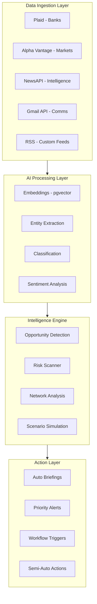

# Empire Intelligence Engine: AI-Powered Dynasty OS

## Vision

Transform RunAlNur from an operations tool into an **always-on intelligence engine** that actively identifies opportunities, manages risk, and accelerates wealth accumulation across all domains - not just financial assets.

---

## Architecture: The Intelligence Stack



---

## Phase 1: Intelligence Foundation (2-3 weeks)

Build the data ingestion and embedding infrastructure that powers all AI capabilities.

### 1.1 Vector Database Setup

Add pgvector to Supabase for semantic search across all data:

```sql
-- Enable pgvector extension
CREATE EXTENSION IF NOT EXISTS vector;

-- Universal embeddings table
CREATE TABLE embeddings (
  id UUID PRIMARY KEY DEFAULT gen_random_uuid(),
  entity_type VARCHAR(50), -- 'intel', 'contact', 'decision', 'holding'
  entity_id UUID,
  content TEXT,
  embedding VECTOR(1536),
  metadata JSONB,
  created_at TIMESTAMP DEFAULT NOW()
);

CREATE INDEX ON embeddings USING ivfflat (embedding vector_cosine_ops);
```

### 1.2 Intelligence Feed Schema

Expand on the existing [Dynasty OS plan](/.cursor/plans/dynasty_os_implementation_eaff59d8.plan.md) intel tables:

```sql
CREATE TABLE intel_sources (
  id UUID PRIMARY KEY,
  source_type VARCHAR(50), -- 'news_api', 'rss', 'manual', 'email', 'social'
  name VARCHAR(255),
  config JSONB, -- API keys, RSS URLs, etc
  is_active BOOLEAN DEFAULT true,
  last_fetched_at TIMESTAMP
);

CREATE TABLE intel_items (
  id UUID PRIMARY KEY,
  source_id UUID REFERENCES intel_sources(id),
  external_id VARCHAR(255),
  title TEXT,
  summary TEXT,
  full_content TEXT,
  url TEXT,
  
  -- AI-generated fields
  relevance_score INTEGER, -- 0-100
  opportunity_score INTEGER, -- 0-100
  risk_score INTEGER, -- 0-100
  sentiment VARCHAR(20),
  categories TEXT[],
  
  -- Entity linking
  related_holdings UUID[],
  related_contacts UUID[],
  related_entities UUID[],
  
  published_at TIMESTAMP,
  processed_at TIMESTAMP,
  created_at TIMESTAMP DEFAULT NOW()
);
```

### 1.3 Intelligence Processor

New file: [`lib/intelligence/processor.ts`](runalnur-app/lib/intelligence/processor.ts)

```typescript
// Core intelligence processing pipeline
export async function processIntelItem(item: RawIntelItem) {
  // 1. Generate embedding for semantic search
  const embedding = await generateEmbedding(item.content);
  
  // 2. AI classification and scoring
  const analysis = await analyzeIntel(item);
  
  // 3. Entity extraction and linking
  const entities = await extractAndLinkEntities(item);
  
  // 4. Opportunity/Risk detection
  const signals = await detectSignals(item, analysis, entities);
  
  // 5. Alert generation if threshold met
  if (signals.opportunityScore > 70 || signals.riskScore > 70) {
    await createAlert(item, signals);
  }
  
  return { embedding, analysis, entities, signals };
}
```

---

## Phase 2: Data Source Integration (2-3 weeks)

### 2.1 Market Data Integration

Integrate Alpha Vantage or Polygon for real-time pricing:

New file: [`lib/integrations/market-data.ts`](runalnur-app/lib/integrations/market-data.ts)

- Fetch stock/ETF/crypto prices
- Update holdings with current values
- Calculate NAV in real-time
- Track price history for performance charts

### 2.2 Bank Aggregation (Plaid)

New file: [`lib/integrations/plaid.ts`](runalnur-app/lib/integrations/plaid.ts)

- Connect bank accounts across entities
- Aggregate real-time balances
- Import transactions for cash flow analysis
- Calculate runway automatically

### 2.3 News Intelligence Feed

New file: [`lib/integrations/news-intel.ts`](runalnur-app/lib/integrations/news-intel.ts)

- NewsAPI integration for broad coverage
- Custom RSS feeds for specific topics
- SEC filings via EDGAR API
- Real estate feeds (Zillow API, etc.)

### 2.4 Communications Parser (Optional - High Value)

New file: [`lib/integrations/email-intel.ts`](runalnur-app/lib/integrations/email-intel.ts)

- Gmail API read-only access
- Extract relationship signals
- Detect opportunities mentioned in emails
- Update last contact dates automatically

---

## Phase 3: AI Intelligence Engine (3-4 weeks)

### 3.1 Opportunity Detection System

The core value: AI that actively finds money and influence opportunities.

New file: [`lib/intelligence/opportunity-engine.ts`](runalnur-app/lib/intelligence/opportunity-engine.ts)

**Opportunity Types to Detect:**

| Type | Signal | Example |

|------|--------|---------|

| Market Dislocation | Price deviation from fair value | Stock 20% below intrinsic |

| Relationship Leverage | Network path to target | 2-hop connection to decision maker |

| Information Edge | Intel you have, market doesn't | Early knowledge of deal |

| Timing Window | Event-driven opportunity | Distressed seller, limited timeline |

| Strategic Synergy | Asset fits your portfolio | Property in target neighborhood |

**Scoring Algorithm:**

```typescript
interface OpportunityScore {
  expectedReturn: number;      // Potential upside (0-100)
  probability: number;         // Likelihood of success (0-100)
  strategicFit: number;        // Alignment with goals (0-100)
  networkLeverage: number;     // Can relationships help? (0-100)
  capitalRequired: number;     // Absolute $
  timeToClose: number;         // Days
  complexity: number;          // Execution difficulty (0-100)
  
  // Final score
  compositeScore: number;      // Weighted combination
}
```

### 3.2 Risk Scanner

New file: [`lib/intelligence/risk-scanner.ts`](runalnur-app/lib/intelligence/risk-scanner.ts)

Continuous monitoring for threats:

- **Concentration Risk**: Too exposed to single asset/sector
- **Liquidity Risk**: Insufficient cash for obligations
- **Relationship Risk**: Key person dependency, deteriorating ties
- **Market Risk**: Macro events affecting portfolio
- **Reputation Risk**: Media/sentiment monitoring

### 3.3 Network Intelligence

New file: [`lib/intelligence/network-engine.ts`](runalnur-app/lib/intelligence/network-engine.ts)

Graph-based relationship analysis:

- **Path Finding**: How to reach any person through network
- **Influence Mapping**: Who has power over what
- **Engagement Prioritization**: Who to contact this week
- **Introduction Requests**: AI suggests warm intros

### 3.4 Scenario Simulation

New file: [`lib/intelligence/simulation.ts`](runalnur-app/lib/intelligence/simulation.ts)

Like Aladdin's Monte Carlo, but for all capital types:

```typescript
interface Scenario {
  name: string;
  probability: number;
  
  // Market impacts
  marketShock: number;  // -50% to +50%
  sectorImpacts: Record<string, number>;
  
  // Relationship impacts
  relationshipChanges: RelationshipChange[];
  
  // Strategic impacts
  opportunitiesCreated: string[];
  risksCreated: string[];
}

async function runScenarioAnalysis(scenarios: Scenario[]) {
  // Calculate portfolio impact under each scenario
  // Identify hedges and vulnerabilities
  // Generate action recommendations
}
```

---

## Phase 4: Action Layer (2 weeks)

### 4.1 Daily Intelligence Briefing

Enhance existing [`lib/ai/briefings.ts`](runalnur-app/lib/ai/briefings.ts):

**Briefing Structure:**

1. **Net Worth Update**: NAV change, top movers
2. **Cash Position**: Liquidity, runway, upcoming calls
3. **Opportunity Feed**: Top 3 opportunities detected
4. **Risk Alerts**: Any threats requiring attention
5. **Relationship Actions**: Who to contact today
6. **Intel Digest**: Key news summarized
7. **Decision Queue**: Pending decisions requiring attention

### 4.2 Semi-Autonomous Actions

Expand [`lib/ai/agent.ts`](runalnur-app/lib/ai/agent.ts) with autonomous capabilities:

**Tier 1 - Fully Autonomous (No Approval):**

- Update contact last_contact_date from emails
- Classify and score incoming intel
- Generate daily briefings
- Update market prices

**Tier 2 - Auto-Execute with Notification:**

- Create calendar reminders for follow-ups
- Send relationship check-in suggestions
- Archive low-relevance intel

**Tier 3 - Requires Approval:**

- Investment recommendations
- Relationship introductions
- Major operational decisions
- Anything involving money movement

### 4.3 Enhanced AI Tools

Add to [`lib/ai/tools.ts`](runalnur-app/lib/ai/tools.ts):

```typescript
// Capital Intelligence
{ name: "get_nav_breakdown", description: "Get NAV by asset class, entity, arm" },
{ name: "get_liquidity_runway", description: "Get cash position and runway in months" },
{ name: "analyze_investment", description: "Run analysis on potential investment" },
{ name: "get_portfolio_risk", description: "Get current risk metrics and concentration" },

// Opportunity Engine
{ name: "get_top_opportunities", description: "Get highest-scored opportunities" },
{ name: "score_opportunity", description: "Score a specific opportunity" },
{ name: "find_similar_opportunities", description: "Find historical similar opportunities" },

// Network Intelligence
{ name: "find_path_to_person", description: "Find connection path to reach someone" },
{ name: "get_engagement_priorities", description: "Get prioritized list of people to contact" },
{ name: "suggest_introductions", description: "Suggest warm intro opportunities" },

// Scenario Analysis
{ name: "run_scenario", description: "Run scenario analysis on portfolio" },
{ name: "get_risk_report", description: "Get comprehensive risk assessment" },

// Decision Support
{ name: "get_similar_decisions", description: "Find past decisions similar to current" },
{ name: "log_decision", description: "Record decision with full reasoning" },
```

---

## Phase 5: UI - Command Center Evolution (2-3 weeks)

### 5.1 Intelligence Dashboard

New route: [`app/intelligence/page.tsx`](runalnur-app/app/intelligence/page.tsx)

**Panels:**

- Live opportunity feed (scored, prioritized)
- Risk radar (current threats)
- Intel stream (processed news)
- Network pulse (relationship health)

### 5.2 Enhanced Command Center

Update [`app/page.tsx`](runalnur-app/app/page.tsx):

**New Panels:**

- NAV ticker with daily change
- Liquidity gauge (months runway)
- Top 3 opportunities carousel
- Alert inbox (requiring action)

### 5.3 Scenario Playground

New route: [`app/scenarios/page.tsx`](runalnur-app/app/scenarios/page.tsx)

Interactive scenario builder:

- Define custom scenarios
- See portfolio impact visualization
- Identify hedging opportunities

---

## Key Files to Create/Modify

| File | Purpose |

|------|---------|

| `lib/intelligence/processor.ts` | Core intel processing pipeline |

| `lib/intelligence/opportunity-engine.ts` | Opportunity detection and scoring |

| `lib/intelligence/risk-scanner.ts` | Risk monitoring and alerts |

| `lib/intelligence/network-engine.ts` | Relationship graph analysis |

| `lib/intelligence/simulation.ts` | Scenario modeling |

| `lib/integrations/market-data.ts` | Stock/crypto price feeds |

| `lib/integrations/plaid.ts` | Bank aggregation |

| `lib/integrations/news-intel.ts` | News API integration |

| `lib/ai/tools.ts` | Expand with intelligence tools |

| `lib/ai/briefings.ts` | Enhanced daily briefings |

| `lib/supabase/schema.sql` | Add intelligence tables |

| `app/api/intelligence/route.ts` | Intel API endpoints |

| `app/api/opportunities/route.ts` | Opportunity endpoints |

| `app/intelligence/page.tsx` | Intelligence dashboard |

---

## Recommended Starting Point

Begin with **Phase 1.2 and 2.3** - the intelligence feed. This delivers immediate value:

1. Set up `intel_items` table
2. Integrate NewsAPI for relevant news
3. Build basic AI scoring of intel items
4. Show intel feed in dashboard

This proves the concept quickly while the deeper integrations (Plaid, market data) follow.