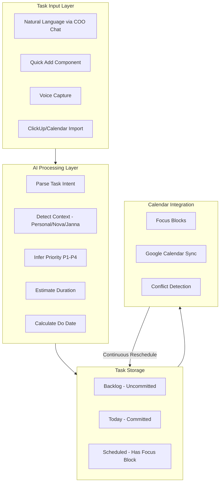

# Incredible Task System for Run Al Nur

## Vision

A task system you'll actually use every day - where you dump tasks naturally (voice, text, quick capture), the AI COO figures out context, priority, and timing, then auto-schedules everything into your Focus Blocks. Motion's intelligence + Sunsama's intentionality + Reclaim's protection.

## Key Concepts (Inspired by the Best)

### From Motion

- **Do Date vs Due Date**: "Due Friday" means deadline; AI calculates WHEN to actually work on it
- **Floating Tasks**: Tasks slot into calendar gaps automatically
- **Proactive Warnings**: "You'll miss the Nova investor deck deadline if you don't start today"
- **Continuous Rescheduling**: Calendar changes? Tasks auto-adjust

### From Sunsama

- **Backlog**: Tasks not committed to a specific day (vs. "Today" tasks)
- **Daily Planning Ritual**: 2-min guided flow each morning
- **Timeboxing**: Realistic time estimates per task
- **Shutdown Ritual**: End-of-day reflection (COO already has this!)

### From Reclaim

- **P1-P4 Priority Auto-bump**: Higher priority tasks bump lower ones
- **Focus Time Protection**: Defend deep work blocks
- **Habits at Optimal Times**: Recurring tasks find the best slot

## Data Model Enhancements

Extend the Task model in [`lib/types.ts`](runalnur-app/lib/types.ts):

```typescript
interface Task {
  // Existing fields...
  
  // NEW: Motion-inspired scheduling
  due_date?: string;           // When it's DUE (deadline)
  do_date?: string;            // When to WORK on it (AI-calculated)
  duration_minutes?: number;   // Time estimate (30, 60, 90, 120)
  scheduled_block_id?: string; // Auto-scheduled Focus Block
  
  // NEW: Priority and auto-scheduling
  priority: 'p1' | 'p2' | 'p3' | 'p4'; // Reclaim-style
  auto_schedule: boolean;      // Let AI schedule this?
  
  // NEW: Backlog vs committed
  committed_date?: string;     // If set, task is "committed" to this day
  
  // NEW: Recurrence
  recurrence_rule?: string;    // RRULE for habits
  parent_task_id?: string;     // For recurring instances
}
```

## Architecture



## Implementation

### 1) Enhanced Task Schema

Migration at [`supabase/migrations/`](runalnur-app/supabase/migrations/):

- Add `do_date`, `duration_minutes`, `scheduled_block_id`
- Add `priority` with P1-P4 values
- Add `committed_date`, `auto_schedule` boolean
- Add `recurrence_rule`, `parent_task_id`

### 2) AI-Powered Task Creation

Enhance the `create_task` tool in [`lib/ai/tools.ts`](runalnur-app/lib/ai/tools.ts):

```typescript
{
  name: "create_task_smart",
  description: "Create a task with AI-powered context detection, priority inference, and optional auto-scheduling",
  parameters: {
    properties: {
      raw_input: { type: "string", description: "Natural language task (e.g., 'Review Nova investor deck by Friday')" },
      // AI will extract and fill these:
      name: { type: "string" },
      context: { type: "string" }, // Auto-detected
      priority: { type: "string" }, // Auto-inferred  
      due_date: { type: "string" },
      duration_minutes: { type: "number" },
      auto_schedule: { type: "boolean" },
    },
    required: ["raw_input"],
  },
}
```

The COO will:

1. Parse natural language: "Call James about the Janna property appraisal tomorrow"
2. Extract: name="Call James about property appraisal", context="janna", due_date="tomorrow"
3. Infer priority based on knowledge base (investors = P1, routine = P3)
4. Estimate duration based on task type

### 3) Auto-Scheduler Engine

New module [`lib/scheduler/engine.ts`](runalnur-app/lib/scheduler/engine.ts):

```typescript
interface SchedulerInput {
  tasks: Task[];           // Unscheduled tasks with auto_schedule=true
  focusBlocks: FocusBlock[]; // Existing calendar
  preferences: {
    workingHours: { start: string; end: string };
    focusTimeGoal: number; // minutes/day to protect
    bufferMinutes: number; // between blocks
  };
}

async function autoSchedule(input: SchedulerInput): Promise<ScheduleResult> {
  // 1. Sort by priority (P1 first) then due date
  // 2. Find available slots (gaps in calendar)
  // 3. Create Focus Blocks for tasks
  // 4. Handle conflicts (bump lower priority)
  // 5. Proactive warnings for at-risk deadlines
}
```

### 4) Enhanced Today Panel

Upgrade [`components/dashboard/TodayPanel.tsx`](runalnur-app/components/dashboard/TodayPanel.tsx):

- **Morning Planning Mode**: Quick ritual to commit tasks from backlog
- **Auto-scheduled indicator**: Show which tasks AI scheduled vs manual
- **Time blocks**: Show duration estimates, progress through day
- **Warnings strip**: "2 tasks at risk of missing deadline"
- **Drag to reschedule**: Drag task to different time slot

### 5) Full Tasks Page

New route `app/tasks/page.tsx`:

- **Inbox/Backlog view**: Uncommitted tasks to triage
- **Today view**: Committed tasks with time blocks
- **Upcoming view**: Week/month timeline
- **Filters**: By context, priority, due date
- **Quick actions**: Commit to today, defer, complete

### 6) COO Integration Enhancements

Enhance [`lib/coo/engine.ts`](runalnur-app/lib/coo/engine.ts):

- **Morning briefing includes scheduling**: "I've scheduled 3 tasks for today..."
- **Proactive task creation**: COO notices you mentioned something in chat and offers to create task
- **Accountability with scheduling**: "You haven't started your P1 task and it's 2pm"
- **Smart rescheduling**: "Your 3pm meeting ran over, I've moved your Nova task to tomorrow"

### 7) Natural Language Commands

The COO should understand:

- "Schedule investor call for this week" → Creates task, AI picks do_date
- "I need to review the Janna docs by Friday" → context=janna, due_date=Friday
- "Add gym to my daily routine" → Creates recurring task with recurrence_rule
- "What do I have today?" → Shows today's committed tasks
- "Push the Nova presentation to next week" → Reschedules

## Key Files to Create/Modify

| File | Action | Purpose |

|------|--------|---------|

| `supabase/migrations/xxx_tasks_v2.sql` | Create | New task fields |

| `lib/types.ts` | Modify | Extended Task interface |

| `lib/scheduler/engine.ts` | Create | Auto-scheduling logic |

| `lib/scheduler/conflicts.ts` | Create | Conflict detection |

| `lib/ai/tools.ts` | Modify | Smart task creation tool |

| `lib/coo/engine.ts` | Modify | Scheduling integration |

| `app/tasks/page.tsx` | Create | Full tasks page |

| `components/tasks/TaskInbox.tsx` | Create | Backlog/inbox view |

| `components/tasks/DayTimeline.tsx` | Create | Today timeline view |

| `components/dashboard/TodayPanel.tsx` | Modify | Enhanced with scheduling |

| `app/api/tasks/schedule/route.ts` | Create | Auto-schedule endpoint |

| `app/api/tasks/commit/route.ts` | Create | Commit task to day |

## Validation Criteria

1. Create task via natural language: "Review Janna lease agreement by Wednesday" → AI detects context=janna, sets due_date, estimates 45min duration
2. Morning planning: See uncommitted tasks, commit 3-5 to today with one tap
3. Auto-schedule: Tasks appear as Focus Blocks in calendar
4. Conflict handling: When calendar changes, tasks reschedule automatically
5. COO accountability: Gets notified if P1 task not started by afternoon
6. Proactive warning: "The Nova deck is due Friday and you haven't started - want me to schedule 2 hours tomorrow?"