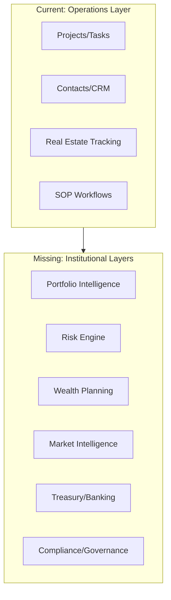
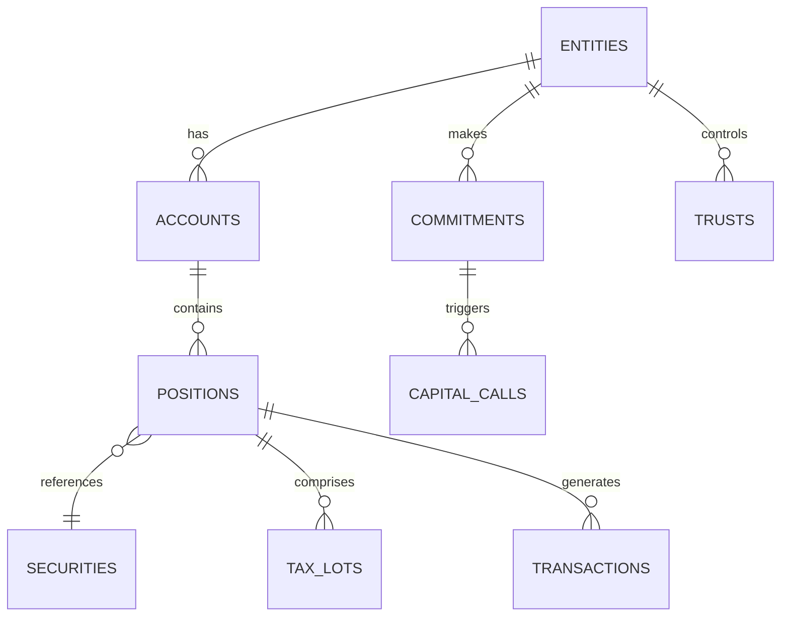

# What BlackRock, Rothschild, and Soros Have That RunAlNur Is Missing

## Current State Assessment

RunAlNur is a solid **operational command center** with:

- Multi-arm business management (7 arms including Maison family office)
- Project/task/contact management with integrations (ClickUp, HubSpot, Process Street)
- Real estate tracking for Janna (properties, renovations, deal pipeline)
- Basic AI assistant with CRUD operations
- SOP workflow execution

**What you have is essentially a business operations system. What they have is a wealth intelligence empire.**

---

## The Missing Layers

---

## 1. Portfolio Intelligence System

**What they have:** Real-time consolidated view of ALL assets across every vehicle, account, and entity.

**Currently missing:**

- No `positions` or `holdings` tables
- No NAV (Net Asset Value) calculations
- No P&L tracking (realized/unrealized)
- No performance attribution
- No benchmark comparisons

**Would require:**

- Holdings database with cost basis, market value, asset class
- Integration with brokerage APIs (Plaid, Yodlee, or direct custodian feeds)
- Real-time market data (Alpha Vantage, Polygon, Bloomberg)
- Performance calculation engine (TWRR, IRR, XIRR)

---

## 2. Risk Management Engine

**What they have:** Real-time risk dashboards that would make Wall Street quants jealous.

**Currently missing:**

- No Value at Risk (VaR) calculations
- No portfolio concentration analysis
- No correlation matrices
- No stress testing / scenario analysis
- No liquidity risk monitoring
- No counterparty exposure tracking

---

## 3. Treasury and Cash Management

**What they have:** Multi-bank, multi-currency visibility with predictive cash flow.

**Currently missing:**

- No bank account aggregation
- No cash position tracking
- No FX exposure management
- No capital call/distribution forecasting
- No yield optimization for idle cash

---

## 4. Private Investment Management

**What they have:** Full GP/LP tracking across funds, co-investments, and directs.

**Currently missing (critical for a family office):**

- No fund commitments tracking
- No capital calls / distributions workflow
- No vintage year analysis
- No J-curve modeling
- No carried interest calculations
- No waterfall distributions

**Your `deals` table is close but lacks the private equity lifecycle.**

---

## 5. Tax and Estate Intelligence

**What they have:** Multi-generational wealth transfer optimization running 24/7.

**Currently missing:**

- No entity structure mapping (LLCs, trusts, holding companies)
- No tax lot optimization
- No estate planning timeline
- No gift/trust tracking
- No K-1 aggregation
- No tax loss harvesting signals

---

## 6. Market Intelligence and Research

**What they have:** Custom intelligence feeds, alternative data, sentiment analysis.

**Currently missing:**

- No news aggregation relevant to holdings
- No sentiment analysis on portfolio companies
- No macro indicator dashboard
- No earnings calendar integration
- No regulatory filing alerts (SEC, etc.)

---

## 7. Compliance and Governance

**What they have:** Audit trails that could survive congressional inquiry.

**Currently missing (you have `activities` but need more):**

- No approval workflows with multi-sig
- No regulatory reporting automation
- No conflict of interest tracking
- No trading compliance (restricted lists, blackout periods)
- No document retention policies

---

## 8. Advanced Analytics and Forecasting

**What they have:** Monte Carlo simulations, AI-driven forecasting, scenario planning.

**Currently missing:**

- No financial projections engine
- No "what-if" scenario modeling
- No cash flow forecasting
- No sensitivity analysis
- No AI-driven anomaly detection

---

## Priority Tiers for Implementation

### Tier 1: Foundation (Highest Impact)

| Feature | Complexity | Why Critical |

|---------|------------|--------------|

| Holdings/Positions tracking | Medium | Can't manage wealth without knowing what you own |

| Bank/brokerage aggregation | High | Single source of truth for liquidity |

| Entity structure mapping | Medium | Tax optimization requires knowing the structure |

| Capital calls workflow | Medium | Essential for any PE/VC investments |

### Tier 2: Intelligence Layer

| Feature | Complexity | Why Critical |

|---------|------------|--------------|

| Real-time market data | Medium | Positions mean nothing without prices |

| Performance attribution | High | Understanding what's working |

| News/sentiment for holdings | Medium | Proactive vs. reactive management |

| Cash flow forecasting | Medium | Never get caught illiquid |

### Tier 3: Institutional Grade

| Feature | Complexity | Why Critical |

|---------|------------|--------------|

| Risk engine (VaR, etc.) | High | What the big boys use |

| Tax optimization engine | Very High | Where real alpha is found |

| Compliance automation | High | Protection and governance |

| Monte Carlo projections | High | Planning across generations |

---

## Architectural Recommendation

Extend your existing schema with new domains:

---

## The Bottom Line

**You have the operational skeleton of a family office OS. What's missing is the financial nervous system.**

BlackRock manages $10T because they have Aladdin - a risk and portfolio management system that sees everything. The Rothschilds have multi-generational structures and tax vehicles that compounds wealth across centuries. Soros has quant models and macro intelligence that spot opportunities before others.

The question is: **What level of sophistication does House Al Nur need?**

1. **Emerging Family Office** - Add holdings tracking + basic reporting
2. **Established Family Office** - Full portfolio + risk + tax optimization  
3. **Institutional Grade** - The full stack with custom intelligence

Which tier resonates with where you want to take this?