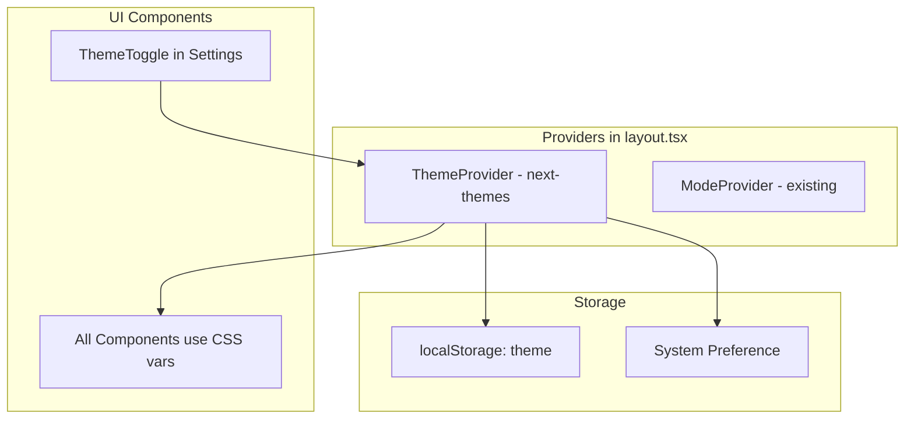

# Light/Dark Mode System

A proper, beautiful light/dark mode implementation with system preference detection, smooth transitions, and comprehensive styling across all components.

---

## Current State Analysis

**What exists:**

- CSS variables for light mode (`:root`) and dark mode (`.dark`) in [`globals.css`](runalnur-app/app/globals.css)
- Both palettes are well-defined (lines 69-130 for light, 133-175 for dark)
- Viewport metadata already has theme-color for both modes in [`layout.tsx`](runalnur-app/app/layout.tsx)

**What's missing:**

- No `next-themes` package or ThemeProvider
- No toggle UI in settings
- No system preference detection
- Hardcoded colors in a few components need fixing
- No smooth transition between themes

---

## Architecture



---

## Implementation Plan

### 1. Install and Configure next-themes

**Install package:**

```bash
npm install next-themes
```

**Create ThemeProvider wrapper** (`lib/theme/provider.tsx`):

```tsx
"use client";

import { ThemeProvider as NextThemesProvider } from "next-themes";
import { type ThemeProviderProps } from "next-themes";

export function ThemeProvider({ children, ...props }: ThemeProviderProps) {
  return (
    <NextThemesProvider
      attribute="class"
      defaultTheme="system"
      enableSystem
      disableTransitionOnChange={false}
      {...props}
    >
      {children}
    </NextThemesProvider>
  );
}
```

**Update layout.tsx:**

- Add `suppressHydrationWarning` to `<html>` tag (required for next-themes)
- Wrap app with ThemeProvider

### 2. Create Theme Toggle Component

**Create** `components/settings/ThemeToggle.tsx`:

```tsx
"use client";

import { useTheme } from "next-themes";
import { Moon, Sun, Monitor } from "lucide-react";
import { motion } from "framer-motion";

// Three options: Light, Dark, System (default)
// Beautiful segmented control UI
// Icons with smooth animations
```

Features:

- Segmented control with three options
- Animated icon transitions
- Current selection highlight
- Keyboard accessible

### 3. Add Theme Tab to Settings Page

Update [`app/settings/page.tsx`](runalnur-app/app/settings/page.tsx):

- Add new "Appearance" tab
- Include ThemeToggle component
- Preview of light/dark appearance

### 4. Fix Hardcoded Colors

**Files to update:**

| File | Issue | Fix |

|------|-------|-----|

| `components/platform/SafeArea.tsx` | Hardcoded `#0a0a0a` for status bar | Use theme-aware color |

| `components/dashboard/ArmCard.tsx` | `rgba(0,0,0,0.2)` shadow | Use CSS variable or theme-aware shadow |

| `components/ui/card.tsx` | Same shadow issue | Same fix |

The brand colors in `ChatInterface.tsx` (Gemini blue, Anthropic amber) should stay as-is since they're intentional brand colors.

### 5. Add Theme Transition Styles

Add to `globals.css`:

```css
/* Smooth theme transitions */
html.transitioning,
html.transitioning *,
html.transitioning *:before,
html.transitioning *:after {
  transition: background-color 0.3s ease, 
              border-color 0.3s ease, 
              color 0.15s ease !important;
  transition-delay: 0 !important;
}
```

### 6. Update Viewport Theme Color

Modify [`layout.tsx`](runalnur-app/app/layout.tsx) to dynamically update the browser theme color based on selected theme:

```tsx
// Already has:
export const viewport: Viewport = {
  themeColor: [
    { media: "(prefers-color-scheme: light)", color: "#ffffff" },
    { media: "(prefers-color-scheme: dark)", color: "#0a0a0a" },
  ],
  // ...
};
```

This handles system preference. For manual toggle, we'll use a client-side script.

### 7. Dark Mode Polish Checklist

Ensure these look beautiful in dark mode:

- [ ] Sidebar background and borders
- [ ] Cards and card headers
- [ ] Input fields and focus states
- [ ] Buttons (all variants)
- [ ] Dropdown menus
- [ ] Modal dialogs
- [ ] Tooltips
- [ ] Toast notifications
- [ ] Tables
- [ ] Status indicators (live, warning, error)
- [ ] Charts (grayscale)
- [ ] Scrollbars
- [ ] Selection highlight
- [ ] Mobile navigation
- [ ] PWA status bar (iOS/Android)

### 8. Mobile-Specific Considerations

**Status Bar:**

Update `SafeArea.tsx` to detect theme and set appropriate status bar style:

- Light mode: Dark text on light background
- Dark mode: Light text on dark background

**PWA manifest:**

The manifest already references theme colors. Ensure consistency.

**Touch states:**

Verify active/hover states look good in both modes.

---

## Files to Create/Modify

| File | Action |

|------|--------|

| `lib/theme/provider.tsx` | Create - ThemeProvider wrapper |

| `components/settings/ThemeToggle.tsx` | Create - Theme selection UI |

| `app/layout.tsx` | Modify - Add ThemeProvider, suppressHydrationWarning |

| `app/settings/page.tsx` | Modify - Add Appearance tab |

| `app/globals.css` | Modify - Add transition styles |

| `components/platform/SafeArea.tsx` | Modify - Theme-aware status bar |

| `components/dashboard/ArmCard.tsx` | Modify - Theme-aware shadows |

| `components/ui/card.tsx` | Modify - Theme-aware shadows |

---

## Theme Toggle UI Design

```
┌─────────────────────────────────────┐
│  APPEARANCE                         │
├─────────────────────────────────────┤
│                                     │
│  Theme                              │
│  ┌─────────────────────────────┐    │
│  │ ☀ Light │ 🌙 Dark │ 💻 System│   │
│  └─────────────────────────────┘    │
│  Matches your system preference     │
│                                     │
│  ┌─────────────────────────────┐    │
│  │   Preview Card               │    │
│  │   Shows current theme        │    │
│  └─────────────────────────────┘    │
│                                     │
└─────────────────────────────────────┘
```

---

## Success Criteria

- [ ] Theme toggle works with three options: Light, Dark, System
- [ ] System is the default
- [ ] Theme persists across sessions (localStorage)
- [ ] Smooth transitions between themes
- [ ] All components look beautiful in both modes
- [ ] No flash of wrong theme on page load
- [ ] Mobile status bar updates correctly
- [ ] PWA theme color updates correctly
- [ ] Keyboard accessible toggle
- [ ] No hardcoded colors that break in dark mode

---

## Testing Checklist

1. **Desktop Browser:**

   - Toggle through all three options
   - Change system preference, verify "System" responds
   - Refresh page, verify theme persists

2. **Mobile Browser:**

   - Same toggle tests
   - Verify status bar color changes
   - Test PWA installed mode

3. **Visual Review:**

   - Every page in light mode
   - Every page in dark mode
   - Every component state (hover, focus, disabled)