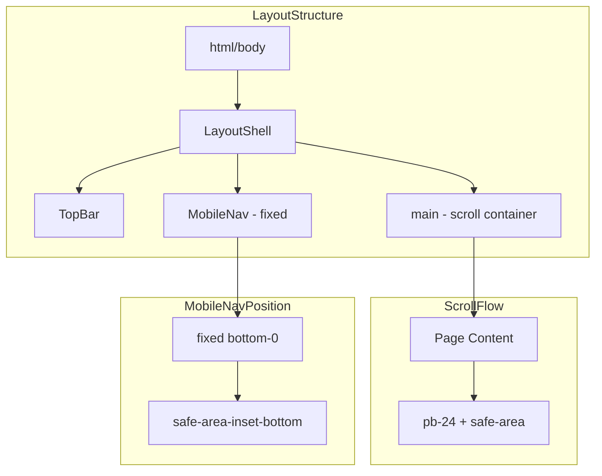

# Mobile Optimization Overhaul

## Critical Issues Identified

1. **Scroll not working** - iOS/Capacitor CSS breaks scroll; `#__next` selector doesn't exist in App Router
2. **Bottom nav overlap** - Content doesn't properly account for nav height + safe areas
3. **Height calculations broken** - Pages use `100vh` without accounting for mobile chrome
4. **Touch targets too small** - Quick actions, filter buttons under 44px
5. **Safe area handling incomplete** - Status bar and home indicator not properly handled

---

## Phase 1: Fix Critical Scroll and Layout

### 1.1 Fix iOS Scroll Blocking in [`globals.css`](runalnur-app/app/globals.css)

The current CSS sets `position: fixed` on body for iOS which completely breaks scroll. Replace with proper scroll containment:

```css
/* REMOVE these problematic rules: */
html.capacitor body,
html.ios body {
  position: fixed; /* THIS BREAKS SCROLL */
  width: 100%;
  height: 100%;
  overflow: hidden;
}

/* REPLACE WITH: */
html.capacitor,
html.ios {
  height: 100%;
  overflow: hidden;
}

html.capacitor body,
html.ios body {
  height: 100%;
  overflow: hidden;
}

/* Main scroll container handles scroll */
html.capacitor main,
html.ios main {
  -webkit-overflow-scrolling: touch;
  overscroll-behavior-y: contain;
}
```

### 1.2 Fix Layout Shell [`LayoutShell.tsx`](runalnur-app/components/layout/LayoutShell.tsx)

```tsx
// Change main content area:
<main className="flex-1 overflow-y-auto overscroll-contain">
  <div className="p-4 md:p-6 pb-24 md:pb-6 max-w-[1600px] mx-auto safe-area-bottom">
    {children}
  </div>
</main>
```

Key changes:

- `overflow-y-auto` instead of relying on parent
- `pb-24` for mobile (64px nav + 32px buffer)
- Add `safe-area-bottom` class
- Add `overscroll-contain` to prevent rubber-banding

### 1.3 Fix Mobile Nav Positioning [`MobileNav.tsx`](runalnur-app/components/layout/MobileNav.tsx)

```tsx
<nav className="md:hidden fixed bottom-0 left-0 right-0 z-50 
  bg-background/95 backdrop-blur-md border-t border-border">
  <div className="flex items-center justify-around h-16 
    pb-[env(safe-area-inset-bottom,0px)]">
    {/* nav items */}
  </div>
</nav>
```

---

## Phase 2: Fix Page Height Calculations

### 2.1 Create Mobile-Aware Height Utility

Add CSS custom properties in [`globals.css`](runalnur-app/app/globals.css):

```css
:root {
  --mobile-nav-height: 64px;
  --header-height: 56px;
  /* Dynamic viewport height that accounts for mobile browser chrome */
  --vh: 1vh;
}

/* Use dvh where supported */
@supports (height: 100dvh) {
  :root {
    --app-height: 100dvh;
  }
}

@supports not (height: 100dvh) {
  :root {
    --app-height: calc(var(--vh, 1vh) * 100);
  }
}
```

### 2.2 Fix AI Page [`app/ai/page.tsx`](runalnur-app/app/ai/page.tsx)

```tsx
// Change from:
<div className="h-[calc(100vh-8rem)]">

// To:
<div className="h-[calc(100dvh-10rem)] md:h-[calc(100vh-8rem)]">
```

---

## Phase 3: Touch Target and UX Fixes

### 3.1 Fix Quick Actions in [`ChatInterface.tsx`](runalnur-app/components/ai/ChatInterface.tsx)

```tsx
{/* Quick Actions - make touch friendly */}
<div className="flex items-center gap-2 mb-3 overflow-x-auto pb-2 -mx-4 px-4 md:mx-0 md:px-0">
  {quickActions.map((action) => (
    <button
      key={action.action}
      onClick={() => handleQuickAction(action.action)}
      className="text-[10px] font-medium tracking-wider uppercase 
        text-muted-foreground hover:text-foreground transition-colors 
        px-3 py-2.5 min-h-[44px] min-w-[44px] /* Touch target */
        border border-border rounded-sm hover:border-foreground/30
        whitespace-nowrap flex-shrink-0"
    >
      {action.label}
    </button>
  ))}
</div>
```

### 3.2 Fix Filter Dropdowns in [`app/projects/page.tsx`](runalnur-app/app/projects/page.tsx)

```tsx
{/* Filters - horizontal scroll on mobile */}
<div className="flex items-center gap-2 overflow-x-auto pb-2 -mr-4 pr-4 md:mr-0 md:pr-0">
  <select className="h-10 md:h-8 text-xs bg-muted border-0 rounded-sm px-3 
    min-w-[100px] flex-shrink-0">
    {/* options */}
  </select>
</div>
```

### 3.3 Add Touch Feedback in [`globals.css`](runalnur-app/app/globals.css)

```css
/* Enhanced touch states for mobile */
@media (pointer: coarse) {
  button:active:not(:disabled),
  [role="button"]:active:not(:disabled),
  a:active {
    transform: scale(0.98);
    opacity: 0.8;
  }
  
  /* Larger tap targets */
  .touch-target {
    min-height: 44px;
    min-width: 44px;
  }
}
```

---

## Phase 4: Safe Area and PWA Optimization

### 4.1 Update Safe Area Classes

```css
/* More robust safe area handling */
.safe-area-bottom {
  padding-bottom: max(env(safe-area-inset-bottom, 0px), 16px);
}

/* For bottom nav specifically */
.mobile-nav-safe {
  padding-bottom: env(safe-area-inset-bottom, 0px);
  margin-bottom: 0;
}

/* Content that sits above mobile nav */
.above-mobile-nav {
  padding-bottom: calc(64px + env(safe-area-inset-bottom, 0px) + 16px);
}

@media (min-width: 768px) {
  .above-mobile-nav {
    padding-bottom: 24px;
  }
}
```

### 4.2 Fix Viewport Height Script

Add to [`SafeArea.tsx`](runalnur-app/components/platform/SafeArea.tsx):

```tsx
useEffect(() => {
  // Fix for mobile viewport height
  const setVH = () => {
    const vh = window.innerHeight * 0.01;
    document.documentElement.style.setProperty('--vh', `${vh}px`);
  };
  
  setVH();
  window.addEventListener('resize', setVH);
  window.addEventListener('orientationchange', setVH);
  
  return () => {
    window.removeEventListener('resize', setVH);
    window.removeEventListener('orientationchange', setVH);
  };
}, []);
```

---

## Phase 5: Component-Level Fixes

### 5.1 Files to Update

| File | Changes |

|------|---------|

| `globals.css` | Remove broken iOS fixed body, add safe area utilities, touch states |

| `LayoutShell.tsx` | Fix overflow, add safe area padding |

| `MobileNav.tsx` | Fix height with safe area, improve touch targets |

| `TopBar.tsx` | Ensure proper height on mobile |

| `ChatInterface.tsx` | Fix quick actions, improve scroll |

| `app/ai/page.tsx` | Fix height calculation |

| `app/projects/page.tsx` | Fix filter scroll |

| `SafeArea.tsx` | Add viewport height fix |

---

## Architecture



---

## Testing Checklist

After implementation, verify on:

- [ ] iPhone Safari (PWA mode)
- [ ] iPhone Safari (browser mode)
- [ ] Android Chrome
- [ ] Desktop Chrome (responsive mode)
- [ ] Test scroll in: Dashboard, Projects, AI Chat, Settings
- [ ] Test bottom nav doesn't overlap content
- [ ] Test all touch targets are 44px+
- [ ] Test filter horizontal scroll on narrow screens