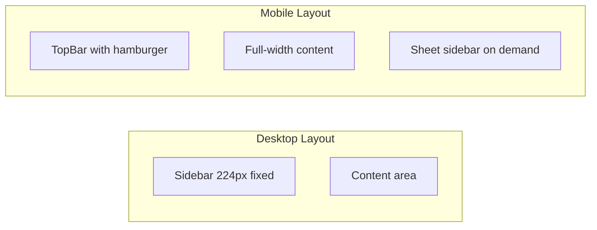

# Mobile Responsive Layout for Empire OS

## Strategy

Use a **mobile-first enhancement** approach:

- Sidebar: Hidden by default on mobile, slides in via Sheet component when hamburger is tapped
- TopBar: Simplified for mobile with hamburger menu button, condensed actions
- Content: Responsive padding, stacked grids, horizontally scrollable tables
- Touch targets: Minimum 44px for all interactive elements

## Key Files to Modify

### 1. Layout Shell - [runalnur-app/components/layout/LayoutShell.tsx](runalnur-app/components/layout/LayoutShell.tsx)

- Add mobile state management for sidebar open/close
- Hide desktop sidebar on mobile (`hidden md:flex`)
- Add Sheet component for mobile sidebar overlay
- Pass toggle function to TopBar

### 2. Sidebar - [runalnur-app/components/layout/Sidebar.tsx](runalnur-app/components/layout/Sidebar.tsx)

- Extract sidebar content into reusable `SidebarContent` component
- Add `onNavigate` callback to close sheet on mobile navigation
- Keep existing desktop behavior unchanged

### 3. TopBar - [runalnur-app/components/layout/TopBar.tsx](runalnur-app/components/layout/TopBar.tsx)

- Add hamburger menu button (visible only on mobile)
- Hide search bar on mobile (keep command palette accessible)
- Hide date on small screens
- Stack/condense action buttons

### 4. Global CSS - [runalnur-app/app/globals.css](runalnur-app/app/globals.css)

- Add responsive table wrapper with horizontal scroll
- Mobile-specific card padding
- Touch-friendly minimum heights

### 5. Dashboard - [runalnur-app/app/page.tsx](runalnur-app/app/page.tsx)

- Responsive grid: `grid-cols-1 lg:grid-cols-3`
- Stack metrics panel on small screens

### 6. Tables (Projects, Contacts pages)

- Wrap tables in horizontal scroll container on mobile
- Reduce visible columns or use card layout for very small screens

## Responsive Breakpoints

| Breakpoint | Width | Layout |

|------------|-------|--------|

| Mobile | < 768px | Sheet sidebar, stacked content |

| Tablet | 768px - 1024px | Sidebar visible, 2-col grids |

| Desktop | > 1024px | Full layout, 3+ col grids |

## Implementation Order

1. LayoutShell + Sidebar (core navigation)
2. TopBar (hamburger trigger)
3. Global CSS (responsive utilities)
4. Page layouts (dashboard, projects, contacts)