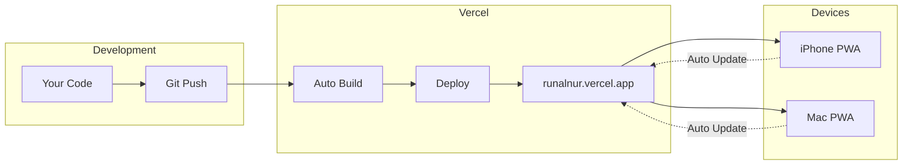

# Native PWA Deployment Plan

## What You'll Get

- App icon on your iPhone home screen and Mac dock
- Full-screen native feel (no browser chrome)
- Automatic updates when you push code
- Offline support
- App shortcuts for quick access to COO, Calendar, Quests

---

## 1. Deploy to Vercel

Connect the repo to Vercel for production hosting:

```bash
# Install Vercel CLI
npm i -g vercel

# Deploy from runalnur-app directory
cd runalnur-app
vercel
```

This gives you `runalnur.vercel.app` (or custom domain).

---

## 2. Generate App Icons

The manifest references PNG icons but only an SVG exists. Generate all required sizes:

Create [`scripts/generate-icons.js`](runalnur-app/scripts/generate-icons.js):

- Use `sharp` library to convert SVG to PNGs at all sizes (72, 96, 128, 144, 152, 192, 384, 512)
- Generate Apple Touch Icons for iOS

---

## 3. iOS Splash Screens

Add Apple splash screens for seamless app launch on iPhone:

Update [`app/layout.tsx`](runalnur-app/app/layout.tsx):

```tsx
<link rel="apple-touch-startup-image" href="/splash/splash-1170x2532.png" 
      media="(device-width: 390px) and (device-height: 844px)" />
// ... more sizes for different iPhones
```

---

## 4. Enhanced PWA Meta Tags

Add iOS-specific meta tags for [`app/layout.tsx`](runalnur-app/app/layout.tsx):

```tsx
<meta name="apple-mobile-web-app-capable" content="yes" />
<meta name="apple-mobile-web-app-status-bar-style" content="black-translucent" />
<meta name="apple-mobile-web-app-title" content="RunAlNur" />
```

---

## 5. Service Worker for Offline + Fast Updates

The existing next-pwa setup handles this. Verify [`next.config.ts`](runalnur-app/next.config.ts) has proper caching strategy for instant updates.

---

## 6. Environment Variables on Vercel

Set these in Vercel Dashboard > Settings > Environment Variables:

- `NEXT_PUBLIC_SUPABASE_URL`
- `NEXT_PUBLIC_SUPABASE_ANON_KEY`
- `SUPABASE_SERVICE_ROLE_KEY`
- All API keys (Anthropic, Google, etc.)

---

## Installation Instructions (Generated)

Create a help page or modal with installation steps:

**iPhone:**

1. Open Safari → runalnur.vercel.app
2. Tap Share button (box with arrow)
3. Tap "Add to Home Screen"
4. Tap "Add"

**Mac:**

1. Open Chrome → runalnur.vercel.app
2. Click the install icon in address bar (or Menu → Install RunAlNur)
3. Click "Install"

---

## Architecture



---

## Files to Create/Modify

| File | Action |

|------|--------|

| `scripts/generate-icons.js` | Create - icon generation script |

| `public/icons/*.png` | Generate - all icon sizes |

| `public/splash/*.png` | Create - iOS splash screens |

| `app/layout.tsx` | Modify - add iOS meta tags |

| `vercel.json` | Create - deployment config |

| `.env.production` | Create - production env template |