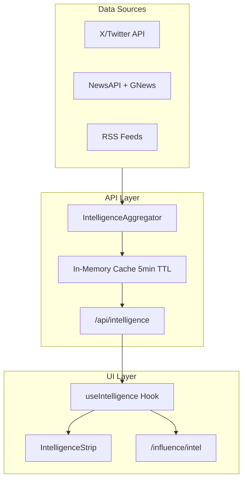

# News Intelligence Feed for Command Center - COMPLETED

## What Was Built

### 1. Types and Constants

- `IntelligenceItem` type in [`lib/types.ts`](runalnur-app/lib/types.ts)
- `INTEL_REGIONS` and `INTEL_SOURCES` in [`lib/constants.ts`](runalnur-app/lib/constants.ts)
- Regional X accounts, news keywords, and RSS feeds configured

### 2. Intelligence Integration Service

[`lib/integrations/intelligence.ts`](runalnur-app/lib/integrations/intelligence.ts):

- `XClient` - Twitter API v2 client for fetching tweets from monitored accounts
- `NewsAPIClient` - NewsAPI.org integration for headlines and search
- `GNewsClient` - GNews.io integration for global news
- RSS parser for fallback/free news sources
- `IntelligenceAggregator` - unified aggregator that combines all sources

### 3. API Route

[`app/api/intelligence/route.ts`](runalnur-app/app/api/intelligence/route.ts):

- GET endpoint with query params: `regions`, `sources`, `limit`, `refresh`
- In-memory caching with 5-minute TTL
- Returns available sources status in response meta

### 4. React Hook

[`lib/hooks/useIntelligence.ts`](runalnur-app/lib/hooks/useIntelligence.ts):

- `useIntelligence` - main hook with polling (default 5 min)
- `useIntelligenceByRegion` - helper for filtering
- `useBreakingNews` - helper for recent/breaking items

### 5. Dashboard Component

[`components/dashboard/IntelligenceStrip.tsx`](runalnur-app/components/dashboard/IntelligenceStrip.tsx):

- Beautiful strip with region filters
- Breaking news indicator with pulse animation
- Source icons (X, News, RSS)
- Time-ago formatting
- Matches existing agentic design system

### 6. Intel Page (Updated)

[`app/influence/intel/page.tsx`](runalnur-app/app/influence/intel/page.tsx):

- Full-screen intelligence view
- Region tabs (Gulf, MENA, America, Global, China, Russia)
- Source filtering (X, News, RSS, All)
- Source availability indicators
- Loading/error states
- Responsive design

### 7. Command Center Integration

- IntelligenceStrip added below Projects/Activity grid in [`app/page.tsx`](runalnur-app/app/page.tsx)

## Environment Variables Required

```env
# X (Twitter) API
X_BEARER_TOKEN=your_bearer_token

# News APIs (at least one recommended)
NEWSAPI_KEY=your_newsapi_key
GNEWS_API_KEY=your_gnews_key
```

## Regional Coverage

| Region | X Accounts | News Keywords |

|--------|------------|---------------|

| Gulf | @UAE_BARQ, @AlArabiya_Brk, @GulfNews | UAE, Saudi Arabia, Qatar, Kuwait, Dubai |

| MENA | @AJABreaking, @MiddleEastEye | Middle East, Arab, Egypt, Jordan, Lebanon |

| America | @AP, @Reuters, @WSJ, @business | US economy, Federal Reserve, Wall Street |

| Global | @BBCBreaking, @AFP, @ReutersWorld | global economy, world news |

| China | @SCMPNews, @XHNews, @ChinaDaily | China, Beijing, Xi Jinping |

| Russia | @RTcom, @MoscowTimes | Russia, Putin, Moscow, Ukraine |

## Navigation

- Sidebar: Influence Mode → Intelligence → NEWS FEED (`/influence/intel`)
- Dashboard: IntelligenceStrip component with "View All" link

## Architecture

