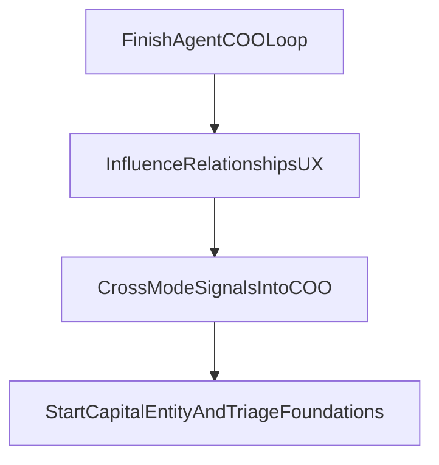

## What I reviewed (so the roadmap matches your plans)

- **3‑mode Dynasty OS** plan is largely implemented already (mode switcher, mode-specific nav, cross‑mode notifications, influence/capital route structure).
- **AgentCOO/AgentBoss** core engine exists (Guru + ClickUp + Opus/Gemini + APIs + COO page), but the *operational loop is incomplete*:
  - DB tables exist (`coo_*`), but **focus sessions are not persisted** (no sessions API/hook).
  - **PriorityBar is not built/integrated** into `TopBar`.
  - **Focus time is hardcoded** (`0m`).
  - **EOD summary UI + settings UI** are missing.
- **Influence → Contacts** now has arm grouping + collapse/focus UX, and a detail view exists — you want the detail view animation upgraded to a **fast shared-layout transform from the clicked row** into a **center floating card** (and **bottom sheet on mobile**).
- You also want this Contacts/Relationships system to be **HubSpot-ready** (and not paint us into a corner if you ever switch CRM later).

## High-level sequence (why this order)

- **Complete the COO daily loop first** because it is the “brain” referenced across multiple plans (AgentBoss/Empire build order) and unlocks cross‑mode orchestration.
- **Then deepen Influence Relationships** so contacts become actionable (reachout, followups, interaction logging), and so COO can ingest Influence signals.
- **Then wire cross‑mode alerts → COO context** so Capital/Influence actually influence the daily plan.

## Phase 1 — Finish AgentCOO daily loop (core functionality)

### 1) Focus sessions: persistence + real-time timer

- **Create API routes**:
  - `runalnur-app/app/api/coo/sessions/route.ts` (start, get active)
  - `runalnur-app/app/api/coo/sessions/[id]/route.ts` (pause/end)
- **Add a hook** in `runalnur-app/lib/hooks/useCOO.ts`:
  - `useFocusSession()` that wraps those endpoints and exposes `start/pause/end/activeSession`.
- **Wire into UI**:
  - Update `runalnur-app/app/coo/page.tsx` so Start/Pause/Done/Defer call the sessions API and log to `coo_accountability_log`.
  - Replace the hardcoded `Focus Time: 0m` with **today’s accumulated minutes + live ticking when active**.

### 2) PriorityBar (TopBar integration)

- **Implement** `runalnur-app/components/coo/PriorityBar.tsx` using the existing `PriorityBarItem` in `runalnur-app/components/coo/PriorityCard.tsx`.
- **Integrate into** `runalnur-app/components/layout/TopBar.tsx`:
  - Show “NOW” focus + timer + quick actions.
  - Behavior: if there’s an active session, show it; otherwise show today’s top 3.

### 3) EOD Summary UI

- **Create** `runalnur-app/components/coo/DaySummary.tsx` (scorecard + assessment + tomorrow preview)
- **Add** an EOD trigger in `runalnur-app/app/coo/page.tsx` that calls `/api/coo/briefing?type=evening` and renders the component.

### 4) COO Settings UI

- **Create** `runalnur-app/components/coo/COOSettings.tsx` and mount it in `runalnur-app/app/coo/page.tsx` (or `/settings` tab).
- Wire to existing `/api/coo/preferences`.

## Phase 2 — Influence Relationships UX (your request)

### 5) Replace side sheet with shared-layout modal animation

- Replace the current side `Sheet` detail view in `runalnur-app/app/influence/contacts/page.tsx` with a **shared layout** transition:
  - Wrap each row in a `motion.div` with `layoutId="contact-card-{id}"`.
  - On click, render an overlay `Dialog`/portal with a centered `motion.div` using the same `layoutId`.
  - Use a **fast spring** transition (snappy, ~200ms) so it feels fluid and location-based.
  - On **mobile**, render a **bottom sheet** variant (same `layoutId`, different target layout).

### 6) Make contact details actionable

- In the floating card:
  - **Email** (mailto)
  - **Phone** (tel)
  - **WhatsApp** (wa.me, best-effort normalize)
  - Show tags, reachout status, notes.

### 7) Next Influence features (small, high leverage)

- **Interaction logging + follow-up** (to power Influence decay + COO inputs):
  - Log “called/emailed/met” with timestamp, optional note.
  - Minimal UI: button in the contact card.
  - Data: either extend existing activity system or add an Influence-specific interaction table.

## Phase 2.5 — CRM integration readiness (HubSpot-first, CRM-agnostic)

### 7.5) HubSpot-ready data model + sync adapter design (no hard dependency yet)

Goal: keep RunAlNur as the *operating system* (arms, AI logic, decay, cross-mode), while letting HubSpot become the *external CRM* when you turn it on.

- **Internal source of truth stays in RunAlNur** for:
  - `arm_id` assignment
  - relationship interactions and follow-ups
  - AI-generated prioritization + nudges
- **External CRM IDs are stored without coupling**:
  - keep `hubspot_id`
  - add a generic external references field (so Salesforce is possible later), e.g. `external_refs: { hubspot: string, salesforce: string }`
- **Make follow-ups first-class**:
  - follow-up has `owner_type` (you / teammate / ai), `owner_id`, `due_at`, `status`, and links to contact + optionally project/arm
  - interactions (call/email/meeting) are time-stamped and can be synced as HubSpot engagements later
- **Sync shape (later)**:
  - inbound: HubSpot webhooks → RunAlNur
  - outbound: RunAlNur actions → HubSpot (tasks/engagements/sequence enrollment)
  - idempotency + de-dupe keys: external ID first, then email, then phone

## Phase 3 — Cross-mode signals into COO (so modes actually talk)

### 8) Feed cross-mode alerts into COO context builder

- Update `runalnur-app/lib/coo/engine.ts` context building to include:
  - Influence alerts (relationship decay / overdue followups)
  - Capital alerts (bills due / cash low)
- Add to prompts so Opus prioritization considers them (and Gemini check-ins references them).

## Phase 4 — Capital foundation (start AgentWealth path)

### 9) Minimal entity + manual accounts + obligations

- Implement the **entity model + manual accounts** first (per AgentWealth plan), and generate cross-mode alerts from due dates.

## Notes / guardrails

- The new animation will originate from the **clicked contact row** (per your answer), and use **bottom sheet on mobile**.
- I’ll keep this incremental: no big schema redesign unless needed; focus on “daily loop + actionable relationships + cross-mode inputs”.