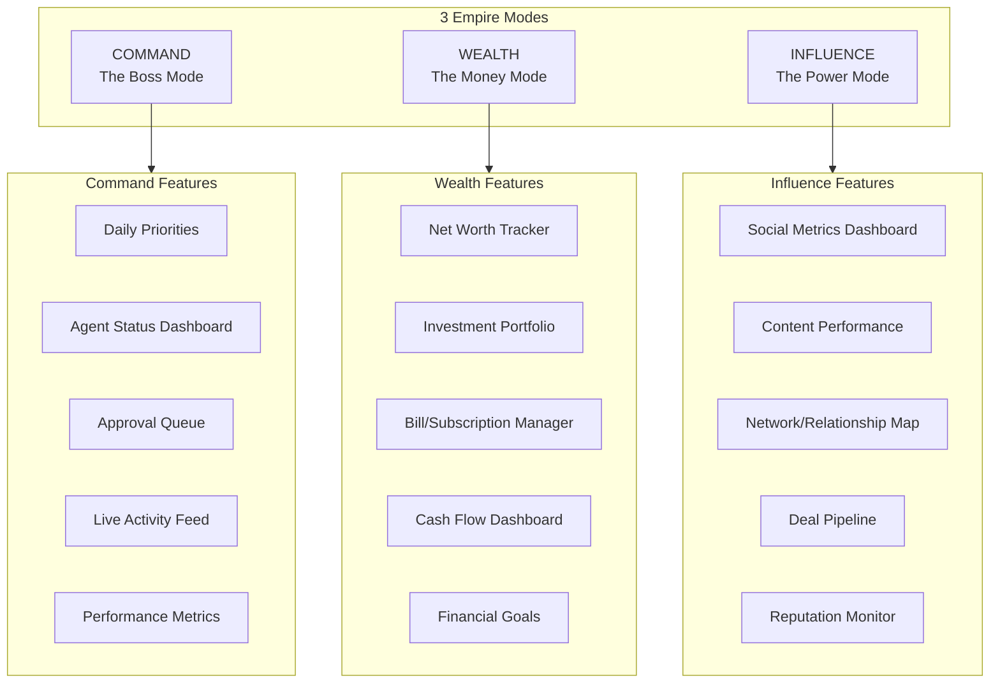

# RunAlNur Empire - 3 Mode Architecture

## The Vision

Inspired by Matt Schlicht's (@MattPRD) Agent ecosystem:

- **AgentCommand** -> your **Command** mode
- **AgentWealth** -> your **Wealth** mode  
- **AgentBoss + Social/Network/Deals** -> your **Influence** mode

Mode switching via top-left square (already handled by you).

---

## Architecture



---

## Mode 1: COMMAND (The Boss)

**Current:** Your existing Command Center page (`app/page.tsx`)

**Enhancement - Add:**

- **Priority Queue** - AI-ranked list of what you should do next
- **Agent Status Grid** - Show what each "agent" (integration/automation) is doing
- **Approval Queue** - Actions awaiting your sign-off
- **Daily Briefing** - Morning summary of what's happening
- **Delegation Panel** - Quick-assign tasks to Arms

**Key Components to Build:**

- `components/command/PriorityQueue.tsx`
- `components/command/AgentStatusGrid.tsx`
- `components/command/ApprovalQueue.tsx`
- `components/command/DailyBriefing.tsx`

---

## Mode 2: WEALTH (The Money)

**New Page:** `app/wealth/page.tsx`

**Features:**

- **Net Worth Dashboard** - Total assets, liabilities, net worth trend
- **Investment Portfolio** - Holdings, performance, allocation
- **Subscription Manager** - All recurring charges, pause/cancel recommendations
- **Bill Tracker** - Upcoming bills, negotiation opportunities
- **Cash Flow** - Income vs expenses, runway
- **Financial Goals** - Savings targets, progress bars
- **Wealth Optimization** - AI suggestions (0% APR transfers, better rates, etc.)

**Key Components to Build:**

- `components/wealth/NetWorthCard.tsx`
- `components/wealth/PortfolioOverview.tsx`
- `components/wealth/SubscriptionManager.tsx`
- `components/wealth/CashFlowChart.tsx`
- `components/wealth/FinancialGoals.tsx`

---

## Mode 3: INFLUENCE (The Power)

**New Page:** `app/influence/page.tsx`

**Features:**

- **Social Dashboard** - Followers, engagement, growth across platforms
- **Content Performance** - Posts performance, best times, viral tracking
- **Network Map** - Key relationships, warm intro paths, CRM
- **Deal Pipeline** - Opportunities, partnerships, BD tracking
- **Reputation Monitor** - Mentions, press, sentiment analysis
- **Influence Score** - Composite metric of your reach/power

**Key Components to Build:**

- `components/influence/SocialMetrics.tsx`
- `components/influence/ContentPerformance.tsx`
- `components/influence/NetworkMap.tsx`
- `components/influence/DealPipeline.tsx` (you already have one for Janna!)
- `components/influence/ReputationMonitor.tsx`
- `components/influence/InfluenceScore.tsx`

---

## File Structure

```
app/
├── page.tsx              # Command mode (existing, enhance)
├── wealth/
│   └── page.tsx          # Wealth mode (new)
├── influence/
│   └── page.tsx          # Influence mode (new)

components/
├── command/              # Command mode components (new)
│   ├── PriorityQueue.tsx
│   ├── AgentStatusGrid.tsx
│   ├── ApprovalQueue.tsx
│   └── DailyBriefing.tsx
├── wealth/               # Wealth mode components (new)
│   ├── NetWorthCard.tsx
│   ├── PortfolioOverview.tsx
│   ├── SubscriptionManager.tsx
│   ├── CashFlowChart.tsx
│   └── FinancialGoals.tsx
├── influence/            # Influence mode components (new)
│   ├── SocialMetrics.tsx
│   ├── ContentPerformance.tsx
│   ├── NetworkMap.tsx
│   ├── DealPipeline.tsx
│   ├── ReputationMonitor.tsx
│   └── InfluenceScore.tsx
```

---

## Implementation Order

### Phase 1: Command Mode Enhancement

Enhance existing Command Center with priority queue and agent status

### Phase 2: Wealth Mode

Build the full Wealth dashboard with mock data first, then real integrations (Plaid, etc.)

### Phase 3: Influence Mode

Build Influence dashboard - leverage existing DealPipeline component, add social/network features

---

## Design Language

Keep the existing agentic, minimal, monospace aesthetic. Each mode should feel like a specialized control room for that domain. "Like you have a family office" (Wealth) / "Like you're running a media empire" (Influence).