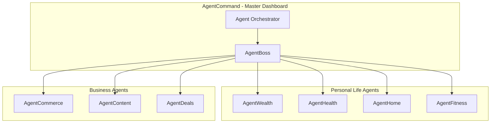

# RunAlNur Agent Empire - Dynasty Operating System

## Vision

Transform RunAlNur into a complete "Agent Empire" command center where specialized AI agents manage every domain of your life and business - inspired by Matt Schlicht's (@MattPRD) recent posts about AgentCommand, AgentWealth, AgentHealth, AgentHome, AgentBoss, and AgentCommerce.

The core idea: **"A one-person team making $1B in 2026"** by having AI agents that run other AI agents.

---

## Architecture Overview

---

## Agent Modules to Build

### 1. AgentCommand (Master Dashboard)

- Central command center showing all agent activity
- Real-time monitoring of what each agent is doing
- Agent-to-agent communication logs
- Priority queue of actions needing human approval
- Performance metrics for each agent

### 2. AgentBoss (AI Manager)

- Tells you what to focus on next
- Monitors your progress on tasks
- Ranks priorities by impact
- Delegates work to other agents
- Daily briefings and end-of-day summaries

### 3. AgentWealth (Finance)

- Bill negotiation automation
- Subscription management (pause/cancel unused)
- Credit card balance optimization (0% APR transfers)
- Gas/fuel price finder
- DCA (Dollar Cost Averaging) into investments
- Net worth tracking
- Budget monitoring and alerts

### 4. AgentHealth (Health)

- Vitals monitoring integration (Apple Watch, Oura, etc.)
- Health metrics dashboard
- Medication reminders
- Doctor appointment scheduling
- Health trend analysis
- Sleep optimization suggestions

### 5. AgentHome (Property)

- Smart home automation
- Maintenance scheduling
- Utility optimization
- Security monitoring
- Service provider management

### 6. AgentCommerce (Business - Shopify focused)

- Inventory management
- Pricing optimization
- Customer service automation
- Marketing campaign management
- Sales analytics

### 7. AgentFitness (Already exists in RunAlNur)

- Workout tracking
- Progress monitoring
- Nutrition guidance
- Goal setting

---

## Implementation Strategy

### Phase 1: Foundation

- Refactor existing RunAlNur dashboard into AgentCommand layout
- Create unified agent status component
- Build agent activity feed
- Implement agent-to-agent messaging system

### Phase 2: Core Personal Agents

- AgentBoss (AI manager giving daily priorities)
- AgentWealth (finance dashboard with mock data first)
- AgentHealth (integrate with existing health tracking)

### Phase 3: Advanced Features

- AgentHome integration
- AgentCommerce for business users
- Real API integrations (Plaid for finance, health APIs, etc.)

---

## Key Files to Modify

- [`runalnur-app/src/app/page.tsx`](runalnur-app/src/app/page.tsx) - Main dashboard becomes AgentCommand
- [`runalnur-app/src/components/`](runalnur-app/src/components/) - Create new agent module components
- Create new routes for each agent domain

---

## Design Philosophy (From Matt Schlicht)

> "Like you have a family office" (AgentWealth)

> "Like you're a billionaire with a full-time medical team" (AgentHealth)

> "Your boss is an AI agent and your legions are AI agents" (AgentCommand)

The goal is to make the user feel like they have an entire staff of experts working for them 24/7.