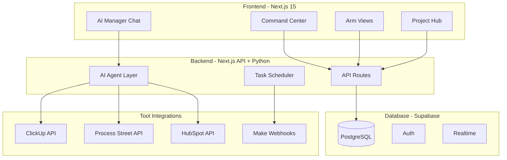

# RunAlNur: House Al Nur Empire OS

## Vision

A unified AI-powered command center where you can see, control, and automate everything across Nova, Janna, Silk, ATW, OBX, and House - with an AI manager that can actually execute tasks, not just suggest them.

---

## Architecture



---

## Tech Stack

| Layer | Technology | Why |

|-------|------------|-----|

| Frontend | Next.js 15 + App Router | Latest React patterns, server components, fast |

| Styling | Tailwind CSS + shadcn/ui | Modern, flexible, dark mode built-in |

| Animations | Framer Motion | Smooth micro-interactions |

| Backend | Next.js API Routes + Python (FastAPI) | JS for quick CRUD, Python for AI/heavy lifting |

| Database | Supabase (PostgreSQL) | Rock-solid, real-time, auth included |

| AI Layer | Claude API / OpenAI | For the AI manager intelligence |

| Auth | Supabase Auth | Simple, secure |

---

## Phase 1: Foundation + Janna Casablanca (Week 1)

Get you immediately operational with the Casablanca project.

**What you'll have:**

- Dashboard with all 7 arms visible (Nova, Janna, Silk, ATW, OBX, House, Maison)
- Janna project view with your Casablanca architects list
- ClickUp integration to sync tasks bidirectionally
- Basic AI chat to query your data ("What's the status of the Casablanca project?")

**Key files:**

- `app/page.tsx` - Command center dashboard
- `app/arms/[arm]/page.tsx` - Per-arm views (Janna, Nova, etc.)
- `app/api/clickup/` - ClickUp integration endpoints
- `lib/ai/agent.ts` - AI manager core logic

---

## Phase 2: Process Street + SOPs (Week 2)

**What you'll have:**

- Process Street integration to trigger and track SOPs
- Pre-built workflows for:
  - "Janna: New Property Acquisition Checklist"
  - "Nova: Product Launch Checklist"  
  - "House: Weekly Empire Review"
- AI can kick off SOPs via chat ("Start the property acquisition checklist for 24-unit Casablanca")

---

## Phase 3: HubSpot CRM + Contacts (Week 3)

**What you'll have:**

- HubSpot sync for contacts, deals, companies across all arms
- Unified contact view (see an architect's info whether they came from Janna or Nova)
- AI can create/update CRM records ("Add Mohamed Architect to Janna contacts, specialty: modern residential")

---

## Phase 4: AI Manager Intelligence (Week 4)

**What you'll have:**

- Full AI manager that can:
  - Generate daily/weekly briefings across all arms
  - Create tasks in ClickUp from natural language
  - Trigger Process Street workflows
  - Update HubSpot contacts
  - Answer questions about empire status
- Scheduled automated briefings (morning summary, end-of-week report)

---

## Immediate Deliverables (Phase 1 Detail)

### 1. Project Structure

```
RunAlNur/
├── app/
│   ├── page.tsx                    # Command center
│   ├── layout.tsx                  # Root layout with nav
│   ├── arms/
│   │   └── [arm]/
│   │       └── page.tsx            # Arm-specific view
│   ├── projects/
│   │   └── [id]/
│   │       └── page.tsx            # Project detail
│   └── api/
│       ├── clickup/
│       │   └── route.ts            # ClickUp sync
│       ├── ai/
│       │   └── chat/
│       │       └── route.ts        # AI manager endpoint
│       └── projects/
│           └── route.ts            # CRUD for projects
├── components/
│   ├── ui/                         # shadcn components
│   ├── dashboard/
│   │   ├── ArmCard.tsx
│   │   ├── MetricsPanel.tsx
│   │   └── RecentActivity.tsx
│   ├── ai/
│   │   └── ChatInterface.tsx
│   └── projects/
│       └── ProjectBoard.tsx
├── lib/
│   ├── supabase/
│   │   └── client.ts
│   ├── integrations/
│   │   ├── clickup.ts
│   │   ├── process-street.ts
│   │   └── hubspot.ts
│   └── ai/
│       └── agent.ts
├── .env.local                      # API keys
├── package.json
└── README.md
```

### 2. Database Schema

```sql
-- Arms (Nova, Janna, etc.)
arms (id, name, slug, head, description, color)

-- Projects (Casablanca 24-unit, Nova Intelligence, etc.)
projects (id, arm_id, name, status, priority, clickup_id, created_at)

-- Contacts (architects, investors, etc.)
contacts (id, name, email, company, role, arm_id, hubspot_id)

-- Activities (audit log of everything)
activities (id, type, description, arm_id, project_id, created_at)
```

### 3. Command Center Dashboard

A dark-themed, beautiful dashboard showing:

- All 7 arms as cards with key metrics
- Active projects across the empire
- Recent activity feed
- AI chat interface in corner (expandable)
- Quick actions (create task, start SOP, add contact)

---

## What I Need From You

Before I start building:

1. **API Keys** - You'll need to provide (in `.env.local`):

   - ClickUp API token
   - Process Street API key  
   - HubSpot API key
   - OpenAI or Claude API key
   - Supabase URL and anon key

2. **ClickUp Structure** - How is your ClickUp organized?

   - One workspace with folders per arm?
   - Or separate workspaces?

3. **Casablanca Architects List** - Share it and I'll import it into the system as the first real data.

---

## Design Direction

Dark theme, inspired by:

- The gravitas of a chaebol command center
- Clean data visualization (not cluttered)
- Moroccan/Arabic subtle geometric patterns as accents
- Typography: IBM Plex Sans (modern, professional, slightly unique)

This won't look like generic "AI slop" - it'll look like the operational heart of an empire.