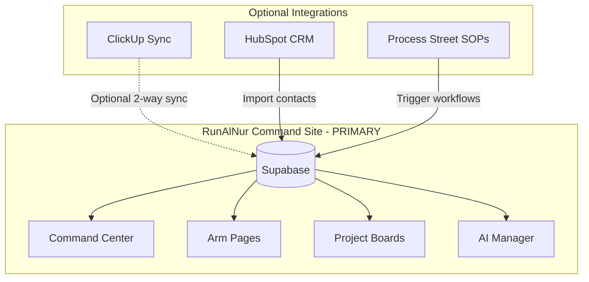

# RunAlNur: Full Command Center Build

## Vision

RunAlNur becomes the single command center for House Al Nur operations. ClickUp structure is imported into RunAlNur's own database. ClickUp sync becomes optional for team members who prefer it.

## Architecture



---

## Phase 1: Import House Al Nur Structure

Instead of setting up ClickUp, we create the structure directly in RunAlNur.

### Schema Updates

**1. Add Folders table** (between Arms and Projects)

```sql
CREATE TABLE folders (
  id UUID PRIMARY KEY DEFAULT gen_random_uuid(),
  arm_id TEXT NOT NULL,           -- 'nova', 'janna', etc.
  name TEXT NOT NULL,             -- '00 Command Center', 'Product & Engineering'
  sort_order INT DEFAULT 0,
  owner_id UUID REFERENCES auth.users(id),
  created_at TIMESTAMPTZ DEFAULT now()
);
```

**2. Update Projects table**

```sql
ALTER TABLE projects ADD COLUMN folder_id UUID REFERENCES folders(id);
```

**3. Enhance Tasks table**

```sql
ALTER TABLE tasks ADD COLUMN parent_id UUID REFERENCES tasks(id);  -- Subtasks
ALTER TABLE tasks ADD COLUMN depends_on UUID[] DEFAULT '{}';       -- Dependencies
ALTER TABLE tasks ADD COLUMN assignee_id UUID REFERENCES profiles(id);
ALTER TABLE tasks ADD COLUMN custom_fields JSONB DEFAULT '{}';
```

**4. Add Comments table**

```sql
CREATE TABLE comments (
  id UUID PRIMARY KEY DEFAULT gen_random_uuid(),
  task_id UUID REFERENCES tasks(id) ON DELETE CASCADE,
  user_id UUID REFERENCES auth.users(id),
  content TEXT NOT NULL,
  created_at TIMESTAMPTZ DEFAULT now()
);
```

### Seed Data Script

Create a migration that seeds the entire House Al Nur structure:

- 5 Arms already exist in constants
- Create folders per arm from spec
- Create projects (lists) per folder
- Create seed tasks per project

---

## Phase 2: Enhanced Task Management UI

### 2.1 Board View Improvements

- Drag-and-drop between columns (already partial)
- Quick-add task inline
- Subtask indicators
- Due date badges
- Assignee avatars

### 2.2 List View 

- Sortable table with all fields
- Inline editing
- Bulk actions (change status, assign, delete)

### 2.3 Calendar View (new)

- Month/week/day views
- Tasks plotted by due date
- Drag to reschedule

### 2.4 Gantt View (new, for Janna projects)

- Timeline visualization
- Dependencies shown as arrows
- Drag to adjust dates

---

## Phase 3: Project/Folder Navigation

### Sidebar Enhancement

Current:

```
ARMS
├── Nova
├── Janna
└── ...
```

Enhanced:

```
ARMS
├── Nova
│   ├── Product & Engineering
│   │   ├── Nova – Current Projects
│   │   └── Nova OS
│   ├── Launches
│   │   └── Studio Pro Gen1 Launch
│   └── ...
├── Janna
│   ├── Deal Flow
│   ├── Projects
│   └── ...
```

---

## Phase 4: ClickUp Sync (Optional)

For team members who prefer ClickUp:

### Import from ClickUp

- One-time import: Pull existing ClickUp tasks into RunAlNur
- Map ClickUp List → RunAlNur Project

### Export to ClickUp  

- Push RunAlNur tasks to ClickUp
- Keep in sync via webhooks

### Settings Toggle

"Sync with ClickUp" checkbox per Arm/Project

---

## Implementation Priority

| Priority | Feature | Effort |

|----------|---------|--------|

| P0 | Schema updates (folders, subtasks, deps) | 1 day |

| P0 | Seed House Al Nur structure | 1 day |

| P1 | Enhanced sidebar with folders | 1 day |

| P1 | Subtasks in task modal | 0.5 day |

| P2 | Calendar view | 1-2 days |

| P2 | Comments on tasks | 0.5 day |

| P3 | Gantt view | 2-3 days |

| P3 | ClickUp sync (optional) | 2 days |

---

## Files to Create/Modify

| File | Change |

|------|--------|

| `lib/supabase/schema.sql` | Add folders, comments tables; alter tasks |

| `lib/types.ts` | Add Folder, Comment types |

| `lib/hooks/useFolders.ts` | New hook |

| `app/api/folders/route.ts` | CRUD for folders |

| `lib/clickup/seed-structure.ts` | Seed data from spec |

| `app/api/seed/route.ts` | One-time seed endpoint |

| `components/layout/Sidebar.tsx` | Folder tree navigation |

| `components/calendar/CalendarView.tsx` | New component |

| `components/tasks/SubtaskList.tsx` | New component |

| `components/tasks/TaskComments.tsx` | New component |

---

## End State

You open RunAlNur and see:

- **Command Center**: All metrics, recent activity, AI briefing
- **Sidebar**: Full folder tree matching your ClickUp spec
- **Any Arm page**: Folders with projects, each with task boards
- **Task detail**: Subtasks, comments, dependencies, custom fields
- **Views**: Board (default), List, Calendar, Gantt (for relevant projects)
- **AI Manager**: Can query across all your tasks, create items, give briefings
- **Optional**: Toggle ClickUp sync per project for team collaboration