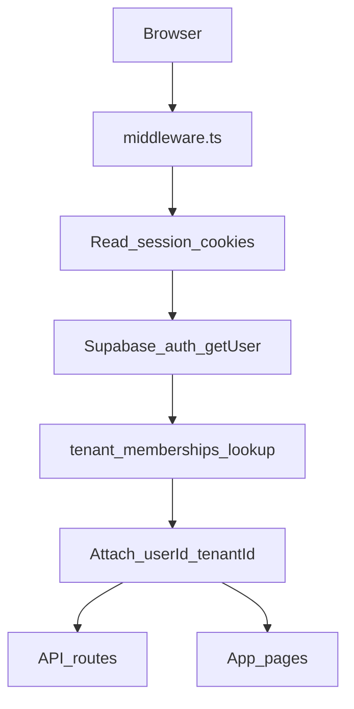
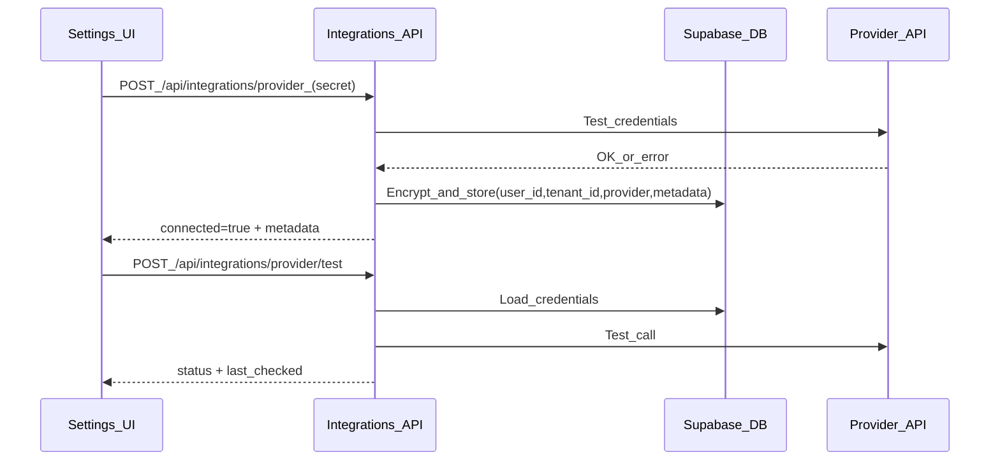

## Scope and success criteria

- **Targets**: Web + PWA only (desktop + mobile browsers). No Capacitor/Tauri packaging in this pass.
- **Tenancy model**: Org/tenant top-level boundary, plus per-user roles/ownership inside a tenant.

### Definition of done (hard gates)

- **Gate 0: Build & lint**
  - `npm run lint` passes (warnings allowed).
  - `npm run build` passes.
- **Gate 1: Auth & isolation**
  - No public/dev bypasses for app routes or APIs (remove TEMP allowances in [`runalnur-app/middleware.ts`](runalnur-app/middleware.ts)).
  - Tenant isolation enforced in DB (RLS) + API + UI.
  - Two-user test: userA cannot read userB/tenantB data across all core entities.
- **Gate 2: Integrations “feel real”**
  - ClickUp + Guru can be connected in-app, stored encrypted, status reflected in UI.
  - **No environment-variable fallback in production** (only permitted behind an explicit `DEMO_MODE` flag).
  - UI shows: connected account/workspace metadata, scopes/permissions, last sync time, and a disconnect/reconnect path.
- **Gate 3: Supabase-first features**
  - All visible CRUD flows are backed by Supabase (no “fake” buttons; no demo-only flows masquerading as real).
- **Gate 4: PWA + mobile polish**
  - All major screens usable on small viewport: safe-area, keyboard, touch targets, scroll/overflow.
  - Install/update UX is clean; manifest/icons correct.

---

## Architecture changes (tenant isolation)

### Data model

Implement tenant-aware schema with explicit membership:

- Add tables:
  - `tenants` (id, name, slug, created_at)
  - `tenant_memberships` (tenant_id, user_id, role, created_at)
- Add `tenant_id` to all tenant-scoped tables (e.g. `projects`, `tasks`, `contacts`, `activities`, etc.), plus `created_by`/`owner_id` where needed.
- Update existing integration credential storage to include tenant context (either `tenant_id` on `user_integrations` or derive via membership).
- RLS policies:
  - `tenant_id = current_tenant()` (derived from authenticated user membership)
  - plus optional per-row privacy rules (`owner_id = auth.uid()` for personal items).

### Auth/session tenant context

- On signup / first login:
  - Create default tenant (House Al Nur) for the first user.
  - Create membership for the new user.
- On subsequent users:
  - Require an invite/join flow to attach them to an existing tenant.

### API route contract

- Every API route derives:
  - `user_id` from session
  - `tenant_id` from membership
  - and enforces scoping on every query.

---

## Anti-drift execution workflow

- **Work in short “slices”**: each slice ends with a passing build + minimal manual verification.
- **Always update the matrices**:
  - API route matrix and UI control inventory are living docs; every time an endpoint/control changes, update its row.
- **No demo masking**:
  - Any demo behavior must be behind `DEMO_MODE` and must be visually labeled.
- **Test-first for isolation**:
  - Add automated checks (unit/integration) for tenant boundaries; keep a manual two-user script as backup.

---

## Key files likely to change

- Auth/gating:
  - [`runalnur-app/middleware.ts`](runalnur-app/middleware.ts) (remove TEMP public routes + dev API bypass)
  - [`runalnur-app/lib/api/auth.ts`](runalnur-app/lib/api/auth.ts) (standardize authz helpers)
  - [`runalnur-app/app/api/auth/setup-profile/route.ts`](runalnur-app/app/api/auth/setup-profile/route.ts)
  - [`runalnur-app/app/auth/callback/route.ts`](runalnur-app/app/auth/callback/route.ts)
- Supabase schema/migrations:
  - [`runalnur-app/supabase/migrations/*`](runalnur-app/supabase/migrations/)
  - [`runalnur-app/lib/supabase/schema.sql`](runalnur-app/lib/supabase/schema.sql)
- Integration storage and connect flows:
  - [`runalnur-app/lib/integrations/user-credentials.ts`](runalnur-app/lib/integrations/user-credentials.ts)
  - `[runalnur-app/app/api/integrations/[provider]/route.ts](runalnur-app/app/api/integrations/[provider]/route.ts)`
  - `[runalnur-app/app/api/integrations/[provider]/test/route.ts](runalnur-app/app/api/integrations/[provider]/test/route.ts)`
  - ClickUp OAuth:
    - [`runalnur-app/app/api/clickup/oauth/start/route.ts`](runalnur-app/app/api/clickup/oauth/start/route.ts)
    - [`runalnur-app/app/api/clickup/oauth/route.ts`](runalnur-app/app/api/clickup/oauth/route.ts)
- Settings / integration UX:
  - [`runalnur-app/app/settings/page.tsx`](runalnur-app/app/settings/page.tsx)
  - [`runalnur-app/components/settings/ClickUpConnect.tsx`](runalnur-app/components/settings/ClickUpConnect.tsx)
  - [`runalnur-app/components/settings/IntegrationConnectModal.tsx`](runalnur-app/components/settings/IntegrationConnectModal.tsx)
- PWA:
  - [`runalnur-app/next.config.ts`](runalnur-app/next.config.ts)
  - [`runalnur-app/public/manifest.json`](runalnur-app/public/manifest.json)
  - [`runalnur-app/components/pwa/*`](runalnur-app/components/pwa/)

---

## Data-flow diagrams

### Auth + tenant resolution

### Integration connect/test/sync

---

## QA plan (Web + PWA)

- **Two-user / two-tenant isolation script**
  - Create tenantA + userA, tenantB + userB.
  - Verify A cannot read/write B across all entity endpoints.
- **Integration realism script** (ClickUp, Guru)
  - Connect -> verify metadata and scopes displayed.
  - Trigger sync -> verify last_sync updates and data appears.
  - Disconnect -> verify UI updates + tokens revoked/cleared.
- **Mobile pass**
  - Small viewport check for each primary route.
  - Verify keyboard behavior on forms (login/signup/modals).
  - Verify PWA install prompt and “update available” UX.

---

## Deliverables

- Updated API route matrix + UI control inventory (living docs).
- Tenant-aware schema + migrations.
- “Real” integration connect/test UX with accurate metadata.
- Mobile-polished PWA experience.